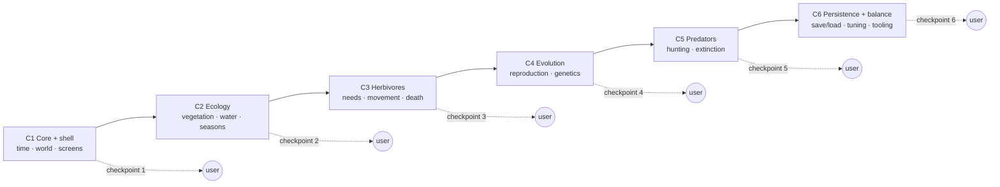
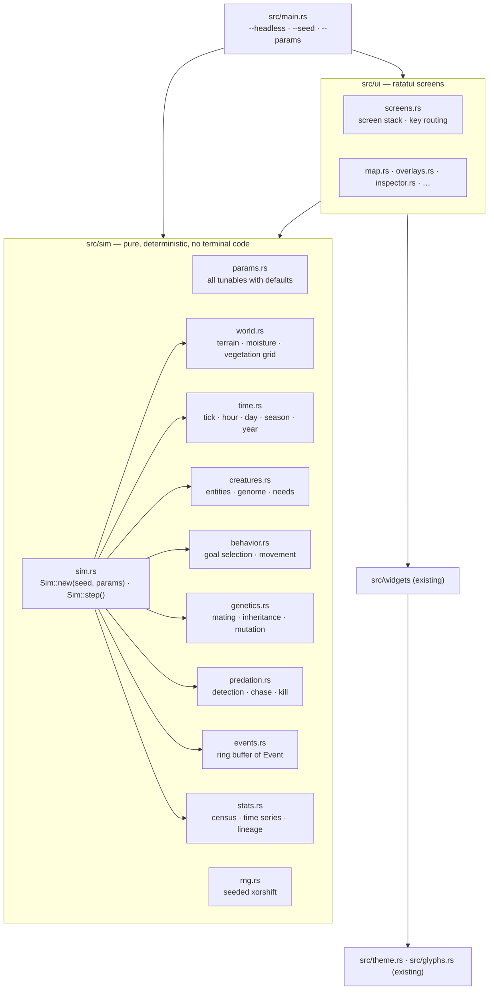

# Sim Fortress — Delivery Roadmap

The project is delivered as **six sequential chunks**. Each chunk ends at a **checkpoint**:
a build the user can run, observe in the terminal, and judge before the next chunk starts.
Course corrections happen at checkpoints; a chunk's scope may be revised as a result, but a
chunk is never started before the previous checkpoint is accepted.

Every chunk has its own document with scope, requirements, acceptance criteria, the
checkpoint demo script, tests and the decisions it depends on.

| Chunk | Title | Checkpoint: what the user can observe | Doc |
|-------|-------|----------------------------------------|-----|
| C1 | Simulation core, world generation and app shell | Generate worlds from a seed, watch the clock, seasons and day/night pass over a living-free map; pause, speed, help, controls | [c1-core-and-shell.md](c1-core-and-shell.md) |
| C2 | Vegetation, water and seasons | Vegetation grows and dies back with the seasons, droughts dry water cells; overlays, ecology screen, event log and charts show it | [c2-ecology.md](c2-ecology.md) |
| C3 | Herbivores: needs, movement, perception, death | Prey creatures wander, graze, drink, rest, age and die; look, follow, inspect, zoom | [c3-herbivores.md](c3-herbivores.md) |
| C4 | Reproduction, genetics and evolution | Populations sustain themselves, traits drift, species browser and lineage tree fill in | [c4-evolution.md](c4-evolution.md) |
| C5 | Predators, predation and extinction | Predator–prey oscillations, sense overlay, hunt stats, phase plot, extinction alerts, migration | [c5-predators.md](c5-predators.md) |
| C6 | Persistence, title flow, balance and tooling | Save/load, title menu, headless experiments, parameter tuning, performance budget | [c6-persistence-and-balance.md](c6-persistence-and-balance.md) |

## Why this order

Each chunk adds one layer of the food web on top of a layer that has already been observed
to behave sensibly. Vegetation must be stable before herbivores eat it; herbivores must
sustain a population before predators hunt them. The UI grows with the simulation: a screen
becomes "live" in the chunk that produces the data it shows, so no chunk ships a screen that
still runs on fixture data.

## Screens by chunk

| Screen (see [docs/screens](../screens/README.md)) | Becomes live in |
|---|---|
| S01a/b/d World Map (clock, terrain, season palette) | C1 |
| S09 World Generation, S10 Controls, S11 Help | C1 |
| S02a/b/c overlays, S06 Ecology, S07a Event Log, S05a/c charts (vegetation series) | C2 |
| S01c Look, S01e Follow, S03a/c Inspector, S13 Zoom, S07b detail, S09 species rows | C3 |
| S04a/b Species Browser, S08 Lineage, S05a/c population lines, S09 evolution fields | C4 |
| S02d Sense overlay, S03b Predator inspector, S05b Phase plot, S12 Alert | C5 |
| S00 Title, Load list, Options and confirm modals, S09 presets, save/load, sweep CLI | C6 |

## Architecture the chunks build toward

Rules that hold for every chunk:

1. **Determinism.** Same seed and parameters produce identical runs, tick for tick. Every
   chunk keeps the determinism test green.
2. **Sim/UI separation.** `src/sim` never imports ratatui; the UI only reads sim state
   through `&Sim` and sends it commands (pause, speed, step, select). A headless run must
   exercise every simulation feature without a terminal.
3. **Screens keep the prototype look.** The 27 prototypes in `src/prototypes` are the visual
   spec. A live screen must match its prototype's layout, glyphs and colours; only the data
   source changes. Prototypes stay compilable behind `--prototypes` until C6 removes them.
4. **CP437 only.** The glyph test in `src/glyphs.rs` stays and every new glyph goes through
   it.
5. **Parameters, not constants.** Any number that tunes behaviour lives in `sim::Params`
   with a documented default, so the user can course-correct without code changes.
6. **Checkpoint demo.** Each chunk doc ends with a scripted demo (keys to press, what to
   see). The chunk is done when the demo runs as written and its tests pass.

## Time model (fixed across chunks)

| Unit | Definition |
|------|------------|
| tick | 1 simulated hour; the smallest step |
| day | 24 ticks |
| season | 90 days (spring, summer, autumn, winter) |
| year | 360 days |
| speed x1 | 2 ticks per real second (12 s per day) |
| speeds | x1, x2, x5, x10, x25 (ticks per second = 2 × speed) |

## Chunk status

| Chunk | Doc status | Validation | Implementation |
|-------|------------|------------|----------------|
| C1 | validated (2 passes) | [VALIDATION.md](VALIDATION.md) | implemented |
| C2 | validated (2 passes) | [VALIDATION.md](VALIDATION.md) | implemented |
| C3 | validated (2 passes) | [VALIDATION.md](VALIDATION.md) | implemented |
| C4 | validated (2 passes) | [VALIDATION.md](VALIDATION.md) | implemented (balance table recorded in the doc) |
| C5 | validated (2 passes) | [VALIDATION.md](VALIDATION.md) | implemented (population bands open — see the status note in the doc) |
| C6 | validated (2 passes) | [VALIDATION.md](VALIDATION.md) | implemented |
