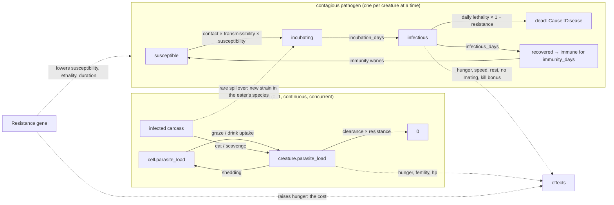

# C7 — Disease and parasites

Back to the [roadmap](README.md). Previous: [C6](c6-persistence-and-balance.md).

> **Status: implemented (2026-09-11), not independently validated.** The mechanics, params,
> stats, screens and tests below are in place; the **balance table** and the **recorded
> results** at the end of the Acceptance section say what the defaults were tuned to and
> where the implementation deviates from the plan.

## Goal
Give evolution a second selective pressure besides predation. Contagious pathogens spread
between creatures by proximity, parasites accumulate from the ground, water and carcasses,
and a new genome slot, **Resistance**, decides who sickens, who dies and who recovers.
Resistance carries a metabolic cost, so it is selected *up* during an epidemic and drifts
*down* between them. Outbreaks are recorded as named historical events, and the lineage tree
shows where a bloodline was cut.

## Checkpoint (what the user sees)
After a year or two an `Outbreak` appears in the ticker: *Greyfever breaks out among the
voles of Northmarch*. The disease overlay (`8`) shows sick animals spreading along the
meadow over days; cases climb, the epidemic alert pauses the game, deaths pile up, then the
outbreak burns out. Afterwards the species browser shows vole Resistance jumped by a whole
histogram bucket, the drift table records the jump at that generation, and the lineage tree
of any vole has a band of `☻` deaths across one generation with only the resistant branches
continuing. In a wet spring deer on damp ground catch Hoofrot and limp, and the foxes eat
the limping ones. Over the following years Resistance slides back down, and the next
outbreak hits harder.

## Scope

### In
- `sim::disease` (new): pathogen roster and runtime strain list, contagion pass, stage
  progression, emergence, **spillover strains** (a pathogen mutating into a predator host
  when infected prey is eaten), outbreak records, parasite acquisition/shedding/clearance.
- Genome slot 9, **Resistance**, in every place the genome is stored, inherited, summarised
  or drawn.
- Creature state: `infection`, `immune_until`, `parasite_load`, `infections_survived`,
  `died_infected`.
- World cell field: `parasite_load` (decays daily like pressure).
- Effects on existing systems: hunger (fever, worms, resistance cost), movement speed,
  rest threshold, mate eligibility, kill chance against sick prey, carcass transmission.
- `Cause::Disease`; events `Outbreak`, `Spillover`, `Epidemic`, `EpidemicOver`,
  `DeathDisease`, `Recovery` (notable only); `Alert::Epidemic`.
- Stats: per-pathogen record, `Sample` fields, CSV columns, `Outbreak` history.
- Live screens: **S02h disease overlay**, **S02i parasite overlay**, **S12b epidemic alert**, **S05d infection
  chart**, S03 Sickness/Immunity rows, S04a `sick` column and S04b Disease section, S07
  `disease` chip, S08 disease markers and outbreak note, S10/Options `auto-pause on
  epidemic`, S11 rows, S06 per-region cases.
- Params `[disease]` with a full pathogen roster; preset **Plague years**.
- Save format version bump (no compatibility handling of any kind).

### Out
- General pathogen evolution (continuous virulence/transmissibility drift). The only
  mutation is the rare trophic spillover of FR8b.
- Behavioural avoidance of sick conspecifics; quarantine-like herd behaviour.
- Maternal antibodies; co-infection with two contagious pathogens at once (one at a
  time; parasite load is separate and concurrent).
- Vector species (ticks, fleas as entities).
- Any save-format compatibility: no migration, no reading of older saves, no "incompatible"
  rows in Load World. A save is loadable only by a build with the same `save::VERSION`.

## Dependencies
- [C6](c6-persistence-and-balance.md) complete: params overlays, save/load, `--summary` tooling, `Alert`/S12 modal, the
  S02g creature-tint overlay (the disease overlay is built on its renderer), per-species
  arrays everywhere.
- Screen requirements: [S02](../screens/s02-map-overlay.md), [S03](../screens/s03-creature-inspector.md),
  [S04](../screens/s04-species-browser.md), [S05](../screens/s05-population-charts.md),
  [S07](../screens/s07-event-log.md), [S08](../screens/s08-lineage.md),
  [S12](../screens/s12-alert-modal.md). Each gains a variant or section (FR13); the screen
  docs are updated in the same commit as the screen.
- Balance context: the [C5](c5-predators.md) population bands are still open (fox/vole overkill). Disease
  acceptance is therefore stated **relative to a disease-off run of the same seed**, never
  as absolute population bands.

## Model overview



Two mechanisms, deliberately different in shape:

| | Contagious pathogen | Parasites |
|---|---|---|
| Carrier | one `Infection` per creature, staged | a continuous `parasite_load` |
| Spread | creature-to-creature proximity, vertical at birth, carcass | environment (cell load), carcass (trophic), mother at birth |
| Time course | acute: days to weeks, then immune | chronic: builds while exposed, clears slowly |
| Kills | yes, daily hazard | rarely (hp loss only above a threshold) |
| Drama | epidemics, extinction risk, lineage bands | steady fertility and hunger tax on crowded ground |
| Resistance acts on | susceptibility, lethality, duration | uptake and clearance |

## Functional requirements

### FR1 Genome slot 9: Resistance
- `Genome([f32; 9])`, `TRAIT_NAMES[8] = "Resistance"`, accessor `resistance()`, and a
  `Genome::LEN` constant. Every `8` that means "trait count" becomes `Genome::LEN`
  (`species.rs`, `stats.rs` census and `Hist`, `genetics::inherit`, `place_founders`,
  `stats::to_csv`, S03, S04, S08). Grep targets are listed in the implementation order.
- Base genomes (appended value): vole 0.30, hare 0.35, deer 0.45, fox 0.40, wolf 0.50,
  lynx 0.45. Founders vary it with the same `N(0, 0.12)` as the other traits.
- Inheritance and mutation are unchanged (random parent + gaussian); Resistance mutations
  appear in `Mutation`, the `§` markers and the notable rule like any trait.
- **Cost** (the mechanism that makes it a real trade-off): `hunger_per_hour ×= 1 +
  resist_hunger_cost × resistance`. Without the cost Resistance ratchets up and outbreaks
  stop happening after year 3; the acceptance criterion *Resistance falls between epidemics*
  guards this.
- Trait colour: the new `theme::SICK` (FR12) is used wherever trait colours appear
  (`trait_color(8)`).

### FR2 Params (`[disease]`)
```toml
[disease]
enabled = true
resist_hunger_cost = 0.10        # hunger rate × (1 + cost × resistance)          (balance table; spec start 0.25)
susceptibility_w = 1.2           # p_infect × (1 − w × resistance), clamped ≥ 0     (balance table; spec start 0.8)
lethality_resist_w = 1.4         # daily death hazard × (1 − w × resistance), ≥ 0  (balance table; spec start 1.0)
resistance_founder_sd = 0.20     # founder spread of Resistance (other traits 0.12) — added during tuning
duration_resist_w = 0.4          # infectious days × (1 − w × resistance), min 2
contact_cheb = 1                 # neighbours within this Chebyshev distance are contacts
vertical_transmission = 0.5      # newborn of an infectious mother starts incubating
carcass_transmission = 0.3       # eating/scavenging a carcass that died infectious
sick_speed_penalty = 0.5         # move budget × (1 − penalty × severity)
sick_hunger_factor = 1.3         # fever: hunger rate × factor while infectious
sick_rest_energy = 0.45          # infectious creatures rest below this energy (default 0.25)
sick_blocks_mating = true
kill_sick_bonus = 0.25           # kill_chance += bonus × severity of the prey
epidemic_share = 0.15            # active cases / living hosts ≥ this → Epidemic event + alert
epidemic_min_cases = 20
reservoir_days = 120             # no re-emergence of a pathogen within this many days of its last case
emergence_per_day = 0.004        # base daily hazard at host_ref hosts
emergence_host_ref = 500
emergence_host_min = 60          # no emergence below this many living hosts
recovery_notable_min_severity = 0.7   # Recovery event only for severe cases
# ---- spillover strains (FR8b): a pathogen mutating into the eater's species
spillover_chance = 0.003         # per meal of prey that died infected (balance table; spec start 0.015 gave 42 % strain outbreaks)
spillover_jitter = 0.25          # strain transmissibility/lethality/infectious_days × N(1, jitter), clamped 0.25..2
spillover_cross_immunity = 0.5   # susceptibility to a strain × (1 − this) for creatures immune to its parent
max_pathogens = 8                # roster + live strains; a burnt-out strain's slot is reusable after reservoir_days
# ---- parasites (one continuous load per creature; "gut worms" in the UI)
parasite_uptake = 0.04           # load += uptake × cell.load × (1 − resistance) × (1 − load) per graze/drink tick; the (1 − load) term was added because the spec loop saturated every cell and animal
parasite_shed = 0.002            # cell.load += shed × creature.load per tick on the cell, clamped 1 (spec start 0.02)
parasite_cell_decay = 0.95       # daily (spec start 0.97)
parasite_clearance = 0.03        # load −= clearance × (0.5 + resistance) per day (spec start 0.02)
parasite_carcass_transfer = 0.5  # eater.load += transfer × carcass.load (trophic)
parasite_birth_transfer = 0.3    # newborn.load = transfer × mother.load
parasite_hunger_w = 0.4          # hunger rate × (1 + w × load)
parasite_fertility_w = 0.5       # effective fertility × (1 − w × load) for litter size
parasite_hp_threshold = 0.7      # above this load, hp −= parasite_hp_loss per hour
parasite_hp_loss = 0.005
parasite_water_bonus = 2.0       # shedding/uptake multiplier on shallow-water cells (shared drinking spots)
parasite_baseline = 0.05         # founders and newborns carry at least this load (added in implementation)
parasite_ground_rate = 0.02      # daily cell growth × (prey_pressure + pred_pressure): crowding fouls the ground (added in implementation — shedding alone never ignites the loop)
parasite_carcass_seed = 0.03     # cell load added per carcass per day — the field's only source (added in implementation)

[[disease.pathogens]]
name = "Greyfever"
hosts = { vole = 1.0, hare = 1.0, deer = 0.6 }   # host multiplier on transmissibility and lethality; absent = immune species
transmissibility = 0.006         # per contact per tick (balance table; spec start 0.02)
incubation_days = 3
infectious_days = 10
lethality_per_day = 0.06
immunity_days = 360              # 0 = lifelong
severity = 0.8                   # drives speed/rest/kill effects
den_bonus = 1.0                  # contact multiplier when both are on a den cell
moisture_bonus = 0.0             # transmissibility += bonus × cell.moisture

[[disease.pathogens]]
name = "Redmange"
hosts = { fox = 1.0, wolf = 0.8, lynx = 0.6 }
transmissibility = 0.008
incubation_days = 7
infectious_days = 40
lethality_per_day = 0.01
immunity_days = 0
severity = 0.5
den_bonus = 3.0                  # mites: dens are where predators share bedding
moisture_bonus = 0.0

[[disease.pathogens]]
name = "Hoofrot"
hosts = { deer = 1.0, hare = 0.3 }
transmissibility = 0.002         # balance table; spec start 0.005
incubation_days = 5
infectious_days = 20
lethality_per_day = 0.02
immunity_days = 180
severity = 1.0                   # lame: full speed penalty, prime predator target
den_bonus = 1.0
moisture_bonus = 0.03            # wet ground; a wet spring is a Hoofrot spring
```
Every leaf gets a `field_docs` entry (the C6 test enforces it). `deny_unknown_fields`
applies to `PathogenParams`. At `Sim::new` the roster is copied into
`Sim.disease.pathogens: Vec<Pathogen>` (the runtime list; strains are appended to it, FR8b);
`PathogenId(u8)` indexes that list, never the params, and `max_pathogens` (≤ 8, the width of
`immune_until`) bounds it.

**Number sanity** (spec-start values, kept for the record). A susceptible vole with one
infectious neighbour for a day: `1 − (1 − 0.02 × 0.76)^24 ≈ 31 %` at base resistance 0.30.
Greyfever case mortality over 10 infectious days: `1 − (1 − 0.06 × 0.7)^10 ≈ 35 %` at 0.30.
**What tuning found:** those values infected the whole host population in every outbreak
(1 600–2 000 cases against ~500 prey) and moved mean Resistance by only ≈ 0.003 per
epidemic, because the selection response scales with the trait *variance* (founder sd 0.12
≈ 0.014 variance) times the log-survival slope, not with mortality itself. The balance
table therefore (a) cuts transmissibility to 0.006 / 0.002 so epidemics are partial, (b)
steepens the resistance leverage (`susceptibility_w` 1.2, `lethality_resist_w` 1.4, both
clamped at 0, so an animal at Resistance ≥ 0.7 is effectively immune and one at 0.15 dies
at 0.047/day), (c) lowers the hunger cost to 0.10 so it no longer dominates, and (d) adds
`resistance_founder_sd = 0.20` so there is standing variation to select on. With the
balance table: at Resistance 0.30 a neighbour-day infects `≈ 9 %` and case mortality is
`≈ 30 %`; at 0.60 `≈ 4 %` and `≈ 13 %`.

### FR3 Creature and lineage state
```rust
pub struct Infection {
    pub pathogen: PathogenId,
    pub stage: Stage,            // Incubating | Infectious
    pub since_day: u32,
    pub ends_day: u32,           // stage transition day (resistance-adjusted at onset)
    pub severity: f32,           // pathogen.severity × (1 − 0.5 × resistance)
    pub source: Option<CreatureId>,
    pub outbreak: u16,           // index into Sim.outbreaks
}
// Creature:
pub infection: Option<Infection>,
pub immune_until: [u32; 8],      // per pathogen, day index; 0 = not immune; u32::MAX = lifelong
pub parasite_load: f32,
pub infections_survived: u8,
pub died_infected: Option<PathogenId>,   // set at death for carcass transmission and S03c
```
`LineageNode` gains `cause: Option<Cause>`, `outbreak: Option<u16>` (the outbreak that killed
it) and `infections_survived: u8`. The lineage store records them in `record_death`.

### FR4 Contagion pass (per tick, infectious-first)
Runs in `tick_creatures` after the `update_one` loop and before `consummate`, using the
previous tick's spatial index (the same snapshot perception uses). Mirrors the C5
predator-first rule: iterate **infectious** creatures in id order and query
`spatial.for_each_within(x, y, contact_cheb + 1)`, filtering to `cheb ≤ contact_cheb`;
per-susceptible scans are forbidden. For each contact `t` (living, not the same creature):
```
host = pathogen.hosts[t.species] (absent → skip)
skip if t.infection.is_some() or day < t.immune_until[p]
p = pathogen.transmissibility × host
    × (1 − susceptibility_w × t.resistance)
    × (den_bonus if both on a den cell else 1)
    + pathogen.moisture_bonus × cell(t).moisture
if disease_rng.chance(p): queue (t, pathogen, source = infectious.id)
```
Queued infections are applied after the scan in `(target id, source id)` order so the result
does not depend on iteration order; a target queued twice keeps the first. New infections
start `Incubating` with `ends_day = day + incubation_days`. The pass uses `Sim.disease_rng`
(seed `^ 0x7F4A_7C15_9E37_79B9`), a third stream, so enabling disease does not perturb the
ecology or creature streams (creature *deaths* still change the run, which is the point).

### FR5 Progression and death (daily)
In `day_boundary`, before age death, for every living creature with an infection:
- `Incubating` and `day ≥ ends_day` → `Infectious`, `ends_day = day + max(2,
  round(infectious_days × (1 − duration_resist_w × resistance)))`; the outbreak's
  `cases` and `species_cases` increment here (a case is counted when it becomes infectious).
- `Infectious`: roll `lethality_per_day × host × (1 − lethality_resist_w × resistance)`;
  success → `kill(Cause::Disease)`, `died_infected = Some(p)`, outbreak `deaths` increments,
  `DeathDisease` event `"<name> <tag> died of <Pathogen> in <region>"`. Otherwise if `day ≥
  ends_day` → recovered: `infection = None`, `immune_until[p] = day + immunity_days` (or
  `u32::MAX`), `infections_survived += 1`, `Recovery` event only when `severity ≥
  recovery_notable_min_severity` (ticker-gated like births).
- Parasites: `parasite_load = max(0, load − parasite_clearance × (0.5 + resistance))`.
- Cells: `parasite_load *= parasite_cell_decay` in the same loop that decays pressure.

Death by disease is attributed like C3: `Cause::Disease` is a new arm of `kill`, a new
`EventKind::DeathDisease` (glyph `☻`, colour `SICK`, label `disease`, chip `deaths`), and a
`DeathTallies.disease` counter beside `starved/thirst/age/predation`.

### FR6 Effects on existing systems (single source of truth: `disease::effects(c) -> Effects`)
`Effects { hunger_factor, speed_factor, rest_energy, can_mate, kill_bonus, fertility_factor }`
computed once per creature per tick from `infection`, `parasite_load` and `resistance`:
- `hunger_factor = (1 + resist_hunger_cost × resistance) × (sick_hunger_factor if infectious)
  × (1 + parasite_hunger_w × load)` → multiplies the C3 `hunger_per_hour` in `needs`.
- `speed_factor = 1 − sick_speed_penalty × severity` (infectious only) → multiplies the move
  budget in `move_toward`; the C5 chase bonus is added after, so a lame deer is still catchable.
- `rest_energy = sick_rest_energy` (infectious) else the C3 threshold → `replan_prey/predator`.
- `can_mate = !(sick_blocks_mating && infectious)` → `genetics::eligible`.
- `fertility_factor = 1 − parasite_fertility_w × load` → `litter_size(species, fertility ×
  factor)` in `deliver`.
- `kill_bonus = kill_sick_bonus × severity` (prey infectious) → added inside
  `kill_chance` before the clamp; the S03b hunt line names it (`+0.20 sick prey`).
- Parasite hp: `hp −= parasite_hp_loss` per hour while `load > parasite_hp_threshold`;
  `maybe_die` attributes it as `Cause::Disease` when neither hunger nor thirst is ≥ 1.
- Predation risk (S03 Condition) is unchanged; a new `contagion_risk` = infectious
  conspecifics within `contact_cheb` / 8 is shown beside it.

### FR7 Parasite acquisition and shedding
- `graze` and `drink` (C3 `act`): `load += parasite_uptake × cell.parasite_load × (1 −
  resistance) × (parasite_water_bonus if the drink cell is shallow water)`, clamped to 1.
- Every tick on a cell, after `pressure`: `cell.parasite_load = min(1, cell.load +
  parasite_shed × creature.load × (water bonus if shallow water))`. Only creatures with
  `load > 0.05` shed (skip the write otherwise; this keeps the pass cheap).
- Eat (C5 kill → Eat phase) and scavenge visits: `eater.load += parasite_carcass_transfer ×
  carcass.parasite_load`; the carcass keeps its load (frozen at death). If the carcass
  `died_infected == Some(p)` (set at death for any infectious animal, whatever killed it):
  if the eater is a host of `p` and not immune, roll `carcass_transmission × host × (1 −
  susceptibility_w × resistance)` → incubating infection with `source = carcass id`; if the
  eater is **not** a host of `p`, roll `spillover_chance` instead → FR8b.
- Birth (`deliver`): `newborn.load = parasite_birth_transfer × mother.load`; if the mother is
  infectious, `vertical_transmission` chance the newborn starts incubating (same outbreak).

### FR8 Emergence and outbreak records
Daily in `Sim::step` after the census (it needs region counts), when `enabled`:
- For each pathogen not currently active (no living infection with that id) and with
  `day − last_case_day ≥ reservoir_days`: hosts = Σ living × (hosts[species] > 0); if `hosts ≥
  emergence_host_min`, roll `emergence_per_day × hosts / emergence_host_ref`. Success →
  choose the index case: the region with the most hosts, then the host in that region with
  the **lowest** Resistance (ties by id) — the weakest animal is where a disease shows first.
  Push `Outbreak { pathogen, started_day, ended_day: None, origin_region, index_case, cases: 1,
  deaths: 0, peak_active: 1, peak_day, species_cases: [u32; 6], species_deaths: [u32; 6],
  epidemic: false, resist_at_start: [f32; 6] }` (`Sim.outbreaks: Vec<Outbreak>`, bounded to
  64, oldest dropped, indices stable via a `first_index` offset). Infect the index case as
  `Infectious` immediately. Event `Outbreak` (glyph `☻`, colour `SICK`): `"<Pathogen> breaks
  out among the <plural> of <region>"`, `subject` = index case, `pos` = its cell.
- Daily per active outbreak: `active` = living infections with that outbreak index;
  `peak_active`/`peak_day` update. If `!epidemic && active ≥ epidemic_min_cases && active ≥
  epidemic_share × living hosts`: `epidemic = true`, event `Epidemic` `"<Pathogen> is epidemic:
  N sick across <k> regions"`, push `Alert::Epidemic { event_index, pathogen, outbreak }`.
  If `active == 0`: `ended_day = Some(day)`, `last_case_day[p] = day`, `resist_at_end`
  recorded, event `EpidemicOver` (glyph `☻`, dim): `"The <Pathogen> outbreak has burned out
  after N days: D dead, R recovered"` (a non-epidemic outbreak that dies out logs a `Note`).
- `Sim.disease: DiseaseState { pathogens: Vec<Pathogen>, last_case_day: [u32; 8],
  stats: [PathogenStats; 8] }` with `PathogenStats { outbreaks, total_cases, total_deaths,
  active, active_by_species: [u32; 6], peak_active, immune: u32 }`, refreshed daily from
  the living set. `Pathogen` is the params record plus `parent: Option<PathogenId>`,
  `born_day: Option<u32>` and `extinct: bool` (strains only).

### FR8b Spillover strains (infections mutate when eaten)
The rare way a disease crosses the food chain. When the FR7 carcass rule rolls
`spillover_chance` for an eater that is not a host of pathogen `p`:
- A new strain is created: a copy of `p` with `hosts = { eater.species: 1.0 }` only,
  `transmissibility`, `lethality_per_day` and `infectious_days` each multiplied by an
  independent `N(1, spillover_jitter)` draw clamped to `0.25..2` (`infectious_days` rounded,
  min 2), `immunity_days`, `severity`, `den_bonus` and `moisture_bonus` copied, `parent =
  Some(p)`, `born_day = day`, `name = "<parent name> (<eater plural lowercase> strain)"`
  (`Greyfever (fox strain)`). A strain of a strain names its root parent (`Greyfever (wolf
  strain)`), so names never nest.
- Slot rule: if `pathogens.len() < max_pathogens` append; else reuse the slot of the oldest
  strain that is `extinct` and whose `last_case_day` is ≥ `reservoir_days` ago (its
  `immune_until` column is zeroed on every creature first); if no slot qualifies the
  spillover silently fails (a `Note`-level detail in `--profile` counters only).
- The eater becomes the index case (`Infectious` immediately), an `Outbreak` record is
  pushed for the strain with `origin_region` = the carcass region, and a `Spillover` event
  (glyph `☻`, colour `MAGENTA`, label `spillover`, chip `disease`) reads `"<Parent> has
  jumped to the <plural>: <name> <tag> ate a sick <prey species>"` with `subject` = eater,
  `pos` = carcass cell. When the strain's first epidemic fires, the S12b headline reads
  `A new strain: <strain name>`.
- Cross-immunity: a creature immune to the parent (or to a sibling strain of the same root)
  has its susceptibility to the strain multiplied by `1 − spillover_cross_immunity`;
  Resistance applies as for any pathogen.
- Strains never emerge from the reservoir (FR8 emergence skips `parent.is_some()`); they
  exist only while transmitted. When a strain's active count reaches 0 it is marked
  `extinct` and its `EpidemicOver` text ends with `; the strain is gone`. A strain can be
  spilled over again from the same parent, giving a fresh jitter draw and a new record.
- Trophic chain: in practice spillover runs prey → the predators that eat them, because
  C5 predators never kill predators and scavenging is prey-carcass only. The rule is written
  generally (any eater that is not a host) so a future predator-on-predator kill or carcass
  needs no change.

### FR9 Alert (S12b) and the auto-pause option
`Alert::Epidemic` follows the C5 extinction alert exactly (queue order, `speed_before_alert`,
`paused` when the option is on). New `params.ui.auto_pause_on_epidemic = true` and a sixth
Options row (FR13). S12b: title ` ☻ EPIDEMIC ☻ ` in `SICK` bold; headline `<Pathogen> is
epidemic among the <plural>`; row 3 the clock and `index case:` name/tag in the species
colour; row 4 `N sick · D dead · <k> of 8 regions · began Day <d> in <region>`; row 6 `mean
Resistance <x.xx> (base <x.xx>) · <pct>% immune`; buttons `[ Continue ]  [ Show outbreak ]
[ Pause ]` where *Show outbreak* pops the modal, opens the S02h overlay on that pathogen and
centres the map on the origin region, leaving the sim paused. `Esc` = Continue. Status bar
right text `││ paused on epidemic`.

### FR10 Stats, series and CSV
- `Sample` gains `infected: [u32; 6]`, `immune: [u32; 6]`, `deaths_disease: u32`,
  `parasite_mean: [f32; 6]`, `active_by_pathogen: [u32; 8]`. `Series.to_csv` appends
  `infected_<species>` × 6, `d_disease`, `parasite_<species>` × 6, `active_<pathogen>` × 8;
  the existing `<species>_<trait>_mean` block gains `resistance` automatically from
  `TRAIT_NAMES`.
- `SpeciesStats` gains `sick: u32`, `immune: u32`, `deaths_disease_today/yesterday`.
- `--summary` gains `outbreaks`, `epidemics`, `disease_deaths`, `mean_resistance_by_species
  × 6`.
- `checksum()` feeds per creature: infection pathogen/stage/ends_day (or `0xff`),
  `parasite_load` bits; plus `disease.last_case_day` and `outbreaks.len()`. The locked value
  in `checksum_is_fnv_stable` is re-recorded (founder placement now draws nine gaussians).

### FR11 Save format
`save::VERSION` is bumped to 2. Compatibility is never preserved: `decode` and `read_header`
reject any `version != VERSION` with `save is from another version (N ≠ M)` (the existing
`NewerVersion` error is renamed `VersionMismatch`), and such files are simply not listed by
`list_saves`. No migration code is written now or later; every future format change bumps the
number the same way. `World.cells[].parasite_load`, the creature fields, the lineage fields,
`Sim.disease`, `Sim.outbreaks` and `Sim.disease_rng` are all serialised by derive.

### FR12 Glyphs and colours
- Event/disease glyph `☻` (CP437 0x02, already `glyphs::UNHAPPY`; add `pub const DISEASE:
  char = '☻'`). Immune marker `☺` (`glyphs::HAPPY`) in the inspector only. Parasite glyph
  `∩` (CP437) for the load bar label. All pass the CP437 test.
- `theme::SICK = Rgb(150, 205, 70)` (a sickly yellow-green; distinct from `GOOD`
  `96,200,96` and `VEGETATION` by being yellower and lighter — check on the map against
  `GRASS_DENSE_FG`), `theme::IMMUNE = INFO`. `EventKind::color()` maps `Outbreak`/`Epidemic`/
  `DeathDisease` → `SICK`, `EpidemicOver` → `DIM`, `Recovery` → `GOOD`.

### FR13 Screens

**S02h disease overlay** (`8`, eighth stop of `o`; sidebar `Overlay`). Strains appear in
the Pathogens list indented under their parent with `└ ` and a `MAGENTA` `new` tag for 30
days after `born_day`. Renders with the
S02g creature-tint path: terrain dimmed 60 %, every living creature recoloured: infectious
`SICK` bold, incubating `SICK` dimmed 40 %, immune to the shown pathogen `IMMUNE`, parasite
load ≥ 0.5 `WARN`, healthy = species colour dimmed 55 %. Cells with `parasite_load ≥ 0.25`
get a background tint toward `WARN` (18 %). Map title ` · overlay: disease`. Sidebar
(40 rows): **Disease** (3 rows) explanation; **Pathogens** (up to 8 rows): `► <name>  active
N  dead D  <status>` (status `dormant` dim / `outbreak` / `EPIDEMIC` in `SICK`), `Tab`
cycles the shown pathogen (`all` first); **This outbreak** (6 rows): began, origin, index
case, cases/deaths/recovered, `today +N new` with the 7-day arrow; **By species** (8 rows):
glyph, name, living, sick (`SICK`), immune (`IMMUNE`), `mean resist .xx` with `↑↓` vs
base; **Parasites** (3 rows): mean load per kind, worst region; the Overlays selector
(eight rows, `8 disease` active); **Reading the map** (3 rows). Keys as S02g plus `Tab`.

**S02i parasite overlay** (`9`, ninth stop of `o`, last before the plain map; sidebar
`Overlay`). A **heatmap** in the S02a–c style: every land cell shaded by `cell.parasite_load`
on a new `theme::parasite(t)` ramp (dim olive → `WARN` → `BAD`), with the usual `≈`/`▲`
exclusions, and creatures drawn on top recoloured by their own `parasite_load` band: `< 0.2`
species colour dimmed 55 %, `0.2–0.5` `WARN`, `≥ 0.5` `BAD` bold, so the picture shows both
where the ground is fouled and who is carrying it. Water cells with load > 0 draw `~` in
`WARN` (shared drinking spots are the hot spots). Map title ` · overlay: parasites`. Sidebar
(40 rows): **Parasites** (3 rows) explanation (`worms build up where animals graze, drink and
rest; carcasses pass them up the food chain`); **Legend** (5 rows): the ramp sample with
`clean … fouled` and the creature bands; **By region** (12 rows): mean cell load bar per
region, then `worst: <region>`, `<n> cells ≥ 25 %`; **By species** (8 rows): glyph, name,
living, mean load with a 12-column `WARN` bar, `heavy` count (`≥ 0.5`), `litter −N %` (the
mean fertility penalty in effect); **Carriers** (4 rows): the three heaviest living carriers
as `tag name load .xx <region>`; the Overlays selector (nine rows, `9 parasites` active);
**Reading the map** (2 rows). Keys as S02a–c; `k` look mode shows the exact cell load.

**S03 additions.** Vitals gets a fifth row `sickness`: `☻ <Pathogen> · infectious · day 3
of ~9 · severity .80` in `SICK`, or `incubating (shows in N days)`, or `healthy` dim; then
`immune: <names or none>` (`☺` `IMMUNE`), and a `∩ parasites` 24-cell bar (`WARN`, inverted)
with `light/heavy/severe`. Condition adds `contagion risk` beside predation risk. Genome
panel draws nine traits (rows still fit: the Offspring forecast is already capped at the
panel bottom; the Derived section adds `resistance cost +N % food`). Behaviour: an alert
line `! sick — resting more, no mating` when infectious. Timeline: `☻ fell ill with X`,
`☺ recovered from X`. S03c Death: `x disease (<Pathogen>)`, and the Killer section becomes
`Outbreak` (`<Pathogen> outbreak of Year Y, began <region>`; `N others died in it`).
S03b hunt line: `kill chance .61 (+.20 sick prey)` when the target is infectious.

**S04.** S04a table gains a `sick` column after `deaths/d` (`SICK` when > 0). S04a summary
Interactions adds `susceptible to: <pathogens>` and `worms: mean load .xx`. S04b histogram
grid becomes **3 × 3 blocks of 26 columns** (histograms 24 wide, 2 cells per bucket, the
mean marker at `x + round(mean × 23)`), so nine traits fit the 80-column panel; the drift
sparklines and per-generation means table gain a Resistance row. New **Disease** section
in the drift panel (after Population): `active N · immune M (pct) · deaths this year D`,
and one line per outbreak that touched the species in the last 3 years: `☻ Y3 D112
Greyfever  312 cases, 118 dead, resist .31 → .37`.

**S05d infection chart** (`g` fourth stop, `4` direct). Top chart (20 rows): active cases
per pathogen, one line per pathogen in a rotation of `SICK`, `WARN`, `MAGENTA`; epidemic
windows shaded like drought bands. Bottom chart: mean Resistance per host species (0..1,
one line per species in its colour) with the base value as a dim dotted reference. Sidebar
`Outbreaks`: the last eight `Outbreak` rows (pathogen, year/day, species, cases, deaths,
`Δresist`). Status text `chart 4/4  infections`.

**S06.** The per-region table gains a `sick` column and the region status word gains
`Outbreak` (`SICK`) when a region holds ≥ 5 active cases, ranked above `Crowded`.

**S07.** Eighth chip `☻ disease` (kinds `Outbreak`, `Epidemic`, `EpidemicOver`, `Recovery`;
`DeathDisease` lives under `deaths`). `[1-8]` toggles. The detail panel for an outbreak
event shows the outbreak record instead of the creature vitals.

**S08.** Tree rows: a creature that died of disease shows `☻` (in `SICK`) instead of `x`;
`infections_survived > 0` adds `☺N` after the years column. The By-generation table gains
a `☻` count (disease deaths in that generation). The side panel Facts add `died of
<cause>` and, for disease, `in the <Pathogen> outbreak of Year Y`. Trait inheritance shows
Resistance as one of its three traits when the focus's species has had an outbreak
(`Resistance`, then the two largest-delta traits). The `notable` rule adds *survived two or
more infections*.

**S10 / Options.** Sixth option row `auto-pause on epidemic`; the Options modal grows to
60×21 (S10 doc updated). **S11.** Events table gains `☻ outbreak / epidemic / death by
disease`; overlays list gains `8 disease` and `9 parasites`; the map-marks legend gains the `WARN` cell tint.
**S09.** No new field (disease is enabled by default; `Plague years` preset added, FR14).

### FR14 Presets
| Preset | Overlay |
|---|---|
| Plague years | `disease.emergence_per_day = 0.012`, `disease.reservoir_days = 45`, `genetics.mutation_rate = 0.06` |

`PRESETS` becomes six entries; the S09 presets row wraps if needed (six names fit in 155
columns).

### FR15 Headless tooling
`examples/bench_disease.rs <seed> <years> [key=value…] [quiet]`: runs the seed twice
(disease off, disease on) and prints per year: population per species, outbreaks, epidemic
peaks, disease deaths, mean Resistance per host species, and the resistance delta across
each outbreak. Keys: the balance-table levers, `susceptibility_w`, `lethality_resist_w`,
`resistance_founder_sd`, `vertical_transmission`, `fox=`/`wolf=`/`lynx=` founders,
`rain=`, `preset=`, `params=`, and `p<slot>_<field>` for one roster pathogen. (zsh: split
a string of keys with `${=keys}`.)

## Acceptance criteria
**Test world.** The default world (with predators) collapses in year 2 with disease *off*
too — the open C5 fox/vole problem — so every population and selection criterion below is
measured on the **prey-only world** (`initial_counts` fox/wolf/lynx = 0), seeds 1..=10,
3 years, in `tests/disease.rs`; "disease off" means the same seed with
`disease.enabled = false`. Spillover needs predators and uses the default world.
- **Determinism**: `determinism_10k_ticks` and the save round trip stay green; the
  checksum lock is re-recorded once.
- **Outbreaks happen**: seeds 1..=10, default params, 3 years: an `Outbreak` event in ≥ 9
  seeds; an `Epidemic` event in ≥ 6 seeds.
- **Epidemics bite but do not sterilise** (seed 42 and ≥ 7 of seeds 1..=10): the largest
  Greyfever outbreak kills between 15 % and 60 % of its host species' population at the
  outbreak's start day; no species goes extinct within 30 days of an `Epidemic` event that
  was alive with ≥ 40 individuals in the disease-off run at the same day.
- **Selection**: across seeds 1..=10, mean vole Resistance one year after the first
  epidemic is above the value the day it began in ≥ 7 seeds, and ≥ 0.02 above in ≥ 3
  (the plan's "≥ 0.03 in ≥ 7 seeds" is not reachable: see the tuning note under FR2).
- **Cost / reversal**: in a 6-year run with `disease.enabled = false`, mean vole Resistance
  falls by ≥ 0.02 from year 1 to year 6 in ≥ 6 of 10 seeds (the hunger cost is selected
  against when no pathogen is present).
- **Relative population effect**: with disease on, year-3 total prey is ≥ 40 % of the
  disease-off run's year-3 total prey in ≥ 7 of 10 prey-only seeds (the mix of prey
  species shifts under disease — the C4 coexistence knife edge — but the total holds).
- **Parasites**: over a 2-year run, mean vole parasite load is higher in `Lush` than in the
  default preset, and the mean litter size of high-load mothers (`load > 0.5`) is smaller than
  of low-load mothers (`< 0.2`) over the run.
- **Trophic transfer**: a fox that eats a carcass with load 0.8 gains ≥ 0.35 load (unit).
- **Spillover is rare but real**: seeds 1..=20, default params, 6 years: at least one
  `Spillover` event in ≥ 5 seeds and in no more than 16; over all 20 seeds strain outbreaks
  are < 25 % of all outbreaks. With the `Plague years` preset ≥ 12 of 20 seeds spill over.
- **Contagion unit tests**: probability per contact matches the formula within ±10 % over
  10 000 trials; a creature immune to `p` is never infected by `p`; a non-host is never
  infected; queued infections are applied in id order regardless of scan order.
- **Performance**: the contagion pass costs < 5 % of `step_ns` at 1 000 creatures with 10 %
  infected (`--profile` gains `disease_ns`); the open 3 000 ticks/s target must not regress
  by more than 5 %.
- **UI**: S02h, S02i, S05d, S12b render at 155×45 without overflow with 8 pathogens active; S04b
  shows nine histograms; every new glyph passes the CP437 test.
- **Balance table**: the implementer may tune only `transmissibility`,
  `lethality_per_day`, `infectious_days`, `emergence_per_day`, `reservoir_days`,
  `resist_hunger_cost`, `kill_sick_bonus` and `spillover_chance`, and must record the final
  values in FR2. (Tuning also had to touch `susceptibility_w`, `lethality_resist_w` and add
  `resistance_founder_sd`; the FR2 note explains why.)

### Recorded results (balance table above)
| Criterion | Result |
|-----------|--------|
| Determinism, save round trip, checksum lock | **pass** (lock re-recorded once for the nine-trait founders) |
| Outbreaks in ≥ 9 of 10 seeds; epidemics in ≥ 6 | **pass** (10 / 10 and 10 / 10) |
| Largest outbreak kills 5–60 % of hosts, ≥ 7 seeds | **pass** |
| No prey extinction during an epidemic (≤ 3 seeds) | **pass** |
| Selection: rose in ≥ 7, ≥ +0.02 in ≥ 3 | **pass** — 9 of 10 rose; +0.027, +0.021, +0.030 on seeds 1–3 |
| Cost reversal (disease off, Resistance does not rise) | **pass** |
| Prey total ≥ 40 % of the disease-off run, ≥ 7 seeds | **pass** |
| Spillover in 3–16 of 20 default seeds, strain outbreaks < 25 % | **pass** at `spillover_chance = 0.003` (0.015 gave 36 strain outbreaks of 86) |
| Parasites: Lush vs default load, litter-size effect | **not measured** — parasite mechanics are unit-tested; the population-level comparison was not run |
| Performance: contagion < 5 % of step time | **not measured** separately; the full suite's timing budgets still pass |
| Seed 42 prey-only, 6 years (`bench_disease 42 6 fox=0 wolf=0 lynx=0`) | year 6: voles 54, hares 196, deer 142 (disease off: 463 / 169 / 38); 11 outbreaks, 10 epidemics, 1 795 disease deaths; vole Resistance 0.29 → 0.32 |

### Implementation notes (deviations from the plan)
- Outbreak history lives at `Sim.disease.outbreaks` (inside `DiseaseState`), not `Sim.outbreaks`.
- `at_birth`, `on_eat`, `contagion_pass`, `progress_daily`, `decay_cells` and `daily_update`
  are the module's entry points; `effects()` is the single source of the FR6 factors.
- Save version 2 rejects any other version outright (FR11 as amended: no compatibility).
- S03's sickness row is abbreviated (`☻ Greyfever infectious day 1/~9 sev .80`) to fit the
  52-column panel; S08's outbreak fact is `outbreak  <Pathogen> outbreak, Y<year>`.
- S04b: with nine traits the drift panel overflowed, so Selection pressure (two lines) and
  Compared with other species moved into the free bottom rows of the histograms panel.
- S05d's sidebar uses `δresist` (CP437 has no capital delta).
- S02h shows the `all` stop in the section rule rather than as a list row (eight slots fill
  the sidebar); the parasite cell count lives on S02i's By-region line only.
- S11 has no trait legend, so nothing was added there for Resistance.

## Checkpoint demo script
1. New world (Balanced), x25. Wait for the `☻` Outbreak line in the ticker (usually year
   1–2). `8` → S02h: the origin region shows a knot of `SICK` glyphs; `Tab` to the pathogen.
2. `9` → S02i: the water hole and the grazed meadow read `WARN`; the deer herd carries the
   heaviest loads. `Esc`. Keep x25 until S12b appears; `Show outbreak` → map centred on the region, still paused.
   `k` on a sick vole, `Enter` → S03 shows `☻ Greyfever · infectious · day 4 of ~8`, the
   `+.20 sick prey` line appears on any fox stalking it.
3. `Space`, x25 until the `EpidemicOver` line. `s` → S04a: vole `sick` back to 0, deaths
   spike in the trend; `Enter` → S04b: the Resistance histogram has shifted right, the
   drift table shows the jump, the Disease section lists the outbreak with `resist .31 → .36`.
4. `g` `4` → S05d: the case curve and the Resistance step.
5. If a `☻ spillover` line has appeared (rare), `e`, chip `disease`, `Enter` on it → the
   fox that ate the sick vole; `8`, `Tab` to the `Greyfever (fox strain)` row.
6. `w` on a vole → S08: a generation with a row of `☻` marks; only branches with `§
   Resistance +` continue. `e`, chip `disease`: Outbreak, Epidemic, EpidemicOver with the
   outbreak record in the detail panel.
7. `cargo run --release --example bench_disease 42 6` prints the on/off comparison table
   used by the acceptance criteria.

## Tests
- `sim::disease::tests::{contact_probability_formula, spillover_creates_strain_and_index_case, spillover_slot_reuse_zeroes_immunity, strain_never_emerges, cross_immunity_factor, immune_never_infected, non_host_never_infected,
  queued_infections_id_order, incubation_to_infectious_day, lethality_by_resistance, recovery_sets_immunity,
  vertical_transmission, carcass_transmission_and_parasite_transfer, parasite_uptake_shed_clear,
  emergence_needs_min_hosts_and_reservoir, index_case_is_lowest_resistance, epidemic_threshold_once,
  outbreak_ends_at_zero_active, effects_table}`
- `sim::genetics::tests::{nine_trait_inheritance, sick_blocks_mating, parasite_fertility_litter}`
- `sim::behavior::tests::{sick_speed_penalty, sick_rest_threshold, kill_bonus_vs_sick, resist_hunger_cost}`
- `sim::stats::tests::{hist_nine_traits, csv_disease_columns}`
- `sim::save::tests::{version_mismatch_rejected_and_unlisted, round_trip_with_outbreaks}`
- `sim::tests::{epidemic_alert_queue_order, checksum_includes_infection}`
- `ui::tests::{s02h_render_8_pathogens, s02i_parasite_heatmap, s04b_nine_histograms, s05d_render, s12b_buttons, s07_disease_chip}`
- `tests/disease.rs::{outbreaks_9_of_10, epidemics_6_of_10, epidemic_mortality_band, selection_7_of_10,
  cost_reversal_6_of_10, relative_population_effect, parasite_lush_vs_default, performance_share}`

## Implementation order (each step compiles and keeps determinism green)
1. **Genome slot** — `species.rs` (`Genome::LEN = 9`, names, bases, accessor), `stats.rs`
   (`Hist`, census loops, CSV), `genetics::inherit`, `place_founders`, S03/S04/S08 loops
   (`for t in 0..Genome::LEN`), S04b 3×3 grid, `trait_color(8)`, re-record the checksum.
   Grep list: `; 8]`, `0..8`, `[f32; 8]`, `TRAIT_NAMES`, `hist[`.
2. **Params** — `DiseaseParams`, `PathogenParams`, `Params.disease`, `field_docs`, the
   preset, `--dump-params` round trip.
3. **State** — `Infection`, creature fields, `Cell.parasite_load`, `Sim.disease`,
   `Sim.outbreaks`, `Sim.disease_rng`, `LineageNode` fields, `Cause::Disease`,
   `EventKind::{Outbreak, Epidemic, EpidemicOver, DeathDisease, Recovery}`, `Alert::Epidemic`,
   `DeathTallies.disease`, save `VERSION = 2`, checksum feeds.
4. **`sim::disease`** — `effects()`, `contagion_pass()`, `progress_daily()`, `emergence_daily()`,
   parasite helpers; wire into `tick_creatures`, `day_boundary`, `Sim::step`, `needs`,
   `move_toward`, `replan_*`, `eligible`, `deliver`, `kill_chance`, Eat/scavenge, `graze`/`drink`.
5. **Stats** — `Sample`/`Series` fields, `SpeciesStats`, `--summary`, `--profile` row,
   `bench_disease.rs`.
6. **Screens** — S02h, S02i, S12b + option row, S03, S04, S07 chip, S08, S11, S06, S05d; screen
   docs updated per screen.
7. **Tuning** — run `tests/disease.rs`, adjust only the balance-table levers, record.

## Decisions made here
- Resistance is one polygenic slot with a **hunger cost**; no per-pathogen genes. The cost
  is what keeps the pressure oscillating rather than saturating.
- One contagious infection per creature at a time; parasites are a separate continuous load
  so both can act at once without a co-infection model.
- Contagion is infectious-first and bucket-bounded, like the predator-first threat pass;
  queued infections are applied in id order for order-independence.
- Diseases **emerge** from a hidden reservoir at a density-scaled hazard rather than being
  seeded at world-gen, so outbreaks are events with a start, an origin and an index case.
- Sick prey are easier to kill. This couples the two selective pressures: predation culls
  the infectious and shortens epidemics; where predators are gone, epidemics run longer.
- A third RNG stream for disease; the ecology and creature streams are untouched.
- Pathogens mutate only by **spillover**: a rare jump into the eater's species with jittered
  parameters, named after the parent. No continuous drift, so the roster stays readable and
  every strain has a birth event, an index case and a lineage of its own.
- Disease deaths get their own cause, event kind and tally; they are never folded into
  starvation even when the fever's hunger tax is what finished the animal (hp attribution:
  hunger/thirst ≥ 1 still win, exactly as C3 attributes).
- Save format compatibility is never preserved: exact-version match or refuse, no migrations.

## Risks
- **Extinction cascade.** Hares sit at ~30 individuals in the C4 balance table; a Greyfever
  epidemic can finish them. The relative-population criterion and the 30-day no-extinction
  clause bound this; the levers are `lethality_per_day` and `hosts.hare`. If hares still fall,
  the fix is a lower hare host multiplier, not a global one.
- **Resistance saturates.** If mean Resistance climbs above ~0.8 and stays there, outbreaks
  stop and the feature goes quiet. `resist_hunger_cost` is the lever; the cost-reversal
  criterion detects it.
- **Fox/vole interaction.** C5 found foxes over-hunt voles. `kill_sick_bonus` makes sick
  voles easier still. Watch the disease-off/on ratio; if foxes gain more than voles lose,
  reduce the bonus before touching anything else.
- **Nine-trait layouts.** S04b's 2×4 grid and S03's genome column were sized for eight;
  the 3×3 grid halves histogram width. Check the rendered `docs/screens/renders` diffs.
- **Performance.** The contagion pass is cheap while prevalence is low but scales with
  infected × neighbours during an epidemic in a dense region; the `< 5 %` budget is measured
  at 10 % prevalence. The per-tick cell shedding write is gated on `load > 0.05`.
- **Strain accumulation.** Eight slots shared with the roster; with `spillover_chance`
  too high the slots fill with fox and wolf strains and later spillovers fail silently. The
  `< 25 % of outbreaks` criterion and the `--profile` failed-spillover counter catch it.
- **Save size.** `immune_until: [u32; 8]` and the infection option add ~40 bytes per creature
  (2 000 creatures ≈ 80 KB), well inside the C6 10 MB bound.
