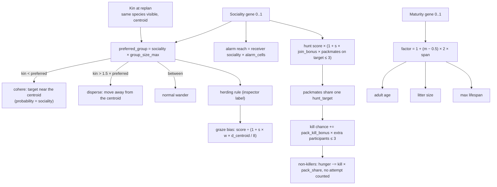

# C8 — Sociality and maturity: herds, packs and life history

Back to the [roadmap](README.md). Previous: [C7](c7-disease-and-parasites.md).

> **Status: implemented (2026-09-13), not independently validated.** This document was written
> *from* the implementation rather than before it, so every requirement below describes what is
> in the tree, not a plan the tree was built to. The mechanics are unit-tested; there is **no
> `tests/social.rs`, no balance table and no acceptance run**, and the *Measured today* table
> under Acceptance records that honestly. Known gaps are listed at the end.

## Goal
Make group living an evolved strategy rather than a scripted behaviour. A new genome slot,
**Sociality**, gives each animal a preferred group size: social prey cohere into herds, bias
their grazing toward the group and pass alarms to nearby kin; social predators join a
packmate's target and share the kill. A second slot, **Maturity**, moves the whole life history
— adult age, litter size and maximum lifespan — with one multiplicative dial, so the species
browser reads an r-versus-K shift from a single drift line. Both traits are inherited and
mutated like every other slot and are visible in the genome rows the player already reads.

## Checkpoint (what the user sees)
A social deer walks toward the nearest same-species cluster until the group reaches its
preferred size, then turns away from it; a hare, whose sociality starts below the cohesion
gate, never herds at all. A fox that flushes one deer sees the alarm pass to the deer beside it
a tick later, while an asocial neighbour ignores it. Two wolves on one deer bring it down more
often than either would alone, and the second wolf eats without its kill count moving. In the
species browser the `Soc` column separates the herd species (deer, wolf) from the solitary ones
(hare, fox, lynx), and over a long run `Soc` drifts where herding pays. The `Mat` drift row
reads as a life-history direction: rising means later, larger litters (K), falling means
earlier, smaller litters (r).

## Scope

### In
- Genome slots 9 and 10, **Sociality** and **Maturity**: `N_TRAITS = 11`, names, abbreviations,
  indices, accessors, base genomes, founder jitter, inheritance and mutation unchanged, and the
  S03/S04/S08 loops that draw the genome.
- `sim::params::SocialParams` — the `[social]` table, eight tunables with field docs.
- Maturity spans in `[genetics]`: `maturity_age_span`, `maturity_litter_span`,
  `maturity_lifespan_span`.
- `sim::behavior::perception::Kin` and `kin_summary`, and `Creature.kin_nearby`.
- Herd/pack **cohesion** in `wander`/`patrol` (join, neutral band, disperse) behind the shared
  `SocialParams::herding` rule.
- Herd **grazing bias** in the `perceive` graze score (`graze_cohesion_w`).
- **Alarm propagation** among same-species prey in `mark_threats` (`alarm_cells`, gated by the
  receiver's own sociality).
- **Pack hunting**: joining a packmate's target in `pick_hunt_target`, and the kill bonus,
  kill sharing and faster carcass consumption in `hunt_contacts`/`resolve_kill`.
- **Maturity** scaling of `adult_age_days`, `max_age_days` and `litter_size`.
- S03 genome rows and Derived fields; S04a trait columns; S04b histograms, drift rows and the
  r/K Selection-pressure sentence.
- Save format v3 (`OlderVersion` for pre-C8 files) and a checksum re-baseline.

### Out
- **Any group or pack entity.** There is no pack id, name, membership, leader or lifecycle.
  A pack is a per-tick spatial fact — shared `hunt_target` plus visible `kin_nearby` — never an
  object. (Follow-up: *pack identity tracking*, [feature ideas](../feature-ideas.md).)
- **Group-size / mean-pack-size statistics.** Nothing counts how large herds get or how often
  packs form; `--summary` still reports only speed and resistance means. (Follow-up: *group-size
  and mean-pack-size statistics*.)
- **A sociality or pack map overlay**, and any drawing of pack bonds or kin links on the map.
  The only map signal remains the S02f species-density cluster.
- Coordinated hunting behaviour: no encircling, driving or alternating chases. Packmates
  converge only because they independently pick the same target.
- Alarm calls that change the caller's behaviour (it was already fleeing), carry a cost, or
  chain: an alarm is exactly one hop from a prey that has a threat.
- Kin recognition beyond "same species visible at the last replan". No relatedness term enters
  any social decision; C4's parents/siblings remain a display-only fact.
- Group defence, cooperative breeding, alloparenting or shared dens (dens are C5/Vole-refuge
  territory and pack dens remain the top candidate in [feature ideas](../feature-ideas.md)).
- Any save migration: pre-C8 (v2) files are refused, not converted.

## Dependencies
- [C4](c4-evolution.md): the genome, random-parent inheritance, mutation events, the
  `follow_mother` step that cohesion must not override, and the maturity hooks in FR4.
- [C5](c5-predators.md): sense ranges, the threat scan, `hunt_target`/`hunt_phase`, the hunt
  contact pass and the migration group word.
- [C7](c7-disease-and-parasites.md): the genome was already widened to nine and the save-version
  pattern established; `[social]` sits beside `[disease]`, and pack kills interact with the
  sick-prey kill bonus.
- [C6](c6-persistence-and-balance.md): parameter overlays and `--dump-params`, presets, the
  headless runner and `--profile`, and the save/load path the version bump rides on.
- Screen requirements: [S03](../screens/s03-creature-inspector.md) and
  [S04](../screens/s04-species-browser.md); their docs are updated in the same commit as the
  screens.
- Balance context: the [C5](c5-predators.md) fox/vole population bands are still open, and pack
  hunting makes predators more efficient, so any C8 balance claim must be measured against the
  same seed with sociality neutralised (`social.group_size_max = 0`). That control does not
  exist yet as a test.

## Model overview



| | Sociality | Maturity |
|---|---|---|
| Slot | 9 (`IDX_SOCIALITY`) | 10 (`IDX_MATURITY`) |
| Acts on | movement target, graze score, alarms, hunt target, kill share | adult age, litter size, max lifespan |
| Neutral value | none (no herding below `cohesion_min`) | 0.5 reproduces the pre-C8 numbers exactly |
| Read in | S03 `kin nearby N (herd\|pack)`, S04a `Soc`, S04b histogram/drift | S03 `adult at`/`max lifespan`/`litter size`, S04a `Mat`, S04b r/K line |
| Base genomes | vole 0.35, hare 0.25, deer 0.70, fox 0.15, wolf 0.70, lynx 0.10 | 0.5 for all six |

With the default `cohesion_min = 0.30`, the base genomes make deer and wolves the herd/pack
species; voles are loosely social (preferred group 4.2, dispersal above 6); and hares, foxes and
lynxes sit below the gate and never herd unless selection raises them.

## Functional requirements

### FR1 Genome slots 9 and 10
- `N_TRAITS = 11`, `Genome::LEN = N_TRAITS`; `IDX_SOCIALITY = 9`, `IDX_MATURITY = 10`,
  `IDX_RESISTANCE = 8` unchanged. `TRAIT_NAMES[9] = "Sociality"`, `[10] = "Maturity"`;
  `TRAIT_ABBR` (`Soc`, `Mat`) stays exactly three cells per abbreviation (S04 columns and
  headers are built from it, never hand-typed).
- Accessors `sociality()` and `maturity()`; every "trait count" site loops `Genome::LEN`
  (`species.rs` tests, `stats::Hist`, `stats::census`, `genetics::inherit`, `place_founders`,
  `Series::to_csv`, S03/S04/S08).
- Base genomes appended in slot order: vole `0.35`, hare `0.25`, deer `0.70`, fox `0.15`,
  wolf `0.70`, lynx `0.10` for Sociality; `0.5` everywhere for Maturity (a `species.rs` test
  asserts the 0.5).
- Founders jitter every trait with `N(0, 0.12)`, except Resistance (`resistance_founder_sd`
  0.20). Maturity therefore starts *near* 0.5, not exactly at it, and Sociality can start on
  either side of `cohesion_min`.
- Inheritance and mutation are untouched: random parent plus `N(0, mutation_strength)`, clamped
  `0.02..=0.98`; Sociality and Maturity mutations appear in `Mutation`, the `§` markers and the
  notable rule like any trait. `inherit_covers_every_slot` guards the wiring.
- Trait colours: Sociality `theme::HARE` (hare colour), Maturity `theme::SEED` (seed colour),
  used wherever `trait_color(t)` appears.

### FR2 Params (`[social]`, plus maturity spans in `[genetics]`)
```toml
[social]
group_size_max = 12.0      # preferred group size = sociality × this, herds and packs alike
cohesion_min = 0.30        # below this sociality a creature never herds: it wanders as before
graze_cohesion_w = 1.0     # graze score ÷ (1 + sociality × w × dist_to_kin_centroid / 8)
alarm_cells = 6.0          # a fleeing prey alerts same-species kin within sociality × this
pack_join_bonus = 1.5      # hunt score × (1 + sociality × bonus × packmates_on_target ≤ 3)
pack_kill_bonus = 0.08     # kill chance += bonus × extra participants ≤ 3
pack_share = 0.5           # hunger relief a non-killer participant gets, as a share of a kill
pack_share_cheb = 6        # a participant is a same-species hunter on that prey within this

[genetics]
maturity_age_span = 0.5        # adult age   × maturity factor
maturity_litter_span = 0.5     # litter size × maturity factor
maturity_lifespan_span = 0.25  # max lifespan × maturity factor
```
`SocialParams` is `#[serde(default, deny_unknown_fields)]` and every leaf has a `field_docs`
entry (the C6 test enforces it), so `--dump-params` documents the table. Two derived helpers
are the single source of truth shared by behaviour and the inspector:
- `preferred_group(sociality) = sociality × group_size_max`.
- `herding(sociality, kin_count) = sociality ≥ cohesion_min ∧ kin_count > 0 ∧
  kin_count ≤ 1.5 × preferred_group(sociality)`.
- `GeneticsParams::maturity_factor(maturity, span) = 1 + (maturity − 0.5) × 2 × span`, exactly
  `1.0` at 0.5 (`maturity_factor_is_neutral_at_half`).

No preset was added for C8; the levers are reachable by `--params` and `--dump-params`.

### FR3 Kin at replan
```rust
pub struct Kin { pub count: u8, pub cx: f32, pub cy: f32 }  // centroid rounded on use
```
`perceive` returns `(Perception, Kin)`; `kin_summary` counts living, same-species neighbours in
the perception id list via the per-tick `TickView`, skipping self. It adds **no spatial query**
and no per-creature allocation beyond a sort of an already-sorted list, following the C6
performance rule. Both `replan_prey` and `replan_predator` store `c.kin_nearby = kin.count`;
the same `kin` value is then passed to `wander`/`patrol`.

`kin_nearby` therefore means "same-species neighbours visible at the last replan", is up to
`replan_ticks` stale, excludes self, and is **not** relatedness. C4's parents/siblings remain a
separate, display-only fact (S03 Life "Kin nearby", S01e Family).

### FR4 Cohesion (C8 FR2, the headline mechanic)
`wander` — used by prey `Wander` and predator `Patrol` — tries the C4 mother-follow step first,
then `cohesion_target`:
- No kin, or `sociality < cohesion_min` → `None`, and the pre-C8 random walk runs unchanged.
- `kin < preferred_group` → **join**: with probability `sociality`, target a walkable cell within
  ±2 of the kin centroid (`find_walkable_near` fallback), so weak sociality means a hesitant
  joiner rather than a follower.
- `kin > 1.5 × preferred_group` → **disperse**: target 5 cells away from the centroid.
- In between → `None`: the neutral band, so a group at its preferred size neither grows nor
  collapses.
Because only `wander`/`patrol` consult kin, a hungry or thirsty animal still services its need
first; herding never overrides drinking, grazing, resting, mating or fleeing. Juveniles still
follow their mother before the herd.

### FR5 Herd grazing (no new vegetation code)
In `perceive`, when `herding`, the graze score below becomes
`score ÷ (1 + sociality × graze_cohesion_w × dist(cell, kin centroid) / 8)`. A herd therefore
concentrates on the same cells and can graze them down, which is the trait's only intrinsic
cost. The bias acts only on target choice inside sense range; grazing itself is unchanged.

### FR6 Alarm propagation
After the predator-first detection pass, `propagate_alarms` walks the prey that hold a threat
and queries prey within `reach = cast!(alarm_cells => u16)` cells (6 by default, a bucket-bounded
`spatial.for_each_within`, like the threat scan). A neighbour `q` is alerted when it is the same
species, not already threatened, and `dist(sender, q) ≤ q.sociality × alarm_cells`: **the
receiver's sociality gates the alarm**, so an asocial animal cannot be dragged along by a social
neighbour. An alerted prey gets `threatened_by = (threat x, y, threat species)` and `dist = 0.0`
— an alarm is explicitly not a detection. Alarms are one hop (alerted prey are not re-scanned as
senders in the same pass), emit no event and cost nothing.

### FR7 Pack hunting
- **Join (`pick_hunt_target`).** Scan the perception ids for same-species peers, tally the prey
  each is already hunting, and for a prey targeted by a packmate skip the detection roll
  entirely. Score = `preference × (1 + sociality × pack_join_bonus × min(packed, 3)) / (1 + d/4)`.
  This is what seeds pack hunting: the pack's target beats a nearer unseen prey, and without the
  bonus the nearer visible prey wins.
- **Kill (`hunt_contacts`).** `pack_participants` are living same-species hunters, not eating,
  on the same `hunt_target`, within `pack_share_cheb` (6) of the prey, excluding the killer.
  `extra = participants.len().min(3)`; `chance = (kill_chance + sick_bonus +
  pack_kill_bonus × extra).clamp(kill_min, kill_max)`. The kill bonus is **not** scaled by
  sociality: two hunters that independently converge on one prey cooperate whether or not either
  is social.
- **Share (`join_kill`).** Each participant gets `hunger −= hunger_per_kill(prey_size) ×
  pack_share` (0.5 of a full meal), its hunt cooldown reset, phase back to `Stalk`, goal
  `Patrol`. Sharing is deliberately **not** `fail_hunt`: it never increments `attempts` and never
  credits `kills`, so `kill_chance` stays the single measure of hunting skill. The carcass is
  also consumed faster: `decay += kill_consumes_decay × (1 + pack_share × extra)`.
- There is no persistent pack: participants are recomputed at the kill from current state, so a
  pack exists only while its members share a target.

### FR8 Maturity
One factor, three applications, all `materialised per individual`:
- `adult_age_days(species, genome, cp, gp) = round(base × factor(maturity, age_span))`.
- `max_age_days(genome, cp, gp) = round(base × factor(maturity, lifespan_span))`.
- `litter_size(species, fertility × disease fertility factor, maturity) =
  1 + round(fertility × litter_max × factor(maturity, litter_span))`.

High maturity is later, larger and longer (K); low is earlier, smaller and shorter (r); 0.5
reproduces the pre-C8 numbers exactly. S04b's Selection-pressure sentence for the trait names
the direction: `Maturity rising (+0.04 over 6 generations): later, larger litters (K)`.

### FR9 Stats, series and CSV
- `stats::census` means/min/max and `SpeciesStats.hist[11][12]` cover both traits; the S04b grid
  and the drift rows iterate `Genome::LEN`.
- `Series::to_csv` gains `<species>_sociality_mean` and `<species>_maturity_mean` automatically
  from `TRAIT_NAMES` (prey species only, as for every trait).
- **Not added:** `--summary` columns. `summary_row` still reports only `speed_<species>` and
  `resistance_<species>`, so a sweep cannot currently read sociality or maturity (gap).
- `checksum()` does not feed the genome directly; the value was re-baselined to
  `0x348e_3c6e_eec2_e6d6` because founder placement draws two more gaussians per founder and
  every downstream draw shifts.

### FR10 Save format
`save::VERSION = 3`. A pre-C8 file (v2) fails with
`SaveError::OlderVersion { found: 2, supported: 3 }` and the message *"save is from an older
version (2, now 3): the genome format changed, so it cannot be loaded"*; a newer file still
fails with `VersionMismatch`. `read_header`/`list_saves` still parse the older header, so the
Load World list can show the file and let the player try it. No migration code exists or is
planned.

### FR11 Screens
- **S03 Creature Inspector.** The Genome column draws eleven trait rows (Sociality in the hare
  colour, Maturity in the seed colour) with own value, delta and species range. The Derived
  table adds `adult at`, `max lifespan`, `litter size (fert f, mat m)` and
  `kin nearby N (herd|pack|scattered|alone)`, the last from `SocialParams::herding`. The Life
  column's Kin-nearby list is C4's relatives, unchanged.
- **S04 Species browser.** S04a gains the `Soc` and `Mat` columns in `TRAIT_ABBR` order (the row
  is at the 153-column edge and the sparkline slot was trimmed to fit). S04b draws eleven
  histograms on a 3 × 4 grid of 25-column blocks (23-wide histograms, 7 rows per block), eleven
  drift sparkline rows and eleven per-generation mean rows, and the Selection-pressure section
  names the r/K direction for Maturity.
- **No new overlay, key, glyph or event kind.** S11 is unchanged because C8 adds no map mark and
  no event; S02's overlay list still ends at `9 parasites`.

### FR12 Tooling
None added. There is no `examples/bench_social.rs`, no `--profile` row and no `--summary`
column, so C8 currently has no headless experiment path of its own.

## Acceptance criteria (proposed — not yet run)
Because C8 shipped ahead of a plan, these are the criteria a validation pass should adopt; the
*Measured today* table says which hold now.
- **Determinism**: the full suite stays green, the checksum lock holds at `0x348e…e6d6`, and the
  v3 save round trip is byte-stable.
- **Genome wiring**: eleven slots everywhere, `inherit_covers_every_slot`,
  `TRAIT_ABBR` exactly three cells, base maturity 0.5.
- **Herding is real**: on the default world over 2 years, mean nearest-same-species-neighbour
  distance for deer and wolves is lower than in a `social.group_size_max = 0` control of the
  same seed, and the mean group size sits between 1 and `1.5 × preferred_group`.
- **Alarms matter**: a prey whose social neighbour sees a predator flees more often than the
  same prey with `alarm_cells = 0`, measured per species over a fixed seed.
- **Packs pay**: wolves' kills per attempt with the default social table exceed the
  `group_size_max = 0` control, and the mean number of wolves that share a carcass is > 1.
- **Selection**: Sociality rises in a majority of seeds where herding is viable and does not sit
  at the 0.98 clamp; Maturity drifts in both directions across presets.
- **Performance**: the cohesion step adds no spatial query and the alarm pass stays
  bucket-bounded; `--profile` shows < 5 % `step_ns` change against the social-neutral control at
  1 000 creatures.
- **UI**: S03 draws eleven genome rows, S04a eleven trait columns and S04b eleven histograms at
  155×45 with no overflow; every glyph still passes the CP437 test.

### Measured today
| Criterion | Result |
|-----------|--------|
| Determinism, checksum lock | **pass** — lock re-baselined to `0x348e_3c6e_eec2_e6d6` |
| Save round trip and v3 version guards | **pass** (`older_version_rejected`, `version_mismatch_rejected`) |
| Genome wiring (eleven slots, every slot inherited, abbreviations) | **pass** (unit) |
| Herding rule and cohesion | **pass** (unit: social joins, asocial identical with and without kin) |
| Alarm propagation | **pass** (unit: social kin alerted, asocial kin not) |
| Pack join and kill sharing | **pass** (unit: shared target picked, participant fed, no extra attempt) |
| Maturity scaling and neutral 0.5 | **pass** (unit) |
| Population-level herding / alarm / pack effects | **not measured** — no integration test |
| Sociality and Maturity selection over years | **not measured** |
| Group-size / mean-pack-size statistics | **not implemented** |
| C8 UI render tests | **not implemented**; S03a/S04a/S04b renders are current by eye |
| Performance share of the C8 passes | **not measured** separately |

## Checkpoint demo script
1. New world (Balanced), x25. `s` → S04a: the `Soc` column reads deer and wolf ≈ 0.70 with hare,
   fox and lynx below 0.30. `Enter` → S04b: the Sociality histogram sits well right of the
   hare's; the Maturity histograms are centred on 0.50.
2. `k`, cursor on a deer inside a group, `Enter` → S03. The Genome column ends with Sociality and
   Maturity; Derived shows `kin nearby 5 (herd)`. `Esc`, find a lone hare, `Enter`: the derived
   word is `scattered` because a hare is below `cohesion_min`.
3. `f` a deer at x1 and watch its target: it turns toward the nearest same-species cluster while
   the group is under its preferred size, wanders normally inside the band, and turns away once
   the group exceeds 1.5 × preferred.
4. `4` (sense) on a wolf with a second wolf in view on the same deer: the first wolf's target is
   the pack's target. `f` one of them and watch `kills N attempts M`; after the kill the
   packmate's hunger drops while its own kill count stays put.
5. `s` → S04b after several generations: the `Mat` drift row and the Selection-pressure line,
   e.g. `Maturity rising …: later, larger litters (K)`.
6. `e` → S07: a group migration still reads `A pack of 4 wolves migrated …` (the C5 group word,
   which is a size word, not evidence of a pack).
7. `cargo run --release -- --headless --seeds 1-10 --years 3 --summary` writes `summary.csv`;
   note that it carries **no** sociality or maturity column — the tooling gap below.

## Tests
- `sim::behavior::tests_social::{alarm_spreads_to_social_kin_only,
  cohesion_pulls_the_social_and_leaves_the_asocial_alone, pack_joins_the_shared_target,
  pack_shares_the_kill}` — the four mechanic tests; fixtures in
  `sim::behavior::tests::{pack_fixture, wolf_and_sighted_prey, all_grass_world, test_creature}`.
- `sim::params::tests::{social_defaults_documented, maturity_factor_is_neutral_at_half}`.
- `sim::genetics::tests::{inherit_covers_every_slot, maturity_scales_adult_age_litter_and_lifespan,
  maturity_switch}`.
- `sim::species` test asserting the accessors and `maturity() == 0.5` on every base genome.
- `sim::tests::checksum_is_fnv_stable` (re-baselined) and `sim::save::tests::{older_version_rejected,
  version_mismatch_rejected, round_trip_checksum_3_seeds}`.
- **Missing:** any `sim::stats` test for the new CSV columns, any UI render test, and any
  `tests/social.rs` acceptance suite.

## Implementation order (as built)
1. **Genome widening** — `species.rs` (`N_TRAITS = 11`, names, abbreviations, indices,
   accessors, base genomes), `stats.rs` (`Hist`, census, CSV), `genetics::inherit`,
   `place_founders`, S03/S04/S08 loops, `trait_color(9|10)`, checksum re-baseline.
2. **Params** — `SocialParams` and its `field_docs`, the three maturity spans, `Params.social`,
   `--dump-params` round trip.
3. **Kin** — `Kin`, `kin_summary`, the `perceive` return type, `Creature.kin_nearby`.
4. **Cohesion** — `cohesion_target` in `wander`, reached by prey `Wander` and predator `Patrol`;
   the shared `herding` rule.
5. **Grazing** — the centroid divisor in the graze score.
6. **Alarms** — `propagate_alarms` inside `mark_threats`.
7. **Packs** — the join tally in `pick_hunt_target`, `pack_participants` and the kill/share
   changes in `hunt_contacts`/`resolve_kill`.
8. **Maturity** — `adult_age_days`, `max_age_days`, `litter_size` and the call sites.
9. **Save** — `VERSION = 3`, `SaveError::OlderVersion`, load/list paths.
10. **Screens** — S03 Derived and genome rows, S04a columns, S04b grid and drift, the r/K
    sentence; S03/S04 screen docs updated.

## Decisions made here
- **One preference trait, not separate herd and pack traits.** `preferred_group` and `herding`
  drive prey herds, predator packs and the inspector label, so the simulation's rule and the
  label the player reads cannot disagree.
- **Groups are spatial facts, not entities.** `kin_nearby` plus a shared `hunt_target` are
  recomputed every tick, so there is no pack lifecycle to serialise and no identity to keep
  stable across a save — at the cost of the pack having no name or continuity (see gaps).
- **Depth over width.** `Kin` rides the existing perception list and `TickView` rather than
  issuing a spatial query per creature, and alarm propagation is one bucket-bounded pass in the
  style of the predator-first threat scan.
- **The receiver's sociality gates an alarm.** Hearing is a property of the listener, so an
  asocial animal is never dragged along by a social neighbour.
- **Cohesion yields to need and to C4.** Only `wander`/`patrol` consult kin, and mother-follow
  runs first, so drinking, grazing, resting, mating and fleeing are untouched.
- **Pack rewards are not attempts.** Sharing never increments `attempts` and never credits
  `kills`, keeping `kill_chance` the single measure of hunting skill.
- **The kill bonus is not scaled by sociality.** Cooperation is a property of the encounter
  (two hunters on one prey), while *joining* the shared target is what sociality buys.
- **Maturity is one shared multiplicative factor**, neutral at 0.5, so the pre-C8 balance is
  reproduced exactly and a single drift line reads as an r/K shift.
- **No new overlay, event, glyph or preset.** C8 is a genome and behaviour chunk; the S02f
  density overlay already makes a herd visible as a bright cluster.
- **Compatibility is never preserved**: the genome widened, so v3 refuses v2 with a named
  `OlderVersion` error rather than a decode failure.

## Risks
- **Sociality ratchets to the 0.98 clamp.** Its only cost is grazing the group's cells down, and
  there is no explicit crowding penalty or acceptance criterion to catch saturation. A cost term
  (or at least a selection test with a ceiling) is the first thing a validation pass should add.
- **Packs push the open C5 fox/vole problem further.** Wolves and lynxes gain efficiency with no
  matching cost, and two hunters that converge on one prey get the bonus at any sociality, so
  the C5 population bands should be re-measured before C8 is called balanced.
- **`kin_nearby` is stale and coarse.** It is a replan-time count of same-species neighbours, so
  the S03 `(pack)` label and the cohesion decision can disagree with the current neighbourhood by
  a few ticks; it is also unrelated to actual kinship.
- **Alarms are free and one-hop.** No energy cost, no event, and an alerted prey receives a
  threat position with `dist = 0.0` it never sensed. That is deliberate (one hop keeps herds from
  cascading alerts across a region) but it means alarm range is bounded only by
  `sociality × alarm_cells`.
- **Layout pressure.** This is the third genome widening; S04a is at the 153-column edge, S04b
  uses a 3 × 4 grid, and S03 pushes the Offspring forecast toward the panel bottom. A twelfth
  trait will not fit without a redesign of S03's genome column or S04a's row.
- **Performance.** Cohesion is cheap, but `pack_participants` scans every living creature once per
  kill contact, so the cost is O(kill contacts × population) when many hunters share a target.
  The C6 budget is measured at 1 000 creatures and has no C8 profile row.
- **The event log's "pack" is a size word.** `Migration` says `pack` for any predator group above
  three members (C5), whether or not its members ever hunted together, so the log cannot be used
  as evidence that packs formed.

## Known gaps and follow-ups
Recorded in [feature ideas](../feature-ideas.md) unless noted:
- **Group-size and mean-pack-size statistics** — per-species mean/max group size and a pack-size
  distribution; the numbers that would let the C5 bands be asserted in the headless runner.
- **Pack identity tracking** — a persistent pack record (members, leader, tag, formed/dissolved
  events) for the inspector, lineage screen and map. The stable group that the top
  [dens](../feature-ideas.md) idea and territory marking both need.
- **A sociality or pack map overlay** — the per-creature `kin_nearby`/sociality data already
  exists; only the rendering does not.
- **`--summary` columns for sociality and maturity**, and a `tests/social.rs` acceptance suite
  with a `group_size_max = 0` control plus a `bench_social` example.
