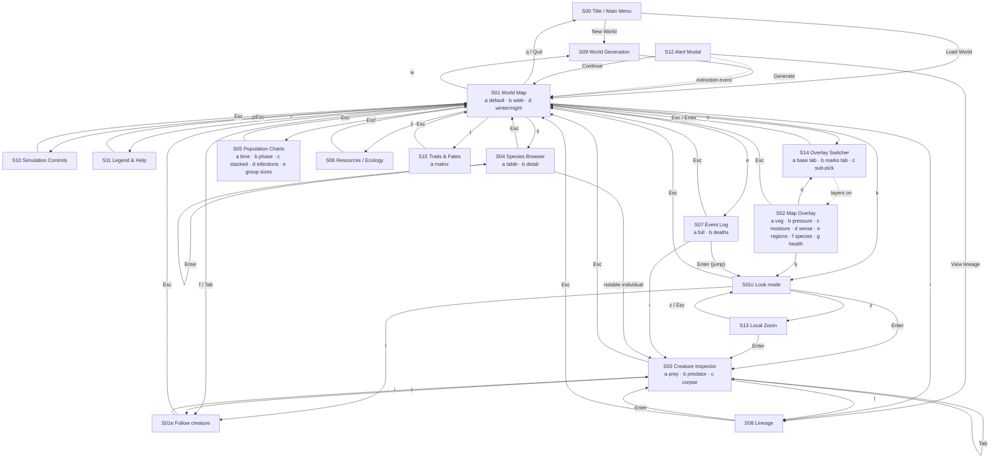
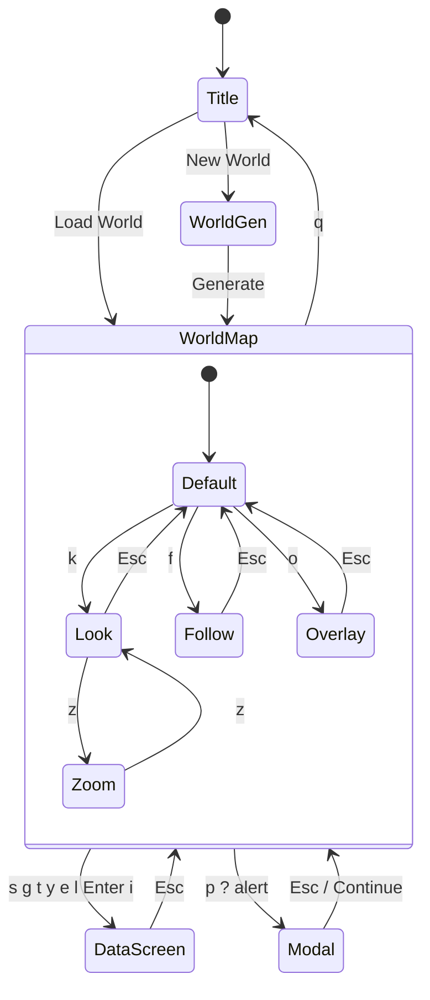

# Sim Fortress — Screen Overview

This document lists every screen in the Sim Fortress UI, its sub-screens (variants), and
how the screens connect. Each screen has its own requirements file, linked from the
tables below. Conventions shared by all screens (frame size, glyph rules, widgets) are in
[../PROTOTYPE_GUIDE.md](../PROTOTYPE_GUIDE.md); the reusable pieces screens are built
from (panels, dividers, bars, tables, inputs) are specified in
[../components/README.md](../components/README.md); the plan that produced the prototypes is
summarised in the repository [README](../../README.md).

## Screen map

Prototype ids (`S01a`, `S03b`, …) are stable identifiers: the number is the screen, the
letter is the variant. The prototype binary shows the id on row 0.

| Id  | Screen                    | Requirements                                   | Variants                                                        |
|-----|---------------------------|------------------------------------------------|-----------------------------------------------------------------|
| S00 | Title / Main Menu         | [s00-title.md](s00-title.md)                   | a: default                                                      |
| S01 | World Map                 | [s01-world-map.md](s01-world-map.md)           | a: default · b: wide · c: look mode · d: winter/night · e: follow |
| S02 | Map Overlay               | [s02-map-overlay.md](s02-map-overlay.md)       | a: vegetation · b: pressure · c: moisture · d: sense range · e: regions · f: species density · g: health · h: disease · i: parasites |
| S03 | Creature Inspector        | [s03-creature-inspector.md](s03-creature-inspector.md) | a: prey · b: predator · c: corpse                        |
| S04 | Species Browser           | [s04-species-browser.md](s04-species-browser.md) | a: table · b: species detail                                  |
| S05 | Population Charts         | [s05-population-charts.md](s05-population-charts.md) | a: over time · b: phase plot · c: stacked area · d: infections · e: group sizes |
| S06 | Resources / Ecology       | [s06-ecology.md](s06-ecology.md)               | a: default                                                      |
| S07 | Event Log                 | [s07-event-log.md](s07-event-log.md)           | a: full log · b: deaths & extinctions with detail · c: chronicle |
| S08 | Lineage / Family Tree     | [s08-lineage.md](s08-lineage.md)               | a: focused creature                                             |
| S09 | World Generation          | [s09-world-generation.md](s09-world-generation.md) | a: new world form · b: species designer modal (AI)          |
| S10 | Simulation Controls       | [s10-simulation-controls.md](s10-simulation-controls.md) | a: modal over the map                                 |
| S11 | Legend & Help             | [s11-legend-help.md](s11-legend-help.md)       | a: overlay over the map                                         |
| S12 | Alert Modal               | [s12-alert-modal.md](s12-alert-modal.md)       | a: extinction event · b: epidemic                                |
| S13 | Local Zoom View           | [s13-local-zoom.md](s13-local-zoom.md)         | a: 3×3 tiles around the cursor                                  |
| S14 | Overlay Switcher          | [s14-overlay-switcher.md](s14-overlay-switcher.md) | a: base heatmap tab · b: marks tab · c: sub-pick list         |
| S15 | Traits & Fates            | [s15-traits-fates.md](s15-traits-fates.md)     | a: trait × outcome matrix                                       |

## Screen families

- **Entry**: S00 Title, S09 World Generation.
- **Map family** (share the map panel, ticker row and status bar): S01 World Map, S02
  Overlays, S13 Local Zoom. Overlays and look/follow modes are *states* of the map rather
  than separate places.
- **Modals over the map** (map stays visible, dimmed): S10 Controls, S11 Help, S12 Alert;
  S14 Overlay Switcher (map stays undimmed as a live preview).
- **Data screens** (full-screen, replace the map): S03 Inspector, S04 Species, S05 Charts,
  S06 Ecology, S07 Event Log, S08 Lineage, S15 Traits & Fates.

## Navigation



Solid arrows are key presses; the dotted arrow is an event raised by the simulation.

## Screen stack model

Screens are organised as a stack. The world map is the root of the in-game stack; data
screens push on top of it and `Esc` pops back. Modals (S10–S12) push on top of *any*
screen but only the map family is drawn underneath them in the prototypes.



## Global key bindings

These keys work on every screen unless the screen's own requirements say otherwise.

| Key            | Action                                    |
|----------------|-------------------------------------------|
| `Esc`          | close modal / pop screen / leave mode     |
| `?`            | Legend & Help overlay (S11)               |
| `Space`        | pause / resume the simulation             |
| `+` `-`        | faster / slower                           |
| `.`            | step one tick (while paused)              |
| `s` `g` `t` `y` `e` `l` `w` | Species, Graphs, Traits & Fates, Ecology, Events, Lineage, World generation |
| `p`            | Simulation Controls modal (S10)           |
| `q`            | quit to title (confirmation on the title screen) |

Screens that use these letters for their own purposes (for example `s` = sort in S04)
document the override in their requirements file.

## Shared layout

Every screen is drawn in a fixed 155×45 frame:

| Rows    | Content                                                            |
|---------|--------------------------------------------------------------------|
| 0       | prototype header (id, name, variant) — dev-only, absent in the game |
| 1–42    | screen body (44 rows including the two below)                       |
| 43      | ticker row (latest event) on map-family screens                     |
| 44      | status bar: `[key] label` hints on the left, context on the right   |

The map family splits the body into a 112-column map panel and a 43-column sidebar. Data
screens choose their own columns but keep the status bar.

## Renders

`renders/<id>.txt` are text snapshots of the live screens: row 0 is the id/title line the
table above describes, rows 1–44 are the screen drawn over a deterministic one-year
`Sim` (seed 7) on a `ratatui::backend::TestBackend` at 155×45. The set is not regenerated
automatically; refresh the ones a change touches with

```bash
cargo test --lib -- --ignored regenerate_screen_renders
```

which rewrites `S03a.txt` (oldest living prey), `S04a.txt` and `S04b.txt` (a predator with
living members, else the most numerous species) and `S15a.txt` (the species with the most living members, all days).
