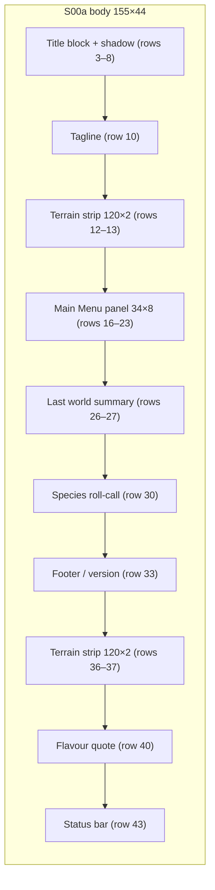

# S00 — Title / Main Menu

Back to the [screen overview](README.md).

Live since: C6

## Purpose
The first screen the player sees. It names the game, offers the four top-level actions
(new world, load world, options, quit) and reminds the player of the world they last
played by showing its name, date, population and inhabitants. It is also the only screen
that exists while no world is loaded, so it must render from saved-game metadata alone
(or from nothing at all on a fresh install).

## Variants
| Id   | Variant | When it is shown |
|------|---------|------------------|
| S00a | default | On launch, and after `q` / Quit from the world map ([S01 World Map](s01-world-map.md)). |

## Layout
Single-column, centred composition on the plain background; the only bordered panel is
the menu box. Rows are relative to the 155×44 body (row 0 of the body is directly under
the dev header).

| Rows  | Element                                   | Width / position                          |
|-------|-------------------------------------------|-------------------------------------------|
| 3–7   | Block-letter title "SIM FORTRESS"         | 82 columns (12 glyphs × 7 cells − 2), centred |
| 8     | Shadow line under the letters             | same width as the title                   |
| 10    | Tagline                                   | centred                                   |
| 12–13 | Decorative terrain strip (upper)          | 120 columns, centred                      |
| 16–23 | "Main Menu" panel (Focus border)          | 34 × 8, centred                           |
| 26–27 | Last-world summary (two lines)            | centred                                   |
| 30    | Species roll-call                         | centred                                   |
| 33    | Version / footer line                     | centred                                   |
| 36–37 | Decorative terrain strip (lower)          | 120 columns, centred                      |
| 40    | Flavour quote                             | centred                                   |
| 43    | Status bar                                | full width                                |

There is no ticker row on this screen.

## Content requirements
1. **Title block.** The words "SIM FORTRESS" rendered in a 5-row block-letter font built
   only from CP437 half/full blocks. Every letter is 5 cells wide with a 2-cell gap. The
   letters carry a vertical gradient from the title colour (top row) to the accent colour
   (bottom row) and are bold. A one-row light-shade line (`░`) directly beneath acts as
   a shadow.
2. **Tagline.** `predator · prey · evolution · scarcity`, italic, dim text.
3. **Terrain strips.** Two 2-row bands of real terrain glyphs sampled from the current
   (or last) world: the upper band from world rows 18–19, the lower from rows 30–31, both
   taking the central 120 columns of the 150-column world. Foreground and background are
   dimmed toward the screen background and fade to nothing over the outer 12 cells of each
   side so the band reads as decoration, not as a map. Source: world cells.
4. **Main Menu panel.** Titled "Main Menu", Focus (double-line) border, four entries in
   order: `New World`, `Load World`, `Options`, `Quit`. The selected entry is drawn in the
   selected style across the full inner width, prefixed with the play glyph `►`, and shows
   an `[Enter]` key hint right-aligned on the same row. Unselected entries use normal text.
   The prototype shows `New World` selected.
5. **Last-world summary, line 1.** `last world: <name>  · Year <y>  · <prey> prey / <pred>
   predators  · seed <hex>`. Name in the title style; prey/predator totals are sums of
   species counts by kind. Source: save-game metadata, species stats.
6. **Last-world summary, line 2.** `autosaved <clock label>  <season glyph> <season name>`
   where the clock label is `Year y, Day d of <Season>  hh:00`. Source: clock.
7. **Species roll-call.** `inhabitants` followed by one entry per species in the fixed
   species order: the species glyph (upper-case, in the species colour, bold), the plural
   name and the current count. Source: species stats.
8. **Footer.** `Sim Fortress v<version>  · ratatui · truecolor · CP437`; version in the
   label style.
9. **Flavour quote.** `♦ every creature you see is born, hunts, breeds and dies by the
   numbers in its genome ♦`, dim text.
10. **Status bar.** Key hints `[↑↓] select  [Enter] confirm  [q] quit`; right-hand context
    text `no world loaded`.

## Glyphs and colors
| Glyph / colour        | Meaning                                                |
|-----------------------|--------------------------------------------------------|
| `█ ▀ ▄`               | block-letter font of the title                         |
| `░`                   | shadow line under the title                            |
| `►`                   | marker on the selected menu entry                      |
| `·`                   | separator in the tagline and summary lines             |
| `♦`                   | decoration around the flavour quote                    |
| `V H D F W L`         | species glyphs in the roll-call, each in its species colour |
| terrain glyphs `≈ ~ · . , " ♣ ♠ ▲` | sampled world rows in the decorative strips, dimmed |
| season glyph `♪ ☼ ♫ *` | current season in the autosave line                   |
| TITLE → ACCENT gradient | title letters, top to bottom                         |
| KEY / SELECT_BG       | `[Enter]` hint and the highlighted menu row            |

## Interaction
| Key      | Action                                         | Goes to |
|----------|------------------------------------------------|---------|
| `↑` `↓`  | move the selection through the four menu entries (wrap or clamp: see open questions) | stays on S00 |
| `Enter`  | confirm `New World`                            | [S09 World Generation](s09-world-generation.md) |
| `Enter`  | confirm `Load World`                           | [S01 World Map](s01-world-map.md) with the last save loaded |
| `Enter`  | confirm `Options`                              | no screen exists yet (see open questions) |
| `Enter`  | confirm `Quit`                                 | exits the program |
| `q`      | quit                                           | exits the program after confirmation (the [README](README.md) says the confirmation lives on this screen) |

Global keys (`Space`, `+`/`-`, `.`, `s g y e w`, `?`) have nothing to act on because no
world is loaded; they must be ignored here rather than opening data screens.

## States and edge cases
- **No save file.** The last-world summary, autosave line and species roll-call depend on
  a saved world. When none exists they must be replaced (for example with a single dim
  `no saved worlds yet` line) and `Load World` should be shown disabled/dim and skipped by
  the selection. The terrain strips also come from a world; with none available draw a
  fixed decorative band or omit them.
- **Long world names.** The summary line is centred as a whole; a very long name pushes the
  line past 155 columns. Names must be truncated with `·` so the line still fits.
- **Extinct species.** The roll-call lists every species in the fixed order even if its
  count is 0; a count of 0 should be dimmed rather than omitted so the row keeps its shape.
- **Season colours.** The autosave line shows the season glyph but the strips are always
  drawn with the summer/day palette; no winter or night variant of the title exists.
- **Quit confirmation.** When a world is loaded and unsaved, `Quit` and `q` must prompt
  before exiting; the prototype does not draw this prompt.

## Open questions
- Does the menu selection wrap from `Quit` back to `New World`, or clamp at the ends?
- What does `Options` open? No options screen is in the screen map; either a screen id is
  needed or the entry should be removed until one exists.
- Is the world name `The Valley of Sunfall` and seed `0xC0FFEE` per save, and does
  `Load World` offer a list of saves or only the most recent autosave?
- The version string `v0.1.0-proto` is hard-coded in the prototype; it should come from
  the crate version.
- The tagline, flavour quote and footer are static copy; confirm final wording.
- Should `Load World` be hidden entirely, or shown dimmed, when there is no save?

Prototype reference: `src/prototypes/s00_title.rs`.
