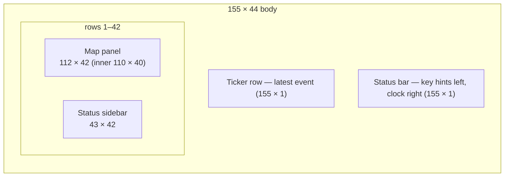

# S01 — World Map

Back to the [screen overview](README.md).

Live since: C1

## Purpose
The World Map is the home screen of a running simulation. The player watches creatures move
over terrain, reads the clock, season and population at a glance, and launches every other
screen from here. All map-family screens ([S02 overlays](s02-map-overlay.md),
[S13 local zoom](s13-local-zoom.md)) and all modals
([S10](s10-simulation-controls.md), [S11](s11-legend-help.md), [S12](s12-alert-modal.md))
are drawn on top of this layout.

## Variants
| Id   | Variant                    | When it is shown                                              |
|------|----------------------------|---------------------------------------------------------------|
| S01a | default                    | normal play                                                   |
| S01b | wide map, sidebar collapsed| player toggles the sidebar to see the whole 150-column world  |
| S01c | look / cursor mode         | after `k`; a cursor cell is selected and a tooltip describes it |
| S01d | winter, night              | same layout under the winter terrain palette and night tint   |
| S01e | following a creature       | after `f` on a creature; its trail, target and vitals are shown |

## Layout

- The map panel shows a **viewport** of the 150 × 40 world. The default origin is
  column 20 so the notable creatures are in view; the panel's right-hand title shows
  `x 20-129 of 150   ← → scroll`.
- **S01b** widens the map panel to 152 columns (inner 150, the whole world) and collapses the
  sidebar to a 3-column gutter labelled `«SIDEBAR»` vertically.
- The sidebar is a stack of sections separated by `── Section ──` rules: Clock, Population,
  Resources, a context section (Notable / Cursor / Following), and Legend.

## Content requirements
1. **Map panel** (see [PROTOTYPE_GUIDE](../PROTOTYPE_GUIDE.md) for the glyph vocabulary):
   1. Every cell draws its terrain glyph in the terrain foreground on the terrain
      background colour.
   2. Resources are drawn over terrain: regrowth `*`, dens `Ω` (bold), carcasses `%`.
   3. Living creatures draw their species letter (uppercase adult, lowercase juvenile) in
      the species colour; adults are bold. Dead creatures draw as `%` in the carcass colour.
   4. In **S01e** the followed creature's recent trail is drawn as `∙` fading from dim to
      bright toward the present, its movement target as `♦`, and the creature itself on an
      accent background.
   5. In **S01c** the cursor cell is inverted (black on white) and its four diagonal
      neighbours show `╬` corner marks.
   6. In **S01d** (winter) sand, dirt and sparse grass become snow `*`, grass loses
      saturation, shallow water becomes ice-blue; at night every colour is blue-shifted
      and darkened.
2. **Clock section**: year, day, season glyph + name in the season colour; hour with
   `☼ day` or `○ night`; speed as `►► x2  running` (or `││ paused`); tick counter with
   thousands separators.
3. **Population section**: one row per species: letter in species colour, name, count,
   trend arrow (`↑` green / `↓` red / `↔` dim), and an 18-cell `░▒▓█` sparkline of the
   last 30 days. A totals line: `prey N  pred N  ratio R:1`.
4. **Resources section**: vegetation and water as labelled bars with percentage;
   counts of carcasses, dens and regrowth sites. In winter an extra
   `! scarcity: N regions below forage line` warning line.
5. **Context section**:
   - default: "Notable" — the two notable creatures (letter, name, tag, short goal) and
     an at-risk species line prefixed `‼` in magenta.
   - S01c: "Cursor" — coordinates, region, terrain, elevation, vegetation, and a hint that
     `Enter` opens the inspector.
   - S01e: "Following" — name, tag, species, sex glyph, position and region, goal and
     target, four vital bars (health, hunger, thirst, energy; hunger/thirst inverted so
     high is red), and a danger line naming the stalking predator, its distance and
     whether the follower has detected it.
6. **Legend section**: terrain and resource glyphs in two columns, species letters
   (upper/lower) in species colours in two rows, and the `UPPER adult   lower juvenile` note.
7. **Look tooltip (S01c)**: a 34 × 9 focus-bordered panel placed to the right of (or left
   of, if it would overflow) the cursor: terrain glyph and name, region, vegetation and
   moisture bars, elevation and prey pressure, and up to three nearby creatures
   (letter, name, tag, goal). The panel must clear the map beneath it.
8. **Ticker row**: the newest event's kind glyph in the kind colour followed by its
   text, and `(e: full log)`. In winter the ticker carries the season notice instead.
9. **Status bar**: key hints on the left (see Interaction); on the right the clock label
   and `☼ day` / `○ night`.

## Glyphs and colors
| Element | Glyph | Colour |
|---------|-------|--------|
| terrain | `≈ ~ · . , " ♣ ♠ ▲` | terrain palette; snow `*` in winter |
| resources | `* Ω %` | seed green, den tan, carcass red-brown |
| creatures | `v h d f w l` / `V H D F W L` | species colours; prey warm neutrals, predators reds/oranges |
| cursor | inverted cell + `╬` corners | white on black |
| trail / target | `∙` / `♦` | trail yellow fading, accent |
| seasons | `♪ ☼ ♫ *` | spring green, summer yellow, autumn orange, winter ice-blue |
| day / night | `☼` / `○` | — |
| alerts | `!` `‼` | warn orange, magenta |

## Interaction
| Key | Action | Goes to |
|-----|--------|---------|
| `k` | enter look mode | S01c |
| `↑↓←→` (S01c) | move the cursor | — |
| `Enter` (S01c) | inspect the cursor cell's creature | [S03](s03-creature-inspector.md) |
| `f` (S01c) | follow the creature under the cursor | S01e |
| `z` (S01c) | zoom into the cursor area | [S13](s13-local-zoom.md) |
| `Esc` (S01c / S01e) | leave look / stop following | S01a |
| `i` (S01e) | inspect the followed creature | [S03](s03-creature-inspector.md) |
| `c` (S01e) | centre the viewport on the followed creature | — |
| `Tab` (S01e) | follow the next notable creature | — |
| `o`, `1`–`7` | open / switch overlays | [S02](s02-map-overlay.md) |
| `Space`, `+/-` | pause, change speed | — |
| `p` | open the controls modal | [S10](s10-simulation-controls.md) |
| `s` `g` `y` `e` `l` | species, graphs, ecology, events, lineage | [S04](s04-species-browser.md), [S05](s05-population-charts.md), [S06](s06-ecology.md), [S07](s07-event-log.md), [S08](s08-lineage.md) |
| `w` | world generation | [S09](s09-world-generation.md) |
| `?` | help overlay | [S11](s11-legend-help.md) |
| `←→` (map) | scroll the viewport | — |

## States and edge cases
- **Viewport clipping**: creatures, trails and cursor marks outside the viewport are not
  drawn; the viewport must never scroll past the world edge.
- **World narrower than the panel** (S01b): unused columns are painted with the frame
  background, not terrain.
- **Tooltip placement**: flips to the left of the cursor when it would overflow the map
  panel to the right, and above when it would overflow the bottom.
- **Long names**: sidebar rows are truncated to the section width; the goal text in
  "Notable" is cut at 17 characters.
- **Winter counts**: population and resource figures reflect the season (lower), and the
  scarcity warning appears.
- **Paused**: the speed line reads `││ paused`; the ticker keeps the last event.

## Open questions
- Should the sidebar collapse (S01b) be a toggle key or automatic when the terminal is
  wider than 155 columns?
- Trail length: the prototype shows ~12 positions; should it be time-based instead?
- The look tooltip and the sidebar "Cursor" section duplicate information; keep both or
  drop the sidebar section?
- Should `Tab` in follow mode cycle notable creatures only, or every living creature by
  distance?

Prototype reference: `src/prototypes/s01_map.rs`, `src/widgets/map.rs`.
