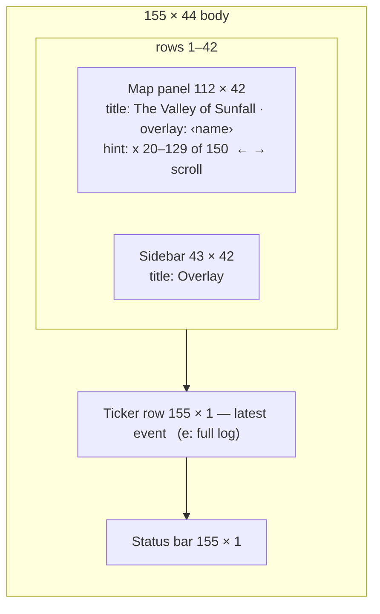

# S02 — Map Overlay

Back to the [screen overview](README.md).

Live since: C2

## Purpose
An overlay recolours the world map so one hidden quantity can be read at a glance across the
whole valley: how much forage is standing, where animals have been crowding, where water and
soil moisture lie, how far a chosen predator can perceive, where one species is massed,
which animals are in trouble, who is sick or immune, and where the ground is fouled with
parasites.
Overlays are a *state* of the
[S01 World Map](s01-world-map.md), not a separate place: the map keeps scrolling, the clock
keeps running, and the sidebar swaps from the status summary to an explanation of what the
colours mean. They are composed through the [S14 Overlay Switcher](s14-overlay-switcher.md):
one base heatmap (S02a/b/c/f/i) plus any number of marks (S02d/e/g/h). This file describes
each overlay on its own; S14 items 16–20 say how they combine. The player uses overlays to answer ecological questions ("why are the hares
starving here?", "can that wolf see the hare yet?") that the plain map cannot show.

## Variants
| Id   | Variant                            | When it is shown                                                        |
|------|------------------------------------|-------------------------------------------------------------------------|
| S02a | vegetation density                 | the Vegetation base is on in the S14 stack                               |
| S02b | population pressure                | the Pressure base is on                                                  |
| S02c | water & moisture                   | the Moisture base is on                                                  |
| S02d | sense range of selected predator   | the Sense mark is on; needs a living predator, `Tab` cycles the subject  |
| S02e | regions                            | the Regions mark is on                                                   |
| S02f | species density                    | the Species base is on; `Tab` cycles the species                         |
| S02g | health                             | the Health mark is on                                                    |
| S02h | disease                            | the Disease mark is on; `Tab` cycles the pathogen                        |
| S02i | parasites                          | the Parasites base is on                                                 |

Each variant is one layer on its own (the sidebars below are drawn with exactly one layer
on). With two or more layers the map composes them (S14 item 16) and the sidebar is the
compact form (S14 item 20).

S02a–c are **heatmaps**: every land cell is shaded by a 0–1 value. S02d is a **ring**: the map
keeps its normal terrain colours and one creature's perception radius is drawn on top. S02e is
a **tint**: terrain glyphs and colours stay, every region's background is blended toward that
region's own hue and its name is written across it. S02f is a **heatmap** too, but of a field
computed from the living creatures rather than a stored cell value. S02g is a **creature
tint**: the terrain is dimmed and every living creature is recoloured by its condition.
S02h is a creature tint too, on the S02g path, recolouring every living creature by its
infection state for one pathogen (or all). S02i is a **heatmap** of the stored
`cell.parasite_load`, with the creatures on top recoloured by their own load.

## Layout
Same frame split as the world map. Only the sidebar contents and the map title change.

| Panel        | Position (cols × rows) | Notes                                                              |
|--------------|------------------------|--------------------------------------------------------------------|
| Map panel    | 112 × 42, top-left      | double border; inner 110 × 40 shows the 150 × 40 world from origin x = 20 |
| Sidebar      | 43 × 42, top-right      | double border, titled `Overlay`; inner 41 × 40                      |
| Ticker row   | 155 × 1, row 43         | latest event, as on S01                                            |
| Status bar   | 155 × 1, row 44         | key hints left, clock right                                        |

The map panel title must append ` · overlay: vegetation` / `pressure` / `moisture` /
`sense range` / `regions` / the shown species' lowercase plural (`voles`, `wolves`) /
`health` / `disease` / `parasites` so the active overlay is named even when the sidebar is
collapsed.

## Content requirements

### Map panel — heatmaps (S02a–c)
1. **Per-cell value** `t` in 0..1, from the world cell:
   - Vegetation: the cell's standing vegetation.
   - Pressure: `min(1, 0.7 × predator traffic + 0.5 × prey traffic)` where both traffic
     values are the cell's recent visitation pressure.
   - Moisture: the cell's soil moisture, except that any water terrain (deep or shallow)
     counts as `1.0`.
2. **Shade glyph** from `t`: round `t × 4` to 0–4 and draw ` ` `░` `▒` `▓` `█`. The empty
   shade is replaced by the bare-dirt glyph `.` so an empty cell is still visibly a cell.
3. **Colour**: foreground is the overlay's ramp colour at `t`; background is the same colour
   dimmed 75 % toward the screen background, so the shade glyph reads as a tint on a darker
   field of the same hue.
4. **Exclusions**: on the vegetation and pressure overlays, deep water keeps its `≈` glyph
   dimmed 40 % and rock keeps its `▲` glyph dimmed 50 %; neither is shaded. On the moisture
   overlay water and rock are shaded like any other cell (water at 100 %).
5. **Resources and creatures stay visible but faded**: seeds, dens and carcasses are dimmed
   50 % and creature glyphs 55 % toward the background so the heatmap dominates. Adults stay
   bold; dead creatures still draw as `%`.
6. Night and winter palettes are not combined with a heatmap in the prototype (all four
   variants render a daytime, non-winter map).

### Map panel — sense ring (S02d)
7. Terrain, resources and creatures draw at full strength (no fade).
8. The selected creature's **radius** `r` in cells is `2 + floor(sense × 10)`, i.e. 2–12
   cells for a sense trait of 0–1.
9. Map cells are drawn 2:1 (a cell is twice as wide as it is tall), so distance from the
   selected creature is measured in an **ellipse metric**: `d = sqrt((dx / 2)² + dy²)`. The
   ring therefore spans `4r + 1` columns by `2r + 1` rows on screen and looks circular.
10. **Ring edge**: every in-bounds cell with `|d − r| < 0.55` is drawn with `°` in the accent
    colour, over resources but under creatures.
11. **Ring interior**: every cell with `d < r` has its background blended 18 % toward the
    accent colour, keeping the terrain glyph and foreground.
12. The selected creature itself is drawn in bright text colour (not its species colour) and
    bold, so it stands out in the middle of the tint.

### Map panel — regions (S02e)
10. **Tint**: each region rectangle's background is blended 30 % toward the region's colour
    (`theme::region(i)`, a categorical palette of eight hues); the selected region is blended
    50 % so it reads brighter. Terrain glyphs and foregrounds are unchanged; creatures and
    resources draw at full strength.
11. **Labels**: the region name, bold and bright, centred on the rectangle and clamped inside
    it; the selected region's label uses the selection style. Labels are drawn under creatures
    and are clipped, not shifted, at the viewport edge. Beneath them, every named feature
    except the ocean (lakes, rivers, ranges; `World.names`) is labelled in plain text at its
    anchor cell (a river's mid-stem, otherwise the member nearest the centroid); a feature
    label that would overlap a region label's row within its span is skipped, so region
    names always win.
12. Night and winter palettes are suppressed as for the heatmaps.

### Map panel — species density (S02f)
13. **Field**: one value `t` in 0..1 per world cell, recomputed every frame from the living
    creatures of the shown species. Each creature adds a kernel of radius `r = 3` cells in the
    same 2:1 ellipse metric as the sense ring, with linear falloff `1 − d / (r + 1)`, so one
    animal draws a soft 7-row by 13-column blob peaking at 1. The sum is clamped against a
    **fixed cap** of 6 creature-equivalents: `t = min(1, sum / 6)`. The cap is fixed rather
    than normalised to the frame's maximum so the picture is comparable across species and
    over time — a lone deer reads faint, a herd reads bright.
14. **Shade glyph and colour** as for the heatmaps (item 2), on the **species ramp**: the
    species' own colour from near-black (dimmed 85 %) through the full colour to a bright
    tint, so the hue itself names the species.
15. **Exclusions** as for the vegetation overlay: deep water keeps its dimmed `≈`, rock its
    dimmed `▲`.
16. **Creatures**: the shown species draws at full colour over its own density; every other
    species fades 55 % and resources 50 % as on the other heatmaps.

### Map panel — health (S02g)
17. **Condition**: for every living creature, the weakest of its four vitals, each read in
    0..1 with 1 best: health, fullness (`1 − hunger`), hydration (`1 − thirst`) and energy.
    Nothing is stored; it is read off the creatures every frame.
18. **Creature colour**: the species colour gives way to the vital-bar bands — good above
    60 %, warning 30–60 %, bad below 30 % — at full strength, adults still bold, so a red
    glyph anywhere on the map is an animal about to die. Carcasses keep `%` in the carcass
    colour; the followed creature keeps its accent highlight.
19. **Terrain**: glyphs and palette are unchanged (winter and night still apply) but both
    foreground and background are dimmed 60 % so the creature colours carry the picture.
    Resources fade 50 % as on the heatmaps.

### Map panel — disease (S02h)
20. **Terrain** as on the health overlay: glyphs and palette unchanged, foreground and
    background dimmed 60 %, resources faded 50 %. Cells with `parasite_load ≥ 0.25` get their
    background blended 18 % toward the warning colour, so fouled ground shows through.
21. **Creature colour**, read off every living creature each frame for the shown pathogen
    slot (or every slot when `all` is shown): infectious → `SICK` bold; incubating → `SICK`
    dimmed 40 %; immune to the shown pathogen (to any, when `all`) → `IMMUNE`; parasite load
    `≥ 0.5` → `WARN`; otherwise the species colour dimmed 55 %. An infection with a pathogen
    other than the shown one counts as healthy for this picture. Carcasses keep `%`; the
    followed creature keeps its accent highlight.
22. Opening with `8` shows `all`; the S12b epidemic alert's *Show outbreak* button opens the
    overlay on its pathogen and centres the viewport on the outbreak (`AppState::pending_overlay`,
    honoured by the next frame and taken by the next key).

### Map panel — parasites (S02i)
23. **Per-cell value** `t = cell.parasite_load` on the `theme::parasite(t)` ramp (dim olive →
    `WARN` → `BAD`), shade glyphs and the 75 % dimmed background as on the other heatmaps.
    Deep water keeps its dimmed `≈` and rock its dimmed `▲`, except that any water cell with a
    load above 0 draws `~` in `WARN` — shared drinking spots are the hot spots.
24. **Creatures** draw on top recoloured by their own load band: `< 0.2` species colour dimmed
    55 %, `0.2–0.5` `WARN`, `≥ 0.5` `BAD` bold; resources fade 50 %.

### Sidebar — heatmaps (S02a–c)
Sections from the top, in order; all fit in the 40 inner rows without scrolling.

13. **Overlay title and description** (3 rows): the overlay name as a section rule followed
    by two dim lines explaining the quantity:
    - Vegetation density — standing biomass per cell; prey graze it down, regrowth (`*`)
      restores it.
    - Population pressure — traffic of prey (×0.5) and predators (×0.7) through each cell
      over the last 30 days.
    - Water & moisture — soil moisture; open water is shown saturated; drives regrowth and
      thirst.
14. **Legend** (5 rows): a 32-cell colour ramp (indented 4) built from the same shade glyphs
    and ramp colours the map uses, so the legend is a true sample of the map; tick labels
    `0% 25% 50% 75% 100%` beneath; the low/high words `bare … lush`, `quiet … crowded`,
    `arid … wet`; and one note: `≈ deep water  ▲ rock (not shaded)` for vegetation and
    pressure, `open water counts as 100% moisture` for moisture.
15. **By region** (12 rows): one labelled bar per named region (eight drainage basins
    named per seed, e.g. `Northern Taiga`; the prototype fixture used Northmarch, Ashen
    Ridge, Sunfall Coast, Reedwater Vale, The Long Meadow, Lakeshore, Southern Thicket,
    Fenlands) showing the **mean cell value** over that region's cells, 18-column label,
    14-column bar, percentage; bar colour is the ramp at 0.8. Then world statistics over all
    6 000 cells: `mean / min / max` percentages; the count and share of cells at or above
    60 %; the highest region (good colour) and the lowest region (warning colour) by mean.
16. **Reading the map** (4 rows): dim notes that creatures and resources are faded and `Esc`
    restores them; the shade-glyph thresholds `░ <25%  ▒ <50%  ▓ <75%  █ ≥75%`.
17. **Stack** (3 rows with one layer on, S14 item 20): `─ Stack ─`, `1. ‹Name›  (base)`, and
    the dim hint `o edits the stack   Esc clears all`. Every overlay sidebar ends with it; the
    former nine-row Overlays selector is gone.

### Sidebar — regions (S02e)
- **Regions** (3 rows): two dim lines explaining that rain and drought are tracked per region
  and pointing at the `y` ecology screen.
- **By region** table: header, then one row per region: a two-cell swatch in the region's
  colour, name (16), vegetation mean and display moisture mean as percentages, and the S06
  status word in its colour. The selected row is highlighted with a `►` marker.
- **Selected** (5 rows): swatch and name, `x a–b  y c–d`, `N cells, M water`, `¡ drought` in
  the warning colour or `no drought` dim, and `Enter centres the map`.
- **Reading the map** (3 rows): tint = region, bright = selected; labels clip at the edge;
  `Esc` restores the plain map.
- The **Stack** section as item 17 (`1. Regions  (mark)`).

### Sidebar — species density (S02f)
Sections from the top, in order; exactly 40 rows.

- **‹Species› density** (3 rows): section rule, then two dim lines: `living ‹plural› within
  3 cells of a spot;` and `one animal reads faint, a herd bright.`
- **Legend** (6 rows): the 24-cell species ramp built from the map's shade glyphs, the
  `0% … 100%` ticks, `none … crowded`, and the note `100% ≈ 6 together  ≈ deep water  ▲ rock`.
- **By region** (11 rows): one row per region: name (16), a 12-column bar of that region's
  **share** of the species' living population, the raw count and the share as a percentage.
  Then `N alive ‹trend›  densest: ‹region›` where the trend is the 30-day arrow used on S01
  and the densest region has the most creatures per cell (dim `—` when the species is extinct).
- **Species** (9 rows): every species as `‹UPPER glyph› Name count`, glyph in the species
  colour, the shown row in the selection style with a `►` marker; `extinct` dim after a zero
  count; then the hint `Tab next  Shift+Tab previous`.
- **Reading the map** (4 rows): shown species bright, others faded; `Esc` restores the plain
  map; the shade-glyph thresholds.
- The **Stack** section as item 17 (`1. Species  (base)`).

### Sidebar — health (S02g)
Sections from the top, in order; 39 of the 40 rows.

- **Health** (3 rows): section rule, then two dim lines: `colour = each animal's weakest vital:`
  and `health, hunger, thirst or energy.`
- **Legend** (5 rows): three `███` swatches in the good / warning / bad colours labelled
  `healthy above 60%`, `strained 30–60%`, `critical below 30%`, then the note `terrain dimmed
  % carcass unchanged`.
- **By species** (9 rows): a dim header, one row per species — coloured upper-case glyph,
  name, living count, then the healthy / strained / critical counts in their band colours and
  the mean condition as a percentage (dim zeros and `—` for an extinct species) — and an
  `all` total row.
- **Weakest vital** (6 rows): `of the N strained or critical:` then one row each for
  `health`, `hunger`, `thirst`, `energy` with a 12-column warning-coloured bar of the share
  of unwell animals whose lowest vital it is, the count and the percentage.
- **Reading the map** (4 rows): colour is the animal, not the ground; `k` look / `Enter`
  inspects one animal; `Esc` restores the plain map.
- The **Stack** section as item 17 (`1. Health  (mark)`).

### Sidebar — disease (S02h)
Sections from the top, in order. The fixed sections take 24 rows plus one per pathogen slot
(at most 8); the rows left over separate the sections and lengthen the reading notes, so the
sidebar never overflows even with every slot filled.

- **Disease** (3 rows): section rule, then two lines naming the colours: `☻ sick` bright,
  `incubating` dim, `☺ immune` blue; `amber` = heavy worms, fouled ground tinted.
- **Pathogens** (1 + up to 8 rows): the rule reads `Pathogens · all` or `Pathogens · ‹name›`;
  one row per slot: `► ‹name›  act N  dead D  ‹status›` where the status is `dormant` (dim),
  `outbreak` (`SICK`), `EPIDEMIC` (`SICK` bold) or `extinct` (dim); the shown slot is in the
  selection style with the `►` marker. Strains are indented `└ ` under their parent and carry
  a `MAGENTA` `new` tag for 30 days after `born_day`. `Tab` / `Shift+Tab` cycle `all` → each
  live slot (extinct strains skipped), wrapping.
- **This outbreak** (6 rows): the shown pathogen's open outbreak, else its latest; for `all`
  the latest open outbreak of any pathogen, else the latest recorded. `‹Pathogen› began
  Year Y, Day D · day N` (or `· over after N d`), `origin ‹region›`, `index case ‹tag name›`,
  `cases N  deaths D  recovered R` in the sick / bad / good colours, and `today +N new ‹arrow›
  active A` with a 7-day arrow of the active count. `no outbreak recorded yet` when none.
- **By species** (8 rows): a dim header, then one row per species: coloured upper-case glyph,
  name, living count, sick (`SICK`, counting infections with the shown pathogen or any),
  immune (`IMMUNE`), `mean resist .xx` with `↑`/`↓`/`↔` against the species base Resistance.
- **Parasites** (3 rows): `mean load` per species as `‹glyph›.xx`, then `worst ground: ‹region›
  .xx` by mean cell load.
- **Reading the map** (1–3 rows): `colour = animal · amber ground = fouled` and `Tab pathogen ·
  k look · Esc restores map`; with all eight slots filled only the second note is shown,
  without its rule.
- The **Stack** section as item 17 (`1. Disease  (mark)`).

### Sidebar — parasites (S02i)
Sections from the top, in order; 35 of the 40 rows.

- **Parasites** (3 rows): section rule, then `worms build up where animals graze, drink` /
  `and rest; carcasses pass them on.`
- **Legend** (4 rows): the 24-cell parasite ramp built from the map's shade glyphs; `clean …
  fouled  ~ fouled water  ▲ rock`; and the creature bands `animals: dim <20%  amber <50%
  red ≥50%` in their colours.
- **By region** (10 rows): one labelled bar per region (18-column label, 14-column `WARN`
  bar, percentage) of the mean cell load over the rectangle, then `worst: ‹region›  N cells
  ≥25%`.
- **By species** (8 rows): a dim header, then one row per species: coloured glyph, name,
  living count, a 12-column `WARN` bar of the mean load, `.xx`, the `heavy` count (`≥ 0.5`,
  in `BAD` when non-zero) and `litter −N%` — the mean fertility penalty in effect,
  `parasite_fertility_w × mean load`.
- **Carriers** (4 rows): the three heaviest living carriers as `‹glyph› ‹tag› ‹name› .xx
  ‹region›`, the load in its band colour; `no carriers` when none.
- **Reading the map** (1 row, no rule): `k look = exact cell load · Esc restores`.
- The **Stack** section as item 17 (`1. Parasites (base)`), after one blank row.

### Sidebar — sense ring (S02d)
18. **Sense range** (3 rows): a two-line explanation that the ring is how far the selected
    creature can see, hear or smell other creatures.
19. **Selected** (7 rows), from the selected creature: bold glyph in bright text, `name tag`
    in title colour, species, life stage and sex glyph (`♂`/`♀`); position `(x, y)` and
    region name; current goal; a 20-column **sense** trait bar; `radius N cells` and
    `ring W×H on screen` (W = 4r + 1, H = 2r + 1); a note that map cells are 2:1 so the ring
    is oval.
20. **Inside the ring** (3 rows), computed with the same ellipse metric over living
    creatures other than the selected one, and over dens, carcasses and water cells within
    the ring: `N creatures: p prey (good) q predators (bad)`; a per-species tally
    `‹UPPER glyph› n Name` for every species present, or `nothing living in range`; and
    `Ω n dens  % n carcasses  ~ n water`.
21. **Detected prey** table (up to 11 rows): header `tag name dist camo status`; living prey
    inside the ring sorted by distance ascending, at most 8 rows, then `… and N more`. Each
    row shows species-coloured glyph, tag, name, distance to one decimal, camouflage to two
    decimals, and a status: **hidden** (dim) when the prey's camouflage exceeds 80 % of the
    selected creature's sense, **target** (accent) when it is the creature the predator is
    stalking, otherwise **seen** (good). When none, `no prey within range`.
22. **Reading the map** (4 rows): `°` ring edge, `W` selected creature, tinted cells are
    within sense range, `[Tab]` cycles through living predators.
23. The **Stack** section as item 17 (`1. Sense  (mark)`).

### Ticker and status bar
24. Ticker: glyph and colour of the newest event kind, its text, then dim `(e: full log)`.
25. Status bar right side: the clock label `Year Y, Day D of Season  HH:00` and `☼ day`.

## Glyphs and colors
| Glyph / colour                | Meaning                                                            |
|-------------------------------|--------------------------------------------------------------------|
| ` ` `░` `▒` `▓` `█`            | heatmap value bands 0, <25 %, <50 %, <75 %, ≥75 % (blank shown as `.`) |
| `.`                            | bare-dirt glyph standing in for the empty shade                    |
| `≈` dimmed, `▲` dimmed         | deep water and rock excluded from vegetation/pressure shading      |
| vegetation ramp               | brown → olive → green → bright green                               |
| species ramp                  | near-black → species colour → bright tint of it (S02f)             |
| good / warning / bad glyphs   | creature condition bands above 60 % / 30–60 % / below 30 % (S02g)  |
| dimmed terrain                | terrain under the health and disease overlays (60 % toward the background) |
| `SICK` bold / dim glyph       | infectious / incubating creature (S02h)                            |
| `IMMUNE` glyph                | creature immune to the shown pathogen (S02h)                       |
| `WARN` glyph                  | creature with parasite load ≥ 0.5 (S02h) or 0.2–0.5 (S02i)         |
| `BAD` bold glyph              | creature with parasite load ≥ 0.5 (S02i)                            |
| warning-tinted background     | cell with parasite load ≥ 0.25 under the disease overlay (18 % blend) |
| parasite ramp                 | dim olive → amber → red (S02i)                                     |
| `~` warning                   | water cell carrying a parasite load (S02i)                         |
| `└ ` / `new`                  | strain under its parent pathogen / born in the last 30 days (S02h) |
| heat ramp                     | navy → blue → green → yellow → orange → red                         |
| water ramp                    | tan → grey-green → blue → deep blue                                 |
| `°` accent                     | sense-ring edge                                                    |
| accent-tinted background       | cells inside the sense ring (18 % blend)                           |
| bright bold creature glyph    | the selected creature at the ring's centre                         |
| `*` `Ω` `%`                    | regrowth, den, carcass (faded on heatmaps)                         |
| `►`                            | selected row in the S02e region table and the S02f/S02h lists     |
| `♂` `♀`                        | sex of the selected creature                                       |
| good / warning colours        | highest / lowest region; prey / predator counts; seen / status     |
| `☼`                            | daytime marker in the status bar                                   |

## Interaction
Layers are turned on and off in the [S14 Overlay Switcher](s14-overlay-switcher.md); the
`1`–`9` keys are no longer bound on the map. The keys below are what the map itself keeps
while a layer is on. Status-bar hints differ between the heatmaps and the sense ring.

### S02a–c
| Key     | Action                                                  | Goes to |
|---------|---------------------------------------------------------|---------|
| `o`     | open the overlay switcher                               | [S14](s14-overlay-switcher.md) |
| `k`     | enter look mode with the overlay still active           | [S01c Look mode](s01-world-map.md) |
| `Space` | pause / resume                                          | stays here |
| `+` `-` | faster / slower                                         | stays here |
| `Esc`   | close the overlay, restore creature and resource colours | [S01 World Map](s01-world-map.md) |
| `?`     | help overlay                                            | [S11 Legend & Help](s11-legend-help.md) |

### S02e
| Key     | Action                                          | Goes to |
|---------|-------------------------------------------------|---------|
| `o`     | open the overlay switcher                       | [S14](s14-overlay-switcher.md) |
| `↑` `↓` | select the previous / next region (wraps)       | stays here |
| `Enter` | centre the viewport on the selected region      | stays here |
| `←` `→` | scroll the map                                  | stays here |
| `Esc`   | close the overlay                               | [S01 World Map](s01-world-map.md) |

### S02f
| Key     | Action                                          | Goes to |
|---------|-------------------------------------------------|---------|
| `o`     | open the overlay switcher                       | [S14](s14-overlay-switcher.md) |
| `Tab` / `Shift+Tab` | next / previous species, wrapping, extinct species included | stays here |
| `←→↑↓`  | scroll the map                                  | stays here |
| `Esc`   | close the overlay                               | [S01 World Map](s01-world-map.md) |

Opening with `6` shows the look-cursor creature's species, else the followed creature's,
else the species last shown if it still lives, else the first species with a living
population. The species shown is remembered across `Esc` and reopening.

### S02g
| Key     | Action                                          | Goes to |
|---------|-------------------------------------------------|---------|
| `o`     | open the overlay switcher                       | [S14](s14-overlay-switcher.md) |
| `←→↑↓`  | scroll the map                                  | stays here |
| `k`     | look mode with the overlay still active         | [S01c Look mode](s01-world-map.md) |
| `Tab`   | collapse / restore the sidebar                  | stays here |
| `Esc`   | close the overlay                               | [S01 World Map](s01-world-map.md) |

`7` works from the plain map, look mode and follow mode alike; the overlay survives all
three.

### S02h
| Key     | Action                                          | Goes to |
|---------|-------------------------------------------------|---------|
| `o`     | open the overlay switcher                       | [S14](s14-overlay-switcher.md) |
| `Tab` / `Shift+Tab` | next / previous pathogen: `all`, then each live slot, wrapping | stays here |
| `←→↑↓`  | scroll the map                                  | stays here |
| `k`     | look mode with the overlay still active         | [S01c Look mode](s01-world-map.md) |
| `Esc`   | close the overlay                               | [S01 World Map](s01-world-map.md) |

`8`, `9` and `Tab` work from the plain map, look mode and follow mode alike, as `7` does.

### S02i
| Key     | Action                                          | Goes to |
|---------|-------------------------------------------------|---------|
| `o`     | open the overlay switcher                       | [S14](s14-overlay-switcher.md) |
| `←→↑↓`  | scroll the map                                  | stays here |
| `k`     | look mode with the overlay still active; the cursor tooltip shows the cell | [S01c Look mode](s01-world-map.md) |
| `Esc`   | close the overlay                               | [S01 World Map](s01-world-map.md) |

### S02d
| Key     | Action                                          | Goes to |
|---------|-------------------------------------------------|---------|
| `o`     | open the overlay switcher                       | [S14](s14-overlay-switcher.md) |
| `Tab`   | select the next living predator, re-centre ring | stays here |
| `i`     | inspect the selected creature                   | [S03 Creature Inspector](s03-creature-inspector.md) |
| `f`     | follow the selected creature                    | [S01e Follow](s01-world-map.md) |
| `Esc`   | close the overlay                               | [S01 World Map](s01-world-map.md) |

Global keys not listed in the bar (`s g y e w q`, `.`) keep their README meaning.

## States and edge cases
- **Viewport scrolling**: the map shows 110 of 150 columns; the title hint reports the
  visible x range. The ring, tint and region bars are computed in world coordinates and must
  be clipped, not shifted, at the viewport edge.
- **Ring at the world edge**: cells outside the world are skipped; the ring is drawn
  truncated. The "inside the ring" counts only consider in-bounds cells.
- **No prey in range**: the detected-prey table shows a single dim placeholder row.
- **Many prey in range**: the table caps at 8 rows plus an overflow line so the reading notes
  and the Stack section below it always stay on screen.
- **Selected creature dies**: the Sense mark turns itself off at the next frame and its
  subject is cleared; the other layers stay (S14 edge cases).
- **Regions with no cells** in a value class produce a 0 % bar; the world min can be 0 % and
  max 100 %.
- **Extinct species** (S02f): still selectable with `Tab`; the map shows no shading, the
  species row reads `extinct`, the total is `0 alive` and the densest region is `—`.
- **Extinct species** (S02g): the row shows dim zeros and `—` for the mean.
- **No unwell animals** (S02g): the weakest-vital bars are empty and read `0  0%`.
- **All eight pathogen slots filled** (S02h): the sidebar drops its section gaps and shrinks
  the reading notes to one line so nothing overflows.
- **Shown pathogen slot vanishes** (S02h): the overlay falls back to `all`.
- **No outbreak yet** (S02h): the outbreak block reads `no outbreak recorded yet`.
- **Nothing fouled** (S02i): every bar is empty, `worst:` names the first region, `0 cells
  ≥25%`, and Carriers reads `no carriers`.
- **Paused simulation**: the overlay stays; only the clock in the status bar stops.
- **Night / winter**: not shown by the prototype; a heatmap replaces terrain colours, so the
  night blue-shift and snow palette have no obvious effect on it.

## Open questions
- The pressure formula (0.7 × predator + 0.5 × prey, clamped) and the "last 30 days" window
  are invented for the prototype; the simulation must define what "traffic" actually
  accumulates and over what period.
- The 60 % threshold for the "cells above" statistic and the 0.8 ratio for
  "camouflage hides you from sense" are placeholders with no design rationale yet.
- Sense radius `2 + floor(sense × 10)` cells is a prototype formula; it should be tied to
  whatever perception model the simulation adopts, and the 2:1 ellipse should match how
  creatures really measure distance (S13 measures plain Euclidean distance — the two
  screens disagree).
- What is "selected" when the player presses `4` with nothing selected? The prototype
  always shows the hero wolf. Options: the followed creature, the last inspected creature,
  or the nearest predator to the viewport centre. And does `4` refuse to open when the
  selection is prey?
- `o` cycles vegetation → pressure → moisture → (sense, when available) → regions → species →
  health → disease → parasites → plain map.
- S02g reads energy as a vital, so an animal simply asleep in its den reads strained or
  critical for a while each night; whether resting should be excluded, or energy dropped
  from the condition, is undecided.
- The S02f kernel radius (3), falloff and cap (6) are presentation choices with no tie to the
  simulation's own notion of crowding (`prey_pressure` / `pred_pressure`); revisit if a
  per-species pressure field is ever stored.
- Does an overlay survive leaving for a data screen (`s`, `g`, …) and returning, and
  does it survive `f` follow mode? The status bar in S02d offers `f`, which implies overlay
  + follow can coexist.
- `Tab` means "next predator" here but "next notable creature" on S01/S11; the cycling
  order (by id, by distance, by species?) is unspecified.
- Look mode over a heatmap should show the exact cell value in the cursor tooltip; the
  prototype's tooltip layout is S01c's and is not adapted to the active overlay.
- Whether faded creatures should still be selectable/visible enough at 55 % on the red end
  of the heat ramp needs a contrast check on real terminals.
- The sense sidebar counts "water cells" in the ring; whether this should instead say
  "nearest water" or a distance is undecided.

Prototype reference: `src/prototypes/s02_overlay.rs`, ring and shading math in
`src/widgets/map.rs`.
