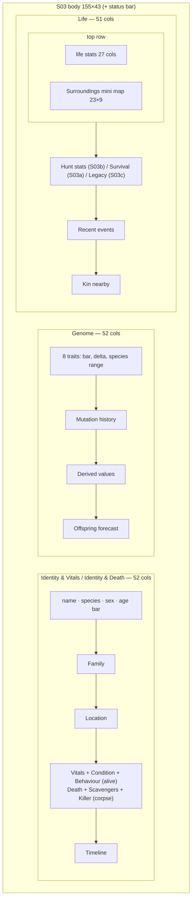
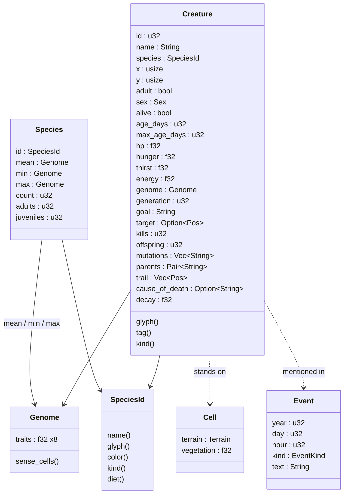

# S03 — Creature Inspector

Back to the [screen overview](README.md).

Live since: C3

## Purpose
Everything the simulation knows about one individual, on one screen: who it is, how it
is doing right now, what its genome says and how that genome differs from its species,
and what it has done in its life. The player opens it from the map (look mode, follow
mode or local zoom), from the event log or from the lineage tree, and uses it to answer
"why is this creature behaving like that?" and "is this individual worth following?".
The same screen also serves as the post-mortem view for a corpse.

## Variants
| Id   | Variant           | When it is shown |
|------|-------------------|------------------|
| S03a | prey (Hare)       | The inspected creature is alive and its species kind is prey. Prototype: Bramble h#217. |
| S03b | predator (Wolf)   | The inspected creature is alive and its species kind is predator. Prototype: Ashfang w#042. |
| S03c | corpse            | The inspected creature is dead (`alive = false`). Prototype: Thistle d#133. |

All three variants share the same three-column layout; the variant changes which
sections appear in the left and right columns.

## Layout
Three full-height panels side by side over a status bar. Body is 155×43 above the status
bar; there is no ticker row.

| Panel                 | Columns   | Width | Rows | Border |
|-----------------------|-----------|-------|------|--------|
| Identity & Vitals (alive) / Identity & Death (corpse) | 0–51 | 52 | 43 | Outer |
| Genome                | 52–103    | 52    | 43   | Outer, right hint `vs <Species plural> mean` |
| Life                  | 104–154   | 51    | 43   | Outer |
| Status bar            | 0–154     | 155   | 1    | — |

Inside the Life panel a 23×9 Inner-bordered "Surroundings" mini map sits in the top-right
corner; the life statistics occupy the 27 columns to its left.

## Data model
The screen reads one `Creature`, the `Species` statistics for its species, the world
cell it stands on, the event log and the clock.

## Content requirements

### Left panel — Identity & Vitals (S03a, S03b) / Identity & Death (S03c)
1. **Name line.** Creature glyph in the species colour, name in the title style, tag
   (`h#217`) in the label style, then a state word: `prey` (good colour), `predator`
   (wolf colour) or `DEAD` (bad colour, bold).
2. **Species line.** Species name in the species colour, sex glyph and word (`♂ male` /
   `♀ female`), `adult` or `juvenile`, and `diet: <species diet>` dimmed.
3. **Age bar.** Label `age`, a 20-cell bar of `age_days / max_age_days`, followed by
   `<age> / <max> days`. Bar colour is the vital colour of `1 − 0.8·age fraction` for the
   living (green → amber → red as the creature ages) and dim for a corpse. A second line
   shows `<age/360> years old` (one decimal) and `generation <n>`.
4. **Family section.** `mother <name tag>   father <name tag>`, then `offspring <n>` and a
   dim reminder `¶ lineage: [l]`.
5. **Location section.** `(x, y)`, region name (title style), terrain glyph in its terrain
   colour and the terrain name. For living creatures add: `goal <goal text>`; `target ♦
   (x, y)  <d> cells <compass>` or `none`; and `trail` listing the five most recent
   positions newest first as `(x,y)` pairs, or `no recent movement`. For a corpse show
   `carcass marked % on the map` instead.
   Distance uses map cells with the 2:1 aspect corrected (x difference halved); compass
   is one of `N S E W NE NW SE SW` or `here`.
6. **Vitals section (alive only).** Four labelled 24-cell bars: `health`, `hunger`,
   `thirst`, `energy`, each with a one-word note to the right (`healthy/injured/critical`,
   `sated/peckish/starving`, `fine/thirsty/parched`, `rested/tiring/exhausted`). Bar and
   note use the vital colour; hunger and thirst are inverted (high = bad).
   *Live since: C7* — three more rows follow: `sickness` (`☻ <Pathogen> infectious day
   N/~M sev .80` in the sick colour, N = today − since_day + 1, M = ends_day − since_day;
   or `☻ <Pathogen> incubating (shows in N days)`; or `healthy` dim), `immune` (`☺ <names>`
   in the immune colour, `(for life)` for lifelong immunity, or `none` dim) and a
   `∩ parasites` 24-cell bar (warn colour, inverted) with the note `light` (< 0.2) /
   `heavy` (< 0.5) / `severe`.
7. **Condition section (alive only).** `predation risk` bar (inverted vital colour),
   `local forage` bar (vegetation of the current cell, vegetation colour), and a line
   `nearest water <n> cells   nearest den <n> cells`. *Live since: C7* — a `contagion
   risk` bar (inverted vital colour) sits under predation risk: infectious conspecifics
   within `disease.contact_cheb` Chebyshev cells, over 8, clamped to 0..1.
8. **Behaviour section (alive only).** Up to four lines explaining the current decision:
   an alert line (`!`) for the current stalking target (predator) or the stalking threat
   (prey), a detection line comparing camouflage and sense values, the strike/flee
   threshold in cells, and a `¶` note tying the behaviour to a vital (for example hunger
   driving pursuit, or heading to water). Source: the creature's AI state.
   *Live since: C7* — an infectious creature gets a leading alert line `! sick — resting
   more, no mating` in the sick colour.
9. **Death section (corpse only).** `x <cause of death>` (*C7:* `x disease (<Pathogen>)`
   when `died_infected` is set), `died <n> days ago (<date>)`,
   `lived <age> of <max> days (<pct>% of lifespan)`, then a `decay` bar (carcass colour),
   a `nutrition` bar (`1 − decay`, warn colour) and `<kg> kg of meat remaining; gone in
   ~<days> days` where meat ≈ size × 120 × nutrition.
10. **Scavengers nearby (corpse only).** The two closest living foxes, each as glyph,
    name, tag, distance, compass and current goal; then a `¶ crows circling (<n> within
    sight)` line.
11. **Killer (corpse only).** Glyph, name and tag of the killer, its total kills and the
    chase length in ticks. *Live since: C7* — for a disease death the section is
    **Outbreak** instead: `☻ <Pathogen> outbreak of Year Y, began <region>` and `N others
    died in it`, from the outbreak record the lineage node (or the infection) points to.
12. **Timeline section.** Chronological list of life milestones, each as glyph, `Y<y>
    D<d>` stamp and text: birth (`♥ born to <mother> and <father>`), adulthood (`↑`),
    first litter (`♥`, if offspring > 0), first kill and pack leadership (predators, `x`
    and `♦`), a narrow escape (prey, `!`), a migration (`→ migrated to <region>`) and, for a
    corpse, the death (`x`). Rows that do not fit in the panel are dropped from the end.
    *Live since: C7* — `☻ fell ill with <Pathogen>` (stamped with the infection's
    `since_day`) and, when `infections_survived > 0`, `☺ recovered N time(s)`.

### Middle panel — Genome
13. **Header row.** `trait  individual  delta  species`.
14. **Per-trait block (8 traits, two rows each; nine from C7, Resistance last in the sick
    colour).** Row A: trait name (in its trait colour),
    a 14-cell bar of the individual's value, `±<delta>` versus the species mean coloured
    good/bad/dim (|delta| ≤ 0.005 counts as dim), and a 9-cell range bar showing species
    min / mean / max. Row B: the individual value to two decimals under the bar, and
    `min/mean/max` under the range bar, both dim.
15. **Summary lines.** `<n> traits above species mean, <8−n> below` and `most divergent:
    <trait> <±delta>`.
16. **Mutation history section.** One `§ <text>` line per recorded mutation (for example
    `Speed +0.06 (gen 44)`), or `none recorded`; then a dim `from <n> lines; rate 0.04 per
    trait per birth` line.
17. **Derived section.** Six label/value rows computed from the genome: `sense range
    <2+sense·10> cells`, `move speed <0.5+speed·2.5> cells/tick`, `daily food need
    <0.2+metabolism·0.8+size·0.4> biomass`, `max lifespan <max_age_days> days`, `litter
    size <1+round(fertility·4)> young`, `detection chance <(1−camouflage)·100>% at 5
    cells`. *Live since: C7* — a seventh row `resistance cost +N % food`, N =
    round(100 × `disease.resist_hunger_cost` × resistance).
18. **Offspring forecast section.** For each trait, a 22-cell range bar centred on
    `(individual + species mean) / 2` with ±0.06 spread and the same numbers in text.
    Rows beyond the panel bottom are dropped.

### Right panel — Life
19. **Life statistics (left of the mini map).** `days alive`, `kills` (predator) or
    `escapes` (prey), `offspring`, `grandkids`, `mates`, `distance <n> cells`, `regions <n>
    visited`. Kills/escapes use the title style.
20. **Surroundings mini map.** 23×9 Inner panel titled "Surroundings" showing the standard
    map renderer with creatures on, the cursor on the creature and (for a living creature)
    follow mode enabled. Origin is the creature position offset by (−10, −3), clamped to
    the world bounds.
21. **Hunt stats (S03b only).** `kills <n>  attempts <n>  success <pct>%`, a `success
    rate` bar (wolf colour), a `preferred prey` list with one bar per prey species showing
    its share of kills, `<pct>%  <kills> kills`, then `last kill <name tag>  <when>,
    <region>`, `♦ current target: <name tag>, <d> cells` and `avg chase <n> ticks; longest
    <n> ticks (Year <y>)`. *Live since: C7* — the current-target line appends
    ` (+.NN sick prey)` in the sick colour when the target is infectious
    (`kill_sick_bonus × severity`).
22. **Survival (S03a only).** `chased <n> times, escaped <n> (<pct>%)`, an `escape rate`
    bar (good colour), a `threats seen` list with one bar per predator species and its
    share, and `litters <n>  last: Y<y> D<d> (<n> young, <n> survived)`.
23. **Legacy (S03c only).** `<n> offspring alive, <n> descendants`, a line naming a
    mutation carried by descendants, and `carcass feeds: wolves <n>  foxes <n>  soil
    regrowth +<x>`.
24. **Recent events section.** Up to 10 event-log lines that mention the creature by name,
    oldest first, each as event glyph (event colour), `Y<y> D<d> <hh>h` stamp and text
    truncated with `·` to the panel width. If fewer than 10 mention the creature the list
    is padded with the most recent world events. Ends with a dim hint `[e] open full log
    filtered to this creature` when a row is free.
25. **Kin nearby section.** The five closest living creatures of the same species, each as
    glyph, name, tag, distance, compass and a relationship word (`sibling`, `offspring`,
    `cousin`, `unrelated`).

### Status bar
26. Key hints `[f] follow  [l] lineage  [Tab] next creature  [Esc] back`; right text
    `<name> <tag>  <clock label>`.

## Glyphs and colors
| Glyph / colour           | Meaning                                                   |
|--------------------------|-----------------------------------------------------------|
| `v h d f w l` / `V H D F W L` | creature glyphs; lower case juvenile, upper case adult, in the species colour |
| `♂ ♀`                    | sex                                                       |
| `♥ ↑ x ♦ ! → §`          | timeline and event glyphs: birth, adulthood, death/kill, leadership, alert, migration, mutation |
| `¶`                      | note / hint lines                                         |
| `☻ ☺ ∩`                  | C7: infection (sick colour), immunity (immune colour), parasite load bar (warn) |
| `%`                      | carcass marker (carcass colour)                           |
| `±`                      | delta prefix in the genome table                          |
| `[█░]`                   | bars; `bars::range` draws min–max span with a mean marker |
| `·`                      | truncation marker on long event text                      |
| terrain glyphs           | the creature's current cell, in terrain colours           |
| trait colours            | one fixed colour per trait (Speed INFO, Size DEER, Sense ACCENT, Metabolism WARN, Aggression BAD, Camouflage VEGETATION, Fertility MAGENTA, Longevity LYNX) shared with [S04](s04-species-browser.md) |
| GOOD / WARN / BAD        | vital bars (> 0.6 / > 0.3 / else; inverted for hunger, thirst, predation risk) and deltas |
| WOLF, HARE, etc.         | species colours for names and bars                        |

## Interaction
| Key   | Action                                                  | Goes to |
|-------|---------------------------------------------------------|---------|
| `f`   | follow this creature on the map                         | [S01e World Map, follow mode](s01-world-map.md) |
| `l`   | open the family tree focused on this creature           | [S08 Lineage](s08-lineage.md) |
| `Tab` | inspect the next creature (see open questions for order) | stays on S03 |
| `Esc` | back to the map                                         | [S01 World Map](s01-world-map.md) |
| `e`   | (hinted in the Life panel, not in the status bar) open the event log filtered to this creature | [S07 Event Log](s07-event-log.md) |

`l` overrides nothing global; `f` is the same key the map uses for follow. `s g y w` keep
their global meaning. For a corpse `f` has no live position to follow: it should either
be disabled or centre the map on the carcass.

## States and edge cases
- **Corpse.** Vitals, Condition and Behaviour are replaced by Death, Scavengers nearby and
  Killer; the panel title changes to "Identity & Death"; the mini map has no follow
  highlight; the age bar is dim; the Life panel shows Legacy instead of hunt/survival stats.
- **Juvenile.** Glyph is lower case, `juvenile` replaces `adult`; the adulthood timeline
  entry must not be shown before it happens.
- **No parents recorded** (first-generation creature): the family line and the `born to`
  timeline entry need an `unknown` fallback; the prototype's generated creatures have
  empty parent strings.
- **No mutations.** Mutation history shows `none recorded`.
- **No target / no trail.** `target none`, `trail no recent movement`.
- **Fewer than 10 events / fewer than 5 kin / fewer than 2 foxes.** Lists are shorter;
  padding events with unrelated world events is a prototype convenience and should be
  replaced by an empty-state line.
- **Overflow.** The Timeline and Offspring forecast both stop drawing at the panel bottom;
  the Recent events list is capped to the rows remaining. Long event text is truncated
  with `·`.
- **Creature dies while inspected.** The screen must switch to the corpse variant in
  place (or return to the map) rather than keep showing stale vitals.
- **Paused simulation.** All values are static; the clock in the status bar shows the
  paused time.

## Open questions
- `Tab` "next creature": next by id, next of the same species, next visible on the map,
  or the next in the list the inspector was opened from (event log, lineage)?
- Predation risk (0.62 prey / 0.18 predator), nearest water/den distances, escapes,
  grandkids, mates, distance travelled, regions visited, hunt attempts (158), chase
  lengths, litter history, threat shares and crows are all invented numbers in the
  prototype. Which of these will the simulation actually track?
- The Behaviour section text is hand-written narrative. Should the real screen render
  templated sentences from AI state, or a short table of state variables?
- The Timeline milestones (adulthood at +90 days, first litter at +160, pack leader at
  +700) are derived from age, not recorded events. Do we keep a per-creature event history?
- The kin relationship words are positional placeholders; real kinship needs the lineage
  graph and a definition of "cousin".
- The mutation rate `0.04 per trait per birth` is the world-gen setting; should the
  inspector read it from the world instead of hard-coding it?
- `[e]` is offered in the Life panel but not in the status bar; decide whether the event
  log shortcut is a real binding here and, if so, add it to the status bar.
- The offspring forecast assumes an "average mate" with a fixed ±0.06 spread; should it use
  the world's mutation strength setting?
- How is the carcass "gone in ~N days" horizon computed by the simulation?

Prototype reference: `src/prototypes/s03_inspector.rs`.
