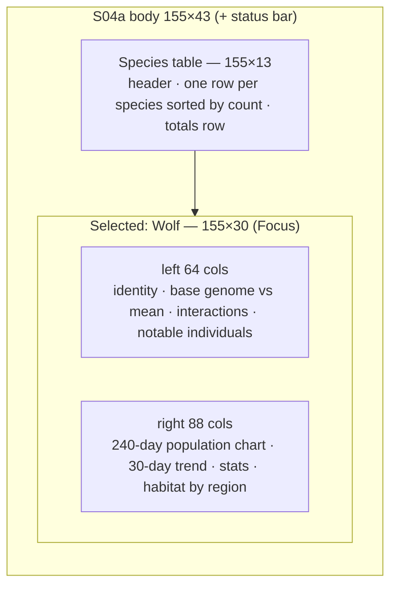
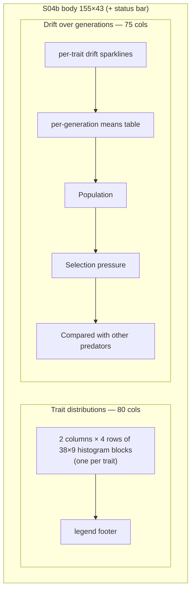
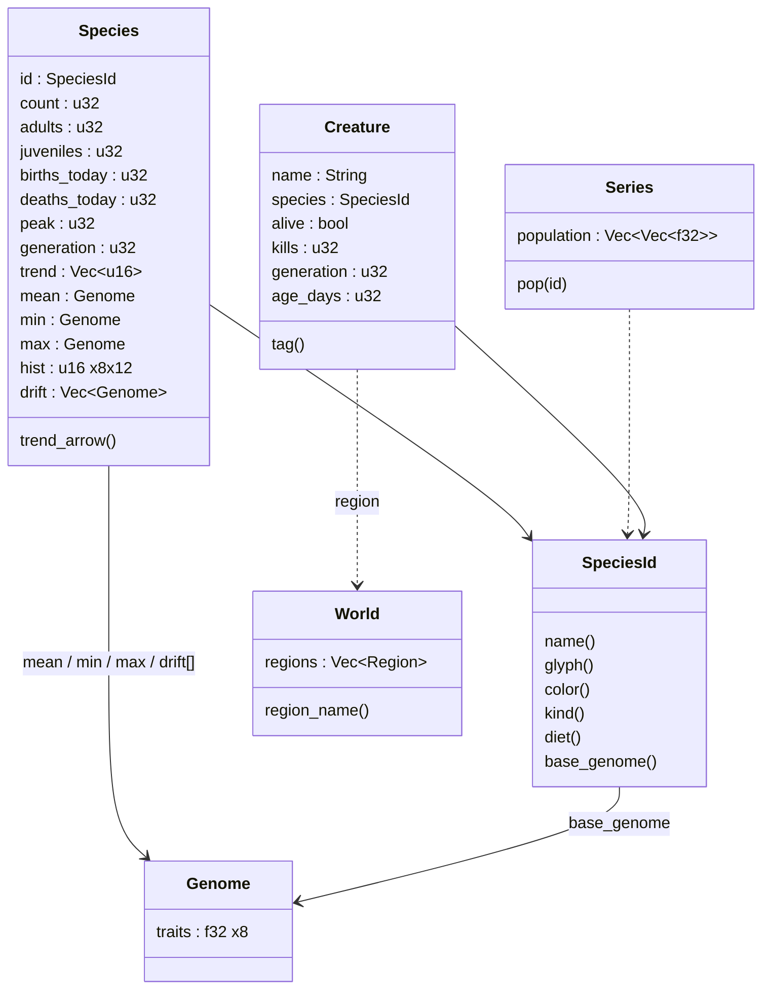

# S04 — Species Browser

Back to the [screen overview](README.md).

## Purpose
The population-level view. The table variant ranks every species by headcount with its
demographics, today's births and deaths, a 30-day trend and its mean genome, so the
player can see at a glance who is winning and who is in trouble. Selecting a species
shows a summary (base genome versus current mean, interactions, notable individuals,
240-day population history, habitat). The detail variant goes one level deeper into the
selected species' trait distributions and how its genome has drifted over generations —
the screen where evolution is actually visible.

## Variants
| Id   | Variant                | When it is shown |
|------|------------------------|------------------|
| S04a | species table          | On entry from the map (`s`). Table of all species plus a summary panel for the selected row. Prototype selection: Wolf. |
| S04b | species detail (Wolf)  | After `Enter` on a table row. Trait histograms and generational drift for the selected species. |

## Layout

### S04a — species table
| Panel                       | Position          | Size     | Border |
|-----------------------------|-------------------|----------|--------|
| Species (table)             | rows 0–12         | 155 × 13 | Outer, right hint `<n> species, 
 prey / <q> predator` |
| Selected: `<Species>`       | rows 13–42        | 155 × 30 | Focus, right hint `Enter for full detail` |
| ├ left: identity, genome, interactions, notable individuals | inner cols 0–63 | 64 wide | — |
| └ right: population history, habitat | inner cols 65–152 | 88 wide | — |
| Status bar                  | row 43            | 155 × 1  | — |

### S04b — species detail
| Panel                        | Position     | Size    | Border |
|------------------------------|--------------|---------|--------|
| `<Species>: trait distributions` | cols 0–79 | 80 × 43 | Outer, right hint `12 buckets, living adults + juveniles` |
| Drift over generations       | cols 80–154  | 75 × 43 | Outer, right hint `12 sampled generations` |
| Status bar                   | row 43       | 155 × 1 | — |

## Data model
The screen reads the per-species statistics for all species, the base genome of each
species, the 240-day population series, living creatures (for notable individuals and
habitat), the world regions and the clock.

## Content requirements

### S04a — Species table panel
1. **Header row** (dim): `Species  Kind  Count  Adults  Juv  Birth/d  Death/d  Peak  Gen
   30-day trend  Spd Siz Sen Met Agg Cam Fer Lon  Diet`.
2. **One row per species**, starting on the second row under the header, sorted by count
   descending (the default sort; see Interaction). Columns: selection marker `►` (only on
   the selected row), species glyph upper-case in the species colour, name (8), kind
   `prey`/`pred` (6), count (6), adults (7), juveniles (6), births today (8, good colour),
   deaths today (8, bad colour), peak (6), generation (5), a 20-cell sparkline of the 30-day
   trend in the species colour followed by the trend arrow (`↑` good, `↓` bad, `↔` dim),
   the eight trait means as two-digit integers (value × 100) each in its trait colour, and
   the diet text (dim). Source: species stats.
3. **Selected row** is drawn in the selected style across the full inner width.
4. **Totals row** (after one blank row): `totals <total>   prey 
  pred <q>  ratio
   <p/q>:1   births <b>  deaths <d>   net <b−d> today      trait columns are species
   means x100`.

### S04a — Selected species panel, left column (64 cols)
5. **Identity line.** Glyph, plural name (title style), kind word and `diet: <diet>`.
6. **Counts line** (dim). `<count> alive  <adults> adults  <juveniles> juveniles
   generation <g>  peak <peak>`.
7. **Base genome vs current mean.** Header `trait  base  current  delta  spread`, then
   one row per trait: name, base value (dim), current mean, a 14-cell bar of the mean in
   the trait colour with a bright `│` marker at the base value, `±delta` coloured
   good/bad/dim, and a 13-cell min/mean/max range bar. A dim legend line follows:
   `│ base marker   spread = min/mean/max across living <plural>`. Source: species
   base genome and mean/min/max.
8. **Interactions.** For a predator: one `eats <glyph> <name>` row per prey species with a
   16-cell bar of its share of kills, `<pct>% of kills   <prey count> alive <trend arrow>`;
   then `competes with <species> for <prey>;  hunted by <…>`. A prey species needs the
   mirror image (`eaten by …`, `competes with … for grass`); the prototype only shows the
   predator form.
9. **Notable individuals.** Up to five living members of the species, ranked by kills
   for predators (see open questions for prey), each as glyph, name, tag, `<kills> kills
   gen <g>  <age> days  <region>`.

### S04a — Selected species panel, right column (88 cols)
10. **Population, last 240 days.** A 6-row block chart, 100 columns wide, of the species'
    240-day population series downsampled to 100 buckets (bucket mean). Each column is a
    stack of `█` with a `▄` half-step; empty rows are `░` in dim. Max and min values are
    printed at the left of the top and bottom rows. Under the chart an axis line reads
    `D-240 … drought … today`, with a warn-coloured `drought` marker at the day the
    drought event occurred. Source: time series.
11. **30-day trend.** Label, a 30-cell sparkline in the species colour, the trend arrow and
    the word `growing` / `declining` / `stable`.
12. **Stats.** `240 days ago`, `today`, `change <±n> (<±pct>%)` (good/bad/dim), `low /
    high`, `births today` (good), `deaths today` (bad).
13. **Narrative note.** `¶ <one sentence explaining the recent population movement>`.
14. **Habitat (living individuals by region).** Every world region, sorted by the number
    of living members there, laid out in two columns: region name (17), a 14-cell bar
    scaled to the largest region, count. Source: living creatures × world regions.

### S04b — Trait distributions panel
15. **Eight histogram blocks** in a 2 × 4 grid, each 38 columns × 9 rows, in trait order
    down the first column then the second. Each block: trait name in its trait colour with
    `min .xx mean .xx max .xx`; a 36-column histogram of the 12 buckets (3 columns per
    bucket) built from `▄`/`█` stacks; an axis of `─` with a bright `┼` at the mean; tick
    labels `0.0`, `0.5`, `1.0`; `n=<sum of buckets>` and `mode <bucket centre>`.
    Source: species `hist`.
16. **Footer legend.** `┼ mean   █ full  ▄ half bucket   each column is 1/12 of the 0..1
    range`.

### S04b — Drift over generations panel
17. **Drift sparklines.** Header `trait  gen 1  oldest … newest  g<current> change`, then
    per trait: name (trait colour), the generation-1 mean, a 36-cell sparkline of the 12
    sampled generation means (each widened to 3 cells), the current mean, and the change
    since generation 1 coloured good/bad/dim. Source: species `drift`.
18. **Per-generation means (x100).** A table with a column per sampled generation labelled
    `g<n>` (evenly spaced from 1 to the current generation) and a row per trait of two-digit
    means, each cell coloured green if it rose versus the previous sample, red if it fell,
    dim for the first column; legend line `green = rose vs previous sample, red = fell`.
19. **Population.** `count <n> (<adults> adults, <juveniles> juveniles)`, `generation`,
    `peak <n> (<pct>% of peak now)`, `births today` (good), `deaths today` (bad), `trend
    <arrow> over 30 days`.
20. **Selection pressure.** Two or three `§`/`¶` lines explaining which traits are moving
    and why (for example aggression rising, camouflage falling, longevity flat).
21. **Compared with other predators (mean x100).** Header `Spd Siz Sen Met Agg Cam Fer Lon
    count gen`, then one row per species of the same kind: glyph, name (title style for
    the selected species), eight means in trait colours, count and generation.

### Status bar
22. S04a: `[↑↓] select  [Enter] detail  [s] sort  [Esc] back`; right text `sorted by
    count ↓  <clock label>`.
23. S04b: the same key hints; right text `<Species> detail  <clock label>`.

## Glyphs and colors
| Glyph / colour        | Meaning                                                       |
|-----------------------|---------------------------------------------------------------|
| `V H D F W L`         | species glyphs (upper-case), in species colours               |
| `►`                   | selected table row                                            |
| `↑ ↓ ↔`               | 30-day trend arrow: growing (GOOD), declining (BAD), stable (DIM) |
| `█ ▄ ░`               | population block chart, histograms, sparklines                |
| `│`                   | base-genome marker inside the mean bar                        |
| `┼ ─`                 | histogram axis and mean marker                                |
| `[█░]`                | bars; range bars show min–mean–max                            |
| `§ ¶`                 | selection-pressure notes and narrative notes                  |
| `±`                   | delta prefix                                                  |
| trait colours         | Speed INFO, Size DEER, Sense ACCENT, Metabolism WARN, Aggression BAD, Camouflage VEGETATION, Fertility MAGENTA, Longevity LYNX (same as [S03](s03-creature-inspector.md)) |
| GOOD / BAD / DIM      | births, deaths, deltas, rise/fall cells                       |
| WARN                  | `drought` marker on the 240-day axis                          |
| SELECT_BG             | selected row; Focus border on the summary panel               |

## Interaction
| Key      | Action                                             | Goes to |
|----------|----------------------------------------------------|---------|
| `↑` `↓`  | move the selection through the table rows; the summary panel follows the selection | stays on S04a |
| `Enter`  | open the detail view for the selected species      | S04b (from S04a) |
| `s`      | cycle the sort column (count is the default, descending) | stays on S04a |
| `Esc`    | back                                               | from S04b to S04a; from S04a to [S01 World Map](s01-world-map.md) |
| —        | jump to a notable individual                       | [S03 Creature Inspector](s03-creature-inspector.md) (listed in the [README](README.md) navigation; no key is shown in the prototype status bar) |

`s` overrides the global "Species" shortcut on this screen (it is already the species
screen). `g y e w` keep their global meaning and replace S04 with the other data screen.

## States and edge cases
- **Extinct species** (count 0): keep the row in the table, dimmed, with an empty
  sparkline and `↔`; the summary panel should say so instead of showing empty habitat and
  notable lists. Peak still shows the historic high.
- **Fewer than five notable individuals** or none alive: shorten the list / show `none`.
- **Sort ties** and sort by non-numeric columns (name, kind, diet): define the tie-break
  (species order).
- **Young world.** The 240-day series is shorter than 240 days and the drift has fewer
  than 12 samples; the chart must stretch what exists and the generation header must not
  divide by zero when `generation = 1`.
- **Prey species selected.** Interactions must show predators-of instead of prey-of;
  "Compared with other predators" becomes "Compared with other prey"; notable individuals
  need a prey ranking.
- **Regions with no members** still appear in the habitat list with an empty bar.
- **Paused simulation.** Static; `births today` / `deaths today` freeze.
- **Long diet text** would overflow the 155-column row; diets are limited to the fixed
  strings.

## Open questions
- Sort: which columns are sortable, and does `s` cycle through them or open a chooser?
  Does a second press flip direction? The status bar text (`sorted by count ↓`) suggests
  direction is shown but not how it is chosen.
- How does the player reach a notable individual (`Enter` on it, a number key, `i`)? The
  README links S04 → S03 but the prototype offers no key.
- Kill shares (Deer 48 / Hare 39 / Vole 13 %), the `competes with … hunted by nothing`
  line, the drought marker position, the narrative note and the selection-pressure notes
  are hand-written. Which are derived from real statistics and which need a template
  system?
- Notable individuals are ranked by kills; what ranks prey (age, offspring, escapes)?
- `n=` under each histogram is the sum of bucket counts, which the fixture inflates; it
  should equal the living count.
- Are the 12 drift samples evenly spaced generations (as the header implies) or a rolling
  window of the last 12?
- The detail variant duplicates population stats from the summary panel; is that
  intentional so S04b stands alone, or should S04b drop them for more drift history?
- Should `Enter` on S04b do anything (the status bar still advertises it)?

Prototype reference: `src/prototypes/s04_species.rs`.
