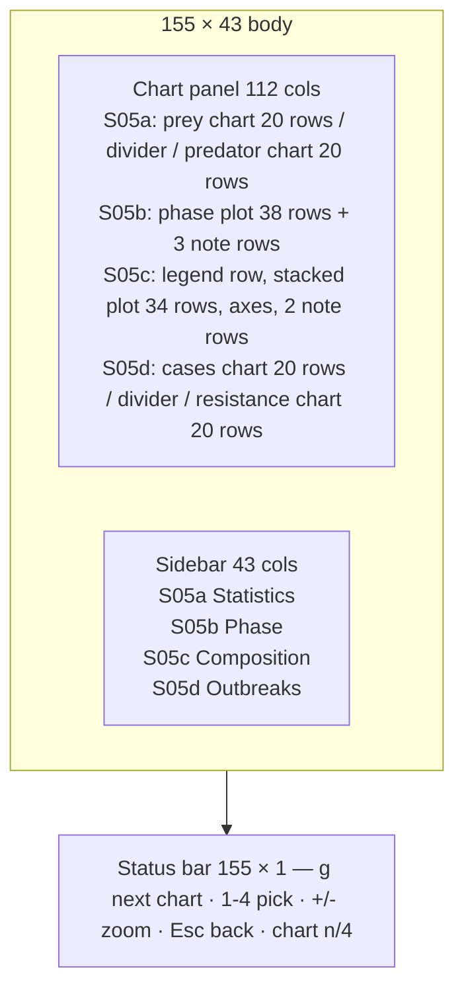

# S05 — Population Charts

Back to the [screen overview](README.md).

Live since: C2

## Purpose
The charts screen is where the player reads the valley as a *system* rather than as
individual creatures. It shows the last 240 days of population history so the player can
see the predator–prey oscillation, spot the drought that bent it, and judge whether the
current state is a boom, a crash or a recovery. Three views of the same time series are
offered: prey and predators over time, a predator-against-prey phase plot that shows the
orbit around the equilibrium, and a stacked area that shows how the total population is
divided between the six species and how it tracks vegetation. A fourth view (C7) shows
the disease side of the same window: active cases per pathogen and the mean Resistance
of the host species.

## Variants
| Id   | Variant                            | When it is shown                                           |
|------|------------------------------------|------------------------------------------------------------|
| S05a | prey vs predator over time         | default view when the screen is opened with `g` or `1`     |
| S05b | predator-prey phase plot           | second view: `g` from S05a, or `2` on any chart            |
| S05c | stacked species + vegetation       | third view: `g` from S05b, or `3` on any chart             |
| S05d | infections — cases and resistance  | fourth view: `g` from S05c, or `4` on any chart            |

`g` cycles a → b → c → d → a. The status bar's right-hand text names the current view
(`chart 1/4  populations`, `chart 2/4  phase plot`, `chart 3/4  stacked species`,
`chart 4/4  infections`).

## Layout
Full-screen data screen (replaces the map). The body is 43 rows (rows 1–43) split into a
**chart panel** of 112 columns (inner 110×41) on the left and a **sidebar** of 43 columns
(inner 41×41) on the right. Row 44 is the status bar. The 112/43 split matches the map
family's map/sidebar split so the eye does not have to re-adjust.

### S05a chart panel
Title `Population — prey vs predators`, right hint `last 240 days, 1 point per day`.
The inner area is split into an upper chart (20 rows, first row carries the label
` Prey (voles + hares + deer) `), one section-divider row titled
`Predators (foxes + wolves + lynx)`, and a lower chart (20 rows).

### S05b chart panel
Title `Phase plot — predators against prey`, right hint `one point per day, 240 days`.
The plot uses all inner rows except the last three, which hold a section divider
`Reading the orbit` and two explanatory rows that double as the in-panel legend.

### S05c chart panel
Title `Stacked populations + vegetation`, right hint `240 days, all six species`.
Row 0 is the legend row; the plot starts at row 2 and is 34 rows tall; below it come the
x axis, its labels, a gap and two note rows. The plot is 98 columns wide: 6 columns are
reserved on the left for the count axis, 6 on the right for the vegetation axis.

### S05d chart panel
Title `Infections — cases and resistance`, right hint `last 240 days`. Same split as
S05a: an upper chart (20 rows, first row ` Active cases` followed by a `▀▄` swatch and
name per drawn pathogen), one section-divider row titled `Mean Resistance (host
species)`, and a lower chart (20 rows, first row `0..1` plus a species legend and
`· base`).

## Content requirements

### Data sources (all variants)
1. **Population time series**: one value per day per species for the last 240 days, in
   species table order (Vole, Hare, Deer, Fox, Wolf, Lynx). *Prey total* is the sum of the
   first three, *predator total* the sum of the last three.
2. **Vegetation series**: mean standing biomass 0–1 per day, same 240 days.
3. **Absolute day index** of the first point so axis labels can be rendered as
   `Y11 D124` (year = day ÷ 360, day = day mod 360, zero-padded to three digits).
4. **Drought window**: the range of days (in the fixture, days 150–190 of the window) during
   which a drought was in effect. It is drawn as a shaded band on every time-axis chart.
5. **Species census** (S05a sidebar only): today's per-species count from the species
   statistics, i.e. the same numbers S04 shows.

### S05a — prey vs predator over time
6. Two line charts, one above the other, sharing the same x axis (240 days, seven labels
   at 40-day intervals, `Y## D###` format, dim). Prey on top in the hare colour, predators
   below in the wolf colour.
7. **Separate y scales**: prey axis runs 0 to the prey maximum rounded up to the next 100;
   predator axis 0 to the predator maximum rounded up to the next 20. Five right-aligned
   labels each (0, ¼, ½, ¾, max). The scales must be stated in the sidebar legend
   (`separate y scales: prey per 100, predators per 20`).
8. The drought window is shaded across empty cells of both charts (panel background tinted
   22 % toward the warning colour) and labelled `¡ drought` in the warning colour at the
   band's top-left.
9. A `now` marker in the accent colour sits at the right edge of each chart on the axis row.
10. Sidebar `Statistics`:
    - **Current**: prey and predator totals today (bold, species colour) each followed by a
      30-day trend arrow and percentage (`↑` above +3 %, `↓` below −3 %, otherwise `↔`), and
      `ratio N.N prey per predator`.
    - **Prey** and **Predators** sections: min, max (each with the day it occurred) and mean,
      plus `swing N%` = (max − min) ÷ mean.
    - **Coupling**: the lag in days between the prey peak and the predator peak with both
      dates; Pearson correlation on the same day and at the best lag in 0–60 days; two lines
      of plain-language explanation of the cycle.
    - **Drought**: window dates, vegetation before the window and its minimum during it
      (`vegetation 61% ↓ 34%, water x0.60`), and the predator count at the start and end of
      the window.
    - **Map census (sampled)**: six species as `GLYPH Name count`, three per row, from the
      species statistics.
    - **Legend**: `▀▄` swatches for prey and predators with their composition, the drought
      band swatch, and the y-scale note.
    - **Keys**: `[+/-] zoom 60/240/720d   [l] log scale`.

### S05b — predator–prey phase plot
11. Scatter of (prey total, predator total), one point per day. x axis 0 to the prey maximum
    rounded up to 50 (six labels), titled `prey total` in the hare colour; y axis 0 to the
    predator maximum rounded up to 20 (five labels), titled `predators` in the wolf colour.
12. Three layers, oldest to newest: days 1–200 as dim `•` dots; the last 40 days as a
    connected half-block line in the accent colour; today as a single `█` in bright text.
13. An **equilibrium crosshair**: a vertical and a horizontal dotted line through
    (mean prey, mean predators), drawn very dim, labelled `♦ equilibrium (p, q)` in the
    info colour just right of the vertical line.
14. Quadrant captions inside the four plot corners: `II  few prey, many predators: hunters
    starve` (top-left), `I  many prey, many predators: prey crash` (top-right), `III  few of
    both: prey recover` (bottom-left), `IV  many prey, few predators: hunters boom`
    (bottom-right).
15. Note rows under the plot: `Reading the orbit` with a sentence describing the
    counter-clockwise cycle, followed by an inline legend (`▀▄ last 40 days`, `█ today`,
    `• older days`).
16. Sidebar `Phase`:
    - **Now**: prey and predator totals with 7-day change (`↑ +12 / 7d`, arrow threshold
      ±1), the current quadrant (I–IV relative to the means) with its one-line meaning, and a
      heading line (`moving up-right (both growing)` etc.) from the signs of the two deltas.
    - **Equilibrium estimate**: prey\* and pred\* as the time means, a two-line note that for
      Lotka-Volterra dynamics the time average equals the orbit centre, `orbit radius now N%
      of centre` (relative distance from the means), and `period ~N days (peak to peak)`
      estimated from the smoothed prey series, or `> 240 days` if fewer than two peaks are
      found.
    - **Quadrants**: I–IV with position and a wrapped description, coloured wolf / warn /
      hare / good.
    - **Recent path (every 10 days)**: five rows — 40, 30, 20, 10 days ago and today — with
      day label, prey, predators and quadrant; today's row bold.
    - **Legend**: `•` days 1–200, `▀▄` last 40 days, `█` today, `•` equilibrium axes.

### S05c — stacked species + vegetation
17. Legend row: `█ Voles   █ Hares   … █ Lynxes   · vegetation biomass (right axis, % of
    max)`, each swatch in the species colour.
18. Stacked area of all six species, stacked bottom-up in species table order (prey below,
    predators on top), so the top edge is the whole population. Each column averages the
    days that fall into it (240 days over 98 columns ≈ 2.4 days per column). Vertical
    resolution is half a row: a cell is `█` when both halves are the same species, `▄` with
    the upper species as background when they differ, `▄`/`▀` over the panel background at
    the top edge.
19. Left axis: `│` with `┼` ticks at six levels (0 to the maximum stack rounded up to 50),
    five-digit dim labels. Right axis: `┼ NN%` in the vegetation colour at 0/20/40/60/80/100 %.
20. **Vegetation line**: a bold `·` in the vegetation colour at the vegetation height on the
    right-hand 0–100 % scale, drawn over the stack while keeping the stack colour under it.
21. Drought window shaded on empty cells and labelled `¡ drought`, as in S05a.
22. x axis `─` with `┼` ticks every 40 days and `Y## D###` labels centred under the ticks
    (clamped to the panel).
23. Two note rows explaining the stacking order, the per-column averaging, and that the
    vegetation dot uses the right-hand scale.
24. Sidebar `Composition`:
    - **Today**: table `species / count / share / 240d` with a colour swatch, today's count,
      share of the total, and the 240-day min–max; a total row with `veg NN%`.
    - **Share today**: one 39-cell stacked bar of today's shares in species colours (the last
      species absorbs rounding), then `prey NN%   predators NN%`.
    - **Peaks**: largest and smallest stack with dates; vegetation min and max.
    - **Drought**: `¡ days 150-190 of the window`, stack size before the window and twenty
      days after it, and a one-line note on which species shrink first/last.
    - **30-day trend**: one row per species: glyph, plural name, `a -> b`, arrow and
      percentage coloured good/bad/dim at ±3 %.
    - **How to read**: five short lines.

### S05d — infections
25. **Top chart — active cases per pathogen.** One half-block line per pathogen slot
    (`Sample.active_by_pathogen`, slots 0–7, roster first then strains) that has any
    nonzero value inside the window; slots that never had a case are not drawn. Line
    colours rotate by slot: `SICK`, `WARN`, `MAGENTA`, `INFO`, `ACCENT`, lynx, deer, hare.
    y axis 0 to the maximum rounded up to the next 10, five labels. **Epidemic windows**
    (days between an outbreak's `started_day` and its `ended_day`, or today while open,
    for outbreaks flagged `epidemic`) are shaded across empty cells like the drought band
    (panel background tinted 22 % toward `SICK`) and labelled `☻ epidemic` at the band's
    top-left. `now` marker as S05a. With no cases in the window the legend row reads
    `no infections in the window` and the chart is an empty axis.
26. **Bottom chart — mean Resistance.** One line per species with a nonzero population
    inside the window (`Sample.genome_mean[i].resistance()`, 0..1, five labels `0.00` …
    `1.00`), each in its species colour; the species' base Resistance
    (`base_genome().resistance()`) is drawn behind it as a dim dotted reference row (`·`
    on every other column). Epidemic windows are shaded here too.
27. Sidebar `Outbreaks`:
    - **Outbreaks** (top, no section title): the last eight outbreaks, newest first, two
      rows each: `☻ <name>` bold in `SICK` (`MAGENTA` when the pathogen is a strain), the
      start day as `Y D`, and `EPIDEMIC` in `SICK` when flagged; then the host species
      glyph (the species with the most cases, in its colour) and
      `cases N  dead D  δresist +.03` — the host's mean Resistance at burn-out minus at
      the start, or `open` while `ended_day` is `None`. Empty: `no outbreaks yet`.
      (`δ` is the CP437 lower-case delta; the capital Δ is not in CP437.)
    - **Pathogens**: one line per drawn slot: swatch in the line colour, name, `now N
      peak P`, and `strain` in `MAGENTA` for spillover strains. Empty: `none active in
      the window`.
    - **Legend**: the two `▀▄` swatches, the `·` base row and the `░` epidemic band.
    - **Keys**: `[+/-] zoom 60/240/720d`.

## Glyphs and colors
This screen must render entirely in CP437. **Chart markers are limited to half-block
(`▀` `▄`), full block (`█`) and dot (`·` `•`) markers; braille and eighth-block markers
are not permitted.** The stacked area is drawn by hand from the same three block glyphs.

| Glyph      | Meaning                                                  |
|------------|----------------------------------------------------------|
| `▀` `▄`    | line series (S05a, S05b recent path); half-row stack edges (S05c) |
| `█`        | today's point (S05b); solid stack cells and legend swatches (S05c) |
| `·`        | vegetation dot (S05c)                                     |
| `•`        | older-days scatter and equilibrium crosshair (S05b)       |
| `♦`        | equilibrium label                                         |
| `¡`        | drought                                                   |
| `☻`        | outbreak / epidemic band label (S05d)                     |
| `δ`        | resistance delta in the S05d sidebar                      |
| `↑` `↓` `↔`| trend arrows                                              |
| `─` `│` `┼`| hand-drawn axes (S05c)                                    |

Palette roles: hare colour = prey total, wolf colour = predator total, per-species colours
for the stack and census, vegetation green for the biomass line and right axis, accent for
the recent path / `now` marker / highlighted numbers, info for the equilibrium label,
warning for drought, good/bad for trend percentages, `SICK` for the epidemic band and
outbreak rows, `MAGENTA` for spillover strains, dim for axis labels and notes,
selection background nowhere (there is no cursor on this screen).

## Interaction
| Key      | Action                                             | Goes to |
|----------|----------------------------------------------------|---------|
| `g`      | next chart (a → b → c → d → a)                     | stays on S05 |
| `1` `2` `3` `4` | pick S05a / S05b / S05c / S05d directly     | stays on S05 |
| `+` `-`  | zoom the time window 60 / 240 / 720 days           | stays on S05 |
| `l`      | toggle log scale (advertised in the S05a sidebar)   | stays on S05 |
| `Esc`    | back                                                | [S01 World Map](s01-world-map.md) |
| `?`      | help overlay                                        | [S11 Legend & Help](s11-legend-help.md) |

Overrides of global keys: `g` is "next chart" here rather than "open Graphs";
`+`/`-` zoom the chart instead of changing simulation speed. `s`, `y`, `e`, `w` keep their
global meaning and switch to [S04](s04-species-browser.md), [S06](s06-ecology.md),
[S07](s07-event-log.md) and [S08](s08-lineage.md).

## States and edge cases
- **Short history**: a new world has fewer than 240 days. Charts must render with the
  available points; the 30-day and 7-day deltas, lag search (needs 61 points) and period
  estimate must degrade to `–` rather than reading outside the series.
- **No drought in the window**: the band and the `Drought` sidebar sections are omitted.
- **No disease in the window** (S05d): the cases chart draws only its axes with the
  legend `no infections in the window`; the Resistance chart still draws every living
  species; the sidebar says `no outbreaks yet` until the first outbreak record exists.
- **Open outbreak** (S05d): its epidemic band runs to the right edge and the sidebar's
  `δresist` reads `open`.
- **Extinct species** (S05c): a species at zero contributes no stack cells; its row in the
  Today table shows 0 and 0 %; the share bar gives it no width.
- **Predator total zero**: the ratio line must guard division (show `∞` or `–`); the phase
  plot still draws points on the x axis.
- **Zoom 60 d / 720 d**: axis labels keep the `Y## D###` format; with 720 days per column
  averaging in S05c widens to ~7 days and the note row must say so.
- **Paused simulation**: the screen is static; `now` is the last recorded day.
- Night/winter palettes do not apply — data screens always use the panel palette.

## Open questions
- **Census vs time series.** The `Map census (sampled)` block uses the species-statistics
  counts (sampled map creatures scaled up), while the charts use the population series.
  In the fixture the two disagree (e.g. today's prey total on the chart is not the sum of
  the census). In the game there must be a single source of truth, or the census block
  should be dropped.
- **Drought window source.** The window is a constant (days 150–190). It should come from
  drought events in the log; multiple or overlapping droughts within the window are not
  handled. The `water x0.60` figure in the sidebar is also invented.
- **Invented thresholds.** Trend arrows use ±3 % over 30 days (S05a/S05c) but ±1 absolute
  over 7 days (S05b); the "recent path" length is 40 days; the lag search stops at 60 days;
  the period estimator uses an 11-day smoothing window and ±8-day peak test. None of these
  have been validated against real simulation output.
- **Per-column averaging text.** The S05c note says "~2.3 days" per column; at the 98-column
  plot width it is ~2.4 and it changes with the zoom level. The note must be computed, not
  hard-coded.
- **`l` log scale** is advertised in the S05a sidebar but is not in the status bar and has
  no prototype. Decide whether it exists, and whether it applies to S05c (a log stack is
  not meaningful).
- **Zoom levels** (`+/-` 60/240/720) are only listed; nothing shows what a 720-day chart
  looks like at one point per day (it needs down-sampling in S05a/S05b too).
- **Quadrant narratives** ("prey crash ahead", "voles shrink first, lynx last") are
  hard-coded fixture text. They should be derived from the data or removed.
- Whether `1-3` should also be reachable from the map (e.g. `g` then `2`) or whether the map
  keeps `1-4` for overlays ([S02](s02-map-overlay.md)) is not settled.

Prototype reference: `src/prototypes/s05_charts.rs` (fixture series in
`src/fixtures/series.rs`).
