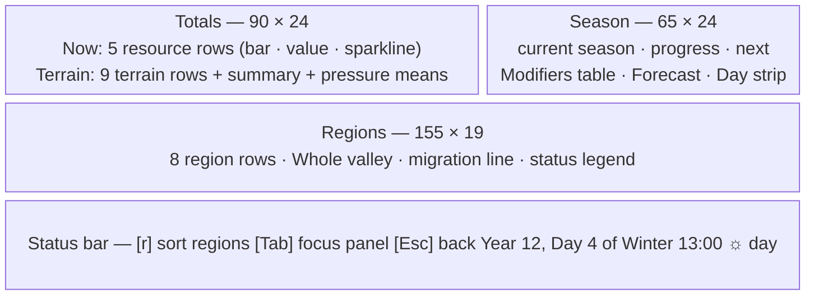

# S06 — Resources / Ecology

Back to the [screen overview](README.md).

Live since: C2

## Purpose
The ecology screen answers "can the valley feed what lives in it?". It summarises the
world's resources (vegetation, water, carcasses, dens, regrowth sites) with their recent
history, shows where the year stands and what the season is doing to regrowth, evaporation
and metabolism, and breaks the map into its named regions so the player can see which ones
are strained or scarce and where migrations are likely to start. It is the screen a player
opens after a drought event or when prey counts on the charts start falling.

## Variants
| Id   | Variant | When it is shown                          |
|------|---------|-------------------------------------------|
| S06a | default | always; opened from the map with `y`      |

## Layout
Full-screen data screen, 155×44 body plus status bar. Three panels:

| Panel   | Position (cols × rows)          | Inner size |
|---------|---------------------------------|------------|
| Totals  | columns 0–89, rows 1–24 (90×24)  | 88×22      |
| Season  | columns 90–154, rows 1–24 (65×24)| 63×22      |
| Regions | columns 0–154, rows 25–43 (155×19)| 153×17    |
| Status bar | row 44, full width           | —          |

## Content requirements

### Data sources
1. **World grid** (150×40 cells): terrain kind, moisture, vegetation biomass 0–1,
   prey pressure 0–1, predator pressure 0–1; the world's lists of dens, carcasses and
   regrowth (seed) sites; the list of named regions as rectangles.
2. **Time series**: vegetation, water and carcass series for the last 240 days, plus the
   predator population total (used to derive the dens history).
3. **Creatures**: alive creatures with position and species kind, counted per region.
4. **Clock**: year, day, season, hour.

### Totals panel (title `Totals`, hint `sparklines = last 240 days`)
5. **Now** section with a dim header row `resource  level  value  trend` and five rows:

   | Row        | Level bar (20 cols)                    | Value                | Sparkline source |
   |------------|----------------------------------------|----------------------|------------------|
   | vegetation | today's mean biomass 0–1, vegetation colour | `NN%`             | vegetation series |
   | water      | today's water level 0–1, shallow-water colour | `NN%`           | water series |
   | carcasses  | count ÷ 240-day maximum, carcass colour | count on the map    | carcass series |
   | dens       | count ÷ 20, den colour                  | count on the map    | derived: predator total scaled to today's den count |
   | regrowth   | count ÷ 30, seed colour                 | count on the map    | derived: (1 − vegetation) scaled to today's site count |

   Layout per row: label 13 cols, bar 20 cols, value right-aligned in 6 cols, sparkline
   from column 43 to the panel edge (44 cells), down-sampled by averaging.
6. A `30d:` line under the table with `veg`, `water`, `carcasses` 30-day changes as
   arrow + signed percentage (`↑` above +3 % in good colour, `↓` below −3 % in bad colour,
   `↔` otherwise dim), followed by `(dens, regrowth trends derived)`.
7. **Terrain** section: one row per terrain kind (deep water, shallow water, sand, bare
   dirt, sparse grass, grassland, meadow, forest, rock), sorted by cell count descending:
   the terrain's map glyph in its map colours, name (14 cols), a 24-col bar scaled to the
   largest kind, `NNNNN cells  NN%` of the map, then either `biomass` + 12-col bar +
   mean vegetation (2 dp) or `no forage` for water and rock.
8. A summary line: `standing biomass N units over N walkable cells; N water cells (NN%)`
   (biomass = sum of cell vegetation; walkable = everything but deep water and rock).
9. A pressure line: `prey pressure` bar (18 cols, mean × 4) in the hare colour and
   `pred pressure` bar in the wolf colour, each with the mean to 2 dp and a `(mean)` tag.
   These are the same fields the pressure overlay in [S02b](s02-map-overlay.md) draws.

### Season panel (title `Season`)
10. Header line: season glyph and name, bold in the season colour (`♪ Spring`, `☼ Summer`,
    `♫ Autumn`, `* Winter`), `day N of 90`, `year Y`.
11. `progress` bar (30 cols, season colour) with a percentage.
12. `next: <glyph Name> in N days   ☼ sunrise 06:00  sunset 18:00`.
13. **Modifiers** table with columns `season  regrowth  evaporation  metabolism  forage`,
    one row per season; the current season's row is selected (`►`, selection background).
    Values (from the design, shown as `1.3x`):

    | Season | regrowth | evaporation | metabolism | forage  |
    |--------|----------|-------------|------------|---------|
    | Spring | 1.3      | 0.8         | 1.0        | lush    |
    | Summer | 1.0      | 1.4         | 1.0        | drying  |
    | Autumn | 0.8      | 0.9         | 1.1        | fading  |
    | Winter | 0.5      | 0.6         | 1.3        | scarce  |

    Multipliers are coloured good/bad by direction (regrowth: higher is good; evaporation
    and metabolism: higher is bad; exactly 1.0 is neutral) and dimmed on non-current rows.
14. **Forecast** section: `drought risk` rating with `water NN%, ↑/↓ ±N% in 30 days`;
    `frost in N days` with `regrowth halves, shallows freeze`; `forage line 0.25 — regions
    below it start migrations`; an `!` alert line counting regions that are strained or
    scarce (`see table below`); and a `¡` line for the latest drought note.
15. **Day** section: a 24-cell hour strip `00 ░░░░░░▒▒▒▒▒▒▒▒▒▒▒▒░░░░░░ 24` — night hours
    (18:00–06:00) as `░` in the deep-water colour, day hours as `▒` in the accent colour, the
    current hour as `█` in bright text — followed by `now HH:00 ☼ day`, and the line
    `12h daylight; night halves sense range and doubles rest`.

### Regions panel (title `Regions`, hint `sorted by name   [r] cycle sort`)
16. Header row: `region  cells  water  vegetation  moisture  prey  pred  sick  pressure  status`.
17. One row per named region. The fixture regions tile the 150×40 world:

    | Region           | x0–x1   | y0–y1 |
    |------------------|---------|-------|
    | Northmarch       | 0–50    | 0–14  |
    | Ashen Ridge      | 50–100  | 0–12  |
    | Sunfall Coast    | 100–150 | 0–16  |
    | Reedwater Vale   | 0–50    | 14–28 |
    | The Long Meadow  | 50–100  | 12–28 |
    | Lakeshore        | 100–150 | 16–40 |
    | Southern Thicket | 0–50    | 28–40 |
    | Fenlands         | 50–100  | 28–40 |

    Cells outside any region belong to `The Wilds`.
18. Per-region values, all computed from the cells inside the rectangle and the alive
    creatures standing in it: `cells`, `water` (% of cells that are water, shallow-water
    colour), `vegetation` (20-col bar coloured by the vegetation ramp + mean to 2 dp),
    `moisture` (20-col bar on the water ramp + mean), `prey` and `pred` counts (hare / wolf
    colours), `sick` (living creatures in the region with an active infection, incubating
    or infectious; `SICK` when > 0, dim when 0 — C7), `pressure` (mean predator pressure
    to 2 dp + 8-col bar on the heat ramp at 1.5×), and a bold **status** label with an
    explanatory note.
19. Status rules (in order): **Scarce** (bad) if vegetation < 0.365; **Outbreak** (`SICK`)
    if the region holds ≥ 5 active cases (C7 — ranked above the crowded/Strained rule so
    a sick herd reads as sick before it reads as crowded); **Strained** (warn) if
    vegetation < 0.40, or the region is crowded (prey > 30 × vegetation) and vegetation
    < 0.45; **Plenty** (good) if vegetation ≥ 0.45 and prey ≥ 8; otherwise **Stable**.
    Notes: Scarce → `! forage line, crowded`; Strained → `! vegetation thinning` when
    vegetation < 0.40, else `! prey outpacing forage`; otherwise `no predators seen` when the
    predator count is 0, else blank.
20. The selected region row (fixture: Ashen Ridge) shows `►` and the selection background.
21. **Whole valley** section: `all regions` with total cells, cell-weighted water %,
    vegetation and moisture means, bold prey and predator totals, mean pressure, the
    prey:predator ratio and a `(map sample)` tag.
22. A migration line: `→ migration pressure: <comma-separated Scarce regions | none>
    → richest forage: <region with the highest mean vegetation>`.
23. A status legend line: `Plenty veg >= .45 & prey >= 8   Stable veg >= .40   Strained
    veg < .40 or prey > 30 x veg   Scarce veg < .37`.

### Status bar
24. `[r] sort regions  [Tab] focus panel  [Esc] back`; right text: the clock label
    (`Year 12, Day 4 of Winter  13:00`) followed by `☼ day` or `○ night`.

## Glyphs and colors
| Glyph            | Meaning                                                  |
|------------------|----------------------------------------------------------|
| `[` `█` `░` `]`  | level bars                                               |
| `░` `▒` `▓` `█`  | sparkline ramp (4 levels) and the hour strip             |
| `≈ ~ · . , " ♣ ♠ ▲` | terrain glyphs in the Terrain table (same as the map) |
| `♪ ☼ ♫ *`        | Spring / Summer / Autumn / Winter                        |
| `☼` `○`          | day / night in the status bar                            |
| `►`              | selected row (season table, region table)                |
| `↑` `↓` `↔`      | 30-day trend arrows                                      |
| `!` `¡` `→`      | alert, drought, migration                                |

Palette roles: vegetation green, shallow-water blue for water/moisture, carcass, den and
seed colours for those resources, hare/wolf colours for prey/predator numbers, the
vegetation/water/heat ramps for the region bars, the season colours for the season header
and progress bar, good/warn/bad for Plenty/Strained/Scarce and for trend deltas, selection
background for the selected rows, dim for headers and notes.

## Interaction
| Key      | Action                                                        | Goes to |
|----------|---------------------------------------------------------------|---------|
| `r`      | cycle region sort (name → vegetation → prey → pressure → status …) | stays on S06 |
| `Tab`    | move focus between the Totals, Season and Regions panels       | stays on S06 |
| `↑` `↓`  | move the selected row inside the focused panel                 | stays on S06 |
| `Esc`    | back                                                           | [S01 World Map](s01-world-map.md) |
| `?`      | help overlay                                                   | [S11 Legend & Help](s11-legend-help.md) |

Global `s`, `g`, `e`, `w` switch to [S04](s04-species-browser.md),
[S05](s05-population-charts.md), [S07](s07-event-log.md) and [S08](s08-lineage.md);
`y` is a no-op here. The prototype does not show it, but `Enter` on a region row should
open the map centred on that region ([S01c look mode](s01-world-map.md)).

## States and edge cases
- **Short history**: with fewer than 240 days the sparklines use what exists; the 30-day
  deltas show `–` until 31 days are available.
- **No carcasses / dens / regrowth sites**: the value is 0, the bar is empty, and the
  sparkline flat; carcass level must guard division by a zero maximum.
- **Regions with no creatures**: prey/pred 0; status can still be Plenty only if prey ≥ 8,
  so an empty rich region reads as Stable. The ratio in the Whole valley line must guard
  a zero predator count.
- **More than 8 regions**: the panel holds 17 rows; beyond ~11 regions the table must
  scroll with the same scrollbar convention as [S07](s07-event-log.md).
- **Long region names**: clipped to 17 columns.
- **Night**: the status bar shows `○ night`; the hour strip marks the current hour in a
  night cell. Winter changes the season header/row and the frost line but not the palette.
- **Paused**: values are static; nothing on the screen indicates pause except the map
  family's status bar convention.

## Open questions
- **Day-of-season vs day-of-year.** The Season panel treats the clock's `day` as the day
  within the 90-day season (`day 4 of 90`, `next … in 86 days`), while the event log and
  chart axes treat it as the day of a 360-day year. One of the two must change, or the
  clock must expose both.
- **Frost forecast** always says `frost in N days` using the days to the next season,
  regardless of which season comes next (in the fixture the next season is Spring).
- **Invented thresholds.** The status cut-offs (0.365 / 0.40 / 0.45, prey ≥ 8, crowded =
  prey > 30 × vegetation) and the forage line 0.25 are fixture guesses; note that the
  on-screen legend rounds 0.365 to `.37` and omits the `veg < .45` part of the crowded rule.
  The dens ÷ 20 and regrowth ÷ 30 bar scales, the pressure × 4 and × 1.5 bar gains, and
  the `drought risk moderate` rating are hard-coded.
- **Derived series.** Dens and regrowth histories are synthesised from other series
  because there are none. The simulation should record them (or the sparklines should be
  dropped and the line say so).
- **Prey/predator counts are a map sample** (alive creatures on the grid), while S05 uses
  the population series and S04 uses scaled census counts. The three must agree in the game.
- **Selected region** is fixed to Ashen Ridge; what selection does (`Enter` to jump to the
  region on the map? highlight it on [S02](s02-map-overlay.md)?) is undecided, as is the
  `r` sort order and whether `Tab` focus is really needed when only the Regions panel has
  rows to select.
- The `¡ Ashen Ridge: 3 water cells dried up this season` line is fixture text; it should
  be the latest drought event from the log.

Prototype reference: `src/prototypes/s06_ecology.rs` (world fixture in
`src/fixtures/world.rs`).
