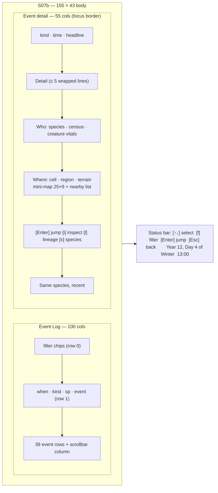
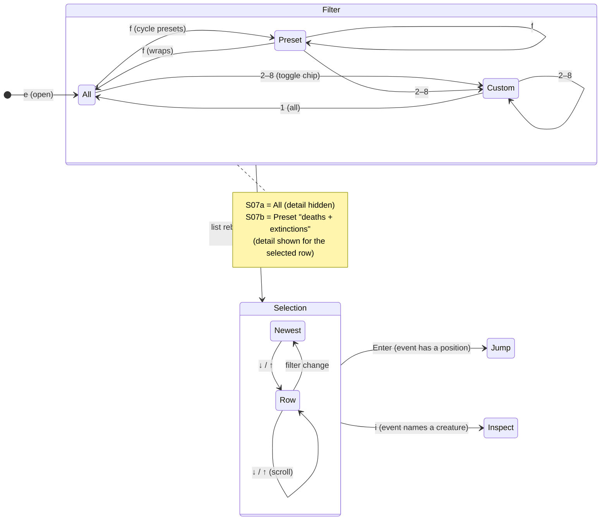

# S07 — Event Log

Back to the [screen overview](README.md).

Live since: C2

## Purpose
The event log is the valley's history, newest first: births, deaths, mutations,
migrations, extinctions, droughts, season changes, prey growing wary of predators and
narrative notes. The player uses it
to find out *what just happened* (the ticker row on the map only shows the latest line),
to filter down to the events that matter (deaths and extinctions), and to jump from an
event to the place or creature it concerns. It is the bridge between the map and the
inspector: every positioned event can be opened on the map, and every creature event can
be opened in the inspector or lineage view.

## Variants
| Id   | Variant                            | When it is shown                                              |
|------|------------------------------------|---------------------------------------------------------------|
| S07a | full log                           | default when opened with `e`; filter chip `all` active        |
| S07b | deaths & extinctions with detail   | the `deaths` + `extinctions` chips are active; the detail panel is shown for the selected event |

The two variants are the same screen in two filter states. The detail panel appears
whenever a filter narrower than `all` is active (see Open questions).

## Layout
Full-screen data screen. Body rows 1–43, status bar row 44.

- **S07a**: one `Event Log` panel, 155×43 (inner 153×41). Inner row 0 is the filter chip
  row, row 1 the column header, rows 2–40 the list (39 event rows). The last inner column
  is a scrollbar; one column of gap separates it from the text.
- **S07b**: the list panel narrows to 100×43 (inner 98×41, 39 rows) titled
  `Event Log — deaths & extinctions`, and an `Event detail` panel (focus border) of 55×43
  (inner 53×41) sits on the right. The detail panel contains a 27×11 mini-map frame
  (25×9 map cells) with a list of nearby creatures beside it.

In S07a the list panel spans all 155 columns and the detail panel is absent.

## Content requirements

### Data sources
1. **Event log**: every event with year, day, hour, kind, optional species, headline text,
   optional map position and a longer detail string. Displayed newest first (sorted by
   year, day, hour descending).
2. **Clock**: today's year and day (for the `N today` count and row emphasis) and the
   status-bar label.
3. **Species statistics** (detail panel): today's count, births and deaths for the event's
   species.
4. **Creatures** (detail panel): the creature named in the headline (matched by its tag,
   e.g. `h#217`) for a vitals line, and all alive creatures near the event position.
5. **World grid** (detail panel): terrain, vegetation and region name at the event cell,
   and the terrain for the mini-map.

### List panel
6. Panel hint (right of the title): `N events, M today`, where *today* means the event's
   year and day equal the clock's.
7. **Filter chip row**: ` filter: ` followed by nine chips in this order:
   `* all`, `♥ births`, `x deaths`, `§ mutations`, `→ migrations`, `‼ extinctions`,
   `¡ droughts`, `☻ disease`, `! wary`. An active chip is drawn in the selected style (name
   only, selection background); an inactive chip shows its glyph in the kind colour and its
   name in text colour. When the row has room (S07a) it ends with the right-aligned hint
   `[f] cycles, [1-9] toggles`. The `disease` chip (C7) shows `Outbreak`, `Spillover`,
   `Epidemic`, `EpidemicOver` and `Recovery`; a death by disease is a death and stays
   under `deaths`. The `wary` chip (C5 `FR5b`) shows the daily per-region prey-avoidance
   summary lines.
8. **Column header** (dim): `when` (16 cols), `kind` (14), `sp` (4), `event`.
9. **Event rows**, one per event:
   - selection marker `►` or space, then `Y12 D004 13:00` — bright when selected, normal
     when the event is today, dim otherwise;
   - kind glyph (bold, kind colour) and kind label padded to 11 (kind colour);
   - species glyph in upper case, bold in the species colour, or `-` dim for valley-wide
     events;
   - the headline, clipped to the available width with a trailing `~`; bold and bright on
     the selected row;
   - S07a only: the map position `(  x, y)` right-aligned in a 9-column field at the row's
     end (blank for valley-wide events). S07b drops this column to make room for the detail
     panel.
   - The selected row is filled with the selection background across the text width.
10. **Scrollbar** in the last inner column: a `░` track (dimmed border colour) with a `█`
    thumb (border colour) whose length is the visible fraction of the list, minimum 1.
11. When the list overflows, ` N more ↓ ` is written on the panel's bottom border near the
    right corner, so no list row loses its position column.
12. The selected event is the newest by default.

### Detail panel (S07b)
13. Header: kind glyph and label, bold in the kind colour, then `Year Y, Day D, HH:00` dim.
14. The headline, bold and bright, word-wrapped to the panel width.
15. **Detail** section: the event's detail text, wrapped, at most 5 lines.
15b. **Outbreak record** (C7): for an `Outbreak`, `Epidemic`, `EpidemicOver` or
    `Spillover` event the panel shows the outbreak instead of the creature vitals. The
    pathogen is the one named in the headline (longest matching name wins, so a strain
    named after its parent is preferred) and the record is that pathogen's latest
    outbreak started on or before the event day. Rows: `☻ <name>  outbreak|epidemic
    ongoing|over after N days` (name in `SICK`, `MAGENTA` for a strain); `began Y D in
    <region>`; `cases N / dead D / recovered R / peak P` (cases `SICK`, dead bad,
    recovered good); `resist H .31 → .37` for the host species (most cases; the current
    mean while the outbreak is open, tagged `(so far)`); `strain of <parent>` when the
    pathogen is a spillover strain. `no outbreak record for this event` when nothing
    matches (e.g. a save that predates the record).
16. **Who** section: species glyph and name in the species colour, `prey`/`predator`, and
    `eats <diet>`; a dim line `N alive today, B born / D died`; if the creature named in the
    headline exists, `Name tag  gen G  age Nd  alive` or `dead: <cause>`. For valley-wide
    events: `whole valley`.
17. **Where** section: `(x, y)  Region  terrain  veg 0.00`, then a mini-map of 25×9 cells
    (single inner border) centred on the event with the origin clamped to the world edge,
    creatures drawn, no overlay, day palette, and the `X` cursor on the event cell. Beside
    the map: `nearby (N):` and up to 8 alive creatures within ±12 columns and ±4 rows
    (glyph in species colour, name and tag), or `no one within 12 cells`; the last line
    reads `X = event cell`. For events without a position: `no position (valley-wide
    event)`.
18. Key hints: `[Enter] jump to map   [i] inspect creature` and `[l] lineage   [s] species
    screen`.
19. **Same species, recent** section: other events for the same species, newest first,
    as ` D### ` (dim), kind glyph (kind colour) and clipped headline, as many as fit.

### Event kinds
Every event kind, its glyph, colour role, list label and the chip that shows it:

| Kind            | Glyph | Colour role | Label        | Filter chip    |
|-----------------|-------|-------------|--------------|----------------|
| Birth           | `♥`   | good        | `birth`      | `births`       |
| DeathStarved    | `x`   | warn        | `starved`    | `deaths`       |
| DeathPredation  | `x`   | bad         | `predation`  | `deaths`       |
| DeathAge        | `x`   | dim         | `old age`    | `deaths`       |
| DeathDisease    | `☻`   | sick        | `disease`    | `deaths`       |
| Mutation        | `§`   | info        | `mutation`   | `mutations`    |
| Migration       | `→`   | accent      | `migration`  | `migrations`   |
| Extinction      | `‼`   | magenta     | `EXTINCTION` | `extinctions`  |
| Drought         | `¡`   | warn        | `drought`    | `droughts`     |
| Outbreak        | `☻`   | sick        | `outbreak`   | `disease`      |
| Spillover       | `☻`   | magenta     | `spillover`  | `disease`      |
| Epidemic        | `☻`   | sick        | `epidemic`   | `disease`      |
| EpidemicOver    | `☻`   | dim         | `burnt out`  | `disease`      |
| Recovery        | `☻`   | good        | `recovery`   | `disease`      |
| Wary            | `!`   | warn        | `wary`       | `wary`         |
| Season          | `☼`   | title       | `season`     | *(none — `all` only)* |
| Note            | `¶`   | text        | `note`       | *(none — `all` only)* |

The three death kinds share the glyph and chip but keep distinct colours so starvation,
predation and old age can be told apart at a glance.

### Filter and selection state

Changing the filter rebuilds the list newest-first and resets the selection to the first
row. `Enter` and `i` are disabled (no-ops with a status-bar hint) for events without a
position or without a creature.

## Glyphs and colors
| Glyph                 | Meaning                                    |
|-----------------------|--------------------------------------------|
| `♥ x § → ‼ ¡ ☼ ¶`     | event kinds (table above)                  |
| `*`                   | the `all` chip                             |
| `►`                   | selected row                               |
| `V H D F W L` / `-`   | species column (upper-case species glyphs); `-` = valley-wide |
| `░` `█`               | scrollbar track and thumb                  |
| `↓`                   | overflow hint (`N more ↓`)                 |
| `~`                   | clipped-text marker                        |
| `X`                   | event cell on the mini-map                 |
| map glyphs            | the mini-map uses the [S01](s01-world-map.md) terrain and creature glyphs |

Palette roles: kind colours as in the table; species colours for the species column, the
Who header and nearby creatures; selection background for the selected row and active
chips; bright text for the selected row and headline; dim for timestamps of older events,
headers, notes and the scrollbar track; accent for the region name; focus border on the
detail panel.

## Interaction
| Key        | Action                                                          | Goes to |
|------------|-----------------------------------------------------------------|---------|
| `↑` `↓`    | move the selection (list scrolls to keep it visible)            | stays on S07 |
| `f`        | cycle the filter presets (all → deaths & extinctions → migrations & droughts → disease → all) | stays on S07 (S07a ↔ S07b) |
| `1`–`8`    | toggle a chip (`1` = all resets the filter)                     | stays on S07 |
| `Enter`    | jump: open the map in look mode with the cursor on the event cell | [S01c World Map, look mode](s01-world-map.md) |
| `i`        | inspect the creature named in the event                         | [S03 Creature Inspector](s03-creature-inspector.md) |
| `l`        | open the lineage of the named creature                          | [S08 Lineage](s08-lineage.md) |
| `s`        | open the species browser on the event's species                 | [S04 Species Browser](s04-species-browser.md) |
| `Esc`      | back                                                            | [S01 World Map](s01-world-map.md) |
| `?`        | help overlay                                                    | [S11 Legend & Help](s11-legend-help.md) |

Overrides of global keys: `s` opens the species browser *on the selected species* rather
than the plain table; `e` is a no-op here. `1`–`8` are chip toggles, not overlay keys.
`g`, `y`, `w` keep their global meaning ([S05](s05-population-charts.md),
[S06](s06-ecology.md), [S08](s08-lineage.md)).

## States and edge cases
- **Empty log** (new world) or a filter that matches nothing: the list shows a dim
  `no events` line, the hint reads `0 events, 0 today`, the scrollbar is a full thumb, and
  the detail panel (if shown) reads `nothing selected`.
- **Long headlines** are clipped with `~` in the list; the detail panel shows them in full,
  wrapped. Detail text is capped at 5 lines.
- **Valley-wide events** (season, drought, some notes) have no species and no position:
  `-` in the species column, blank position, `whole valley` / `no position` in the detail,
  and `Enter`/`i`/`l` disabled.
- **Events near the map edge**: the mini-map origin is clamped so the 25×9 window stays
  inside the 150×40 world; the cursor is then off-centre.
- **Dead creatures**: the Who line shows `dead: <cause>`; `i` opens the corpse variant
  [S03c](s03-creature-inspector.md).
- **Creature no longer exists** (despawned corpse, pruned lineage): the vitals line is
  omitted and `i`/`l` are disabled.
- **Many events**: the list is virtualised; the scrollbar thumb shrinks and ` N more ↓ `
  counts the rows below the viewport. Older-than-today timestamps are dim so today's
  events stand out.
- **Live updates**: new events arrive at the top while the screen is open. The selection
  must stay on the same event (not the same row index) unless it was on the newest row.
- **Paused simulation**: no new events; nothing else changes.
- The mini-map always uses the day palette even at night or in winter.

## Open questions
- **When does the detail panel show?** The prototype ties it to the deaths-&-extinctions
  preset. Alternatives: always shown (list narrows to 100 columns in S07a too), shown for
  any filter narrower than `all`, or toggled with a key. Related: whether the position
  column should stay when the detail panel is open.
- **`f` cycle order and preset list** are not defined beyond "all" and "deaths +
  extinctions". Are the presets the seven chips in turn, a curated list (all → deaths &
  extinctions → migrations & droughts → all), or does `f` just open a chip picker?
- **Season and Note kinds have no chip**; they are only visible under `all`. Decide whether
  they need chips (an 8th/9th chip no longer fits `1-7`) or whether `all` should be renamed.
- **Chip toggle semantics**: does toggling `births` while `all` is active mean "only
  births" or "all minus births"? The prototype only shows single-state chips.
- **Creature matching by tag in the headline text** is fragile (a migration headline names a
  herd tag, a predation headline names two tags). Events should carry explicit subject and
  object creature ids so `i`, `l` and the vitals line are unambiguous — and `i` needs a rule
  for which creature to open when two are named.
- **Species census in the detail panel** comes from the species statistics (scaled sample),
  the same mismatch noted in [S05](s05-population-charts.md).
- **Nearby search radius** (±12 columns, ±4 rows, max 8 listed) and the 5-line detail cap
  are invented; the radius should probably follow the mini-map window instead.
- **Jump target**: `Enter` opens look mode at the event cell, but for extinction events the
  position is the last individual's cell — is that useful, or should it open
  [S08 Lineage](s08-lineage.md) as the [S12 alert](s12-alert-modal.md) does?
- **Today count** uses the year/day equality only; events from the previous day that
  happened "tonight" (after midnight) will be counted as today — acceptable?

Prototype reference: `src/prototypes/s07_log.rs` (event fixture in
`src/fixtures/events.rs`).
