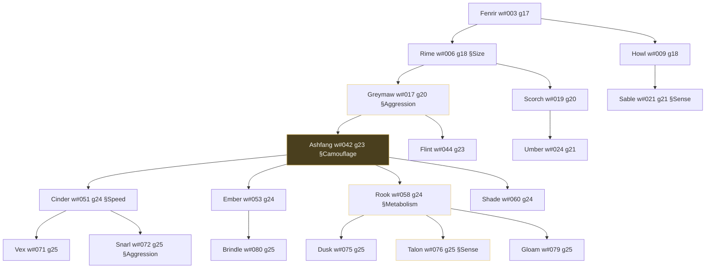

# S08 — Lineage / Family Tree

Back to the [screen overview](README.md).

Live since: C4

## Purpose
Shows where a creature came from and what it left behind: its ancestors, siblings,
children and descendants as an indented tree, with the mutation each individual was born
with, so the player can trace how a trait entered a bloodline and spread. It is the
screen for the "evolution" half of the game — the inspector shows one genome, the
lineage shows the genome moving through generations. Opened from the inspector (`l`),
from the map (`w`) or from an extinction alert ("View lineage").

## Variants
| Id   | Variant           | When it is shown |
|------|-------------------|------------------|
| S08a | Ashfang w#042     | Focused on one creature; the tree is rooted at its oldest known ancestor. Prototype: the hero wolf Ashfang, rooted at Fenrir w#003. |

## Layout
Two panels over a status bar; body is 155×43.

| Panel                          | Columns  | Width | Rows | Border |
|--------------------------------|----------|-------|------|--------|
| `Lineage of <root name> <tag>` | 0–114    | 115   | 43   | Outer, right hint `<n> wolves, <g> generations` |
| Focused wolf                   | 115–154  | 40    | 43   | Focus |
| Status bar                     | 0–154    | 155   | 1    | — |

Inside the tree panel, from top to bottom: column header (1 row + blank), the tree (one
row per individual), a blank row, the "By generation" table, and a "Legend" section pinned
to the last six rows of the panel.

The reference lineage used by the prototype (Ashfang's line) has this shape; the screen must
render any tree of this form, rooted at the focused creature's oldest known ancestor:

`§` marks a mutation recorded at that individual's birth; the highlighted node is the focus.

## Content requirements

### Tree panel
1. **Title and hint.** `Lineage of <root name> <root tag>`; hint `<node count> wolves,
   <max generation − root generation + 1> generations` (species plural should follow the
   focused creature's species).
2. **Column header** (dim): `ancestry (older on the left)` over the tree, then fixed
   columns `gen` (col 47), `years` (col 56), `mutations` (col 67).
3. **Tree rows.** A depth-first flattening of the descendant tree from the root, one row
   per individual, using box-drawing prefixes: `├──` for a child with later siblings,
   `└──` for the last child, `│  ` to continue an open branch and three spaces under a
   closed one; the root has no prefix. Each row shows:
   - `<name> <tag>` styled: selected style if it is the focused individual; title style if
     `notable`; dim if dead; normal text if living.
   - `◄ you are here` in the key colour after the focused individual's name.
   - `g<generation>` (dim if dead).
   - years `Y<born>-Y<died>` (dim) or `Y<born>-` in the good colour if still living.
   - `♥` (good) if living or `x` (dim) if dead.
   - one `§ <mutation>` entry per mutation recorded at birth, in the info colour (bold if
     the individual is notable), followed by `♦ notable` in the label style when notable
     and space allows.
   Source: lineage nodes (name, tag, generation, born_year, died_year, mutations,
   children, notable).
4. **By generation table.** Header `gen  wolves  alive  mutations  members`, then one row
   per generation from the root's to the newest: `g<n>`, one `■` per member in the wolf
   colour, the living count (good), one `§` per mutation in that generation (info colour),
   and the member names joined by `, ` (dim, truncated at 70 cells).
5. **Legend section** (pinned to the bottom six rows). A sample of each row style:
   ` focus ` (selected), `notable` (title), `living`, `dead` (dim), `§ mutation at birth`,
   `♥ alive  x dead`.
6. **Statistics line** (dim). `<n> in tree: <a> alive, <d> dead   <k> notable   <m>
   mutations recorded   longest branch: <first> → <last> (<g> generations)`.
7. **Mates line** (dim). `mates are not shown; <mother name tag> (<relation>) is <focus
   name>'s mother.` — an explanation that the tree is single-parent (see open questions).

### Focused wolf panel (40 cols)
8. **Name line.** Species glyph (upper-case, species colour), name (title style), tag
   (label style), `alive` / `dead`.
9. **Facts** (label dim, value text): `generation`, `born Year <y> (age <current year −
   y> years)`, `died Year <y>` or `still living`, `father`, `mother`, `grandfather`,
   `children <n> (<living> living)`, `descendants <n> (<living> living)`, `kills`.
   Father and grandfather are found by walking up the tree; `unknown` if the focus is the
   root. Source: lineage nodes, creature record for kills and mother.
10. **Mutations section.** `§ <mutation> at birth (gen <n>)` per recorded mutation, or
    `none`; then dim `inherited:` lines naming mutations carried down from named ancestors
    (for example `Aggression +0.09 (Greymaw)`).
11. **Trait inheritance section.** Header `grand  parent  self  kids`, then for a small set
    of traits (three in the prototype): the trait name and four two-decimal values —
    grandparent (dim), parent, self (selected style), children's mean (good if higher than
    self, bad if lower) — and under them a 26-cell range bar from the lowest to the highest
    of the four values with the self value as the marker, prefixed by the `±` change from
    grandparent to kids. Footer `kids = mean of living children`.
12. **Children section.** One row per child: `♥`/`x` status, name, tag, `g<gen>
    Y<born>-Y<died>`, and `+kids` (label style) if the child has children of its own.
13. **Direct line section.** The chain from the root to the focused individual, one per
    row, indented one cell per generation with `→`, `<name> <tag>  g<gen>`; the focus is in
    the selected style, dead ancestors dim.
14. **Siblings section.** Other children of the focused individual's parent, same format as
    the children rows, or `none`.

### Status bar
15. `[↑↓←→] navigate  [Enter] inspect  [Esc] back`; right text `<focus name> <tag>  <index>
    of <n> wolves` where index is the focus position in the tree list.

## Glyphs and colors
| Glyph / colour     | Meaning                                                     |
|--------------------|-------------------------------------------------------------|
| `├── └── │`        | tree branches (border colour)                               |
| `◄`                | "you are here" marker on the focused row (KEY colour)       |
| `♥` / `x`          | living (GOOD) / dead (DIM)                                   |
| `§`                | a mutation recorded at birth (INFO)                         |
| `♦`                | notable individual                                          |
| `■`                | one individual in the per-generation count (WOLF colour)    |
| `→`                | direct-line indentation and the longest-branch arrow        |
| `±`                | change prefix in trait inheritance                          |
| `W` etc.           | species glyph in the focused panel, species colour          |
| selected style     | focused individual everywhere it appears                    |
| title style        | notable individuals                                         |
| dim text           | dead individuals                                            |

## Interaction
| Key            | Action                                                     | Goes to |
|----------------|------------------------------------------------------------|---------|
| `↑` `↓`        | move the focus to the previous / next row of the tree; the side panel follows | stays on S08 |
| `←` `→`        | move the focus to the parent / first child (see open questions) | stays on S08 |
| `Enter`        | open the inspector for the focused individual              | [S03 Creature Inspector](s03-creature-inspector.md) (corpse variant if dead) |
| `Esc`          | back                                                       | [S01 World Map](s01-world-map.md), or the screen the lineage was opened from |

`w` (global Lineage key) is a no-op here. Entry points: `l` from [S03](s03-creature-inspector.md),
`w` from [S01](s01-world-map.md), "View lineage" from [S12 Alert Modal](s12-alert-modal.md).

## States and edge cases
- **Tree taller than the panel.** 19 rows fit in the prototype; a long-lived lineage will
  not. The tree must scroll with the focus, keeping the header and the pinned legend, and
  the "By generation" table must be limited or moved (for example collapsed to the
  generations visible).
- **Wide trees.** Many mutations on one row overflow the 115 columns; truncate the
  mutation list with `·` and keep `♦ notable` only when it fits.
- **Focus at the root.** Father, grandfather, direct line and siblings degrade to
  `unknown` / a single entry / `none`.
- **No children.** The Children section shows nothing; descendants are `0 (0 living)`;
  the trait-inheritance `kids` column has no value.
- **Dead focus.** `died Year <y>` and `dead` in the name line; `Enter` opens the corpse
  inspector only while the carcass still exists — after that the inspector needs a
  "historical" mode or `Enter` must be disabled.
- **Everyone dead** (opened from an extinction alert): every row dim, living counts 0;
  the screen must still render.
- **Names repeat.** Names are drawn from a small pool; the tag is the unique identifier
  and must always be shown next to the name.
- **Paused simulation.** No effect; the tree only changes on births and deaths.

## Open questions
- The data model stores one parent link per node (father); mothers are only mentioned in a
  footnote and the mother in the side panel is taken from the creature record. Is the
  real lineage a two-parent graph, and if so how is it drawn (mates in parentheses,
  a second tree, a toggle)?
- What exactly do `←` / `→` do — jump to parent / child, collapse / expand a branch, or
  scroll horizontally?
- Which traits appear in "Trait inheritance"? The prototype picks three; the values there
  are derived by subtracting fixed offsets and must come from stored ancestor genomes.
  Do we keep genomes of dead ancestors?
- `inherited:` mutations (`Aggression +0.09 (Greymaw)`) imply tracing each mutation to the
  ancestor it appeared in; is that a stored attribute or recomputed from the tree?
- The `longest branch: Fenrir → Talon (8 generations)` line is hand-written; define
  "longest branch" (deepest leaf from the root).
- How is the root chosen: the oldest recorded ancestor, or a fixed number of generations
  above the focus? How many generations of history does the simulation retain?
- `kills` in the side panel only makes sense for predators; what is shown for prey
  (offspring, escapes)?
- `notable` has no definition in the fixtures; what earns the ♦ (kills, offspring count,
  a mutation that spread)?
- The status bar says `<index> of <n> wolves`; the species name should follow the focus.

Prototype reference: `src/prototypes/s08_lineage.rs`.
