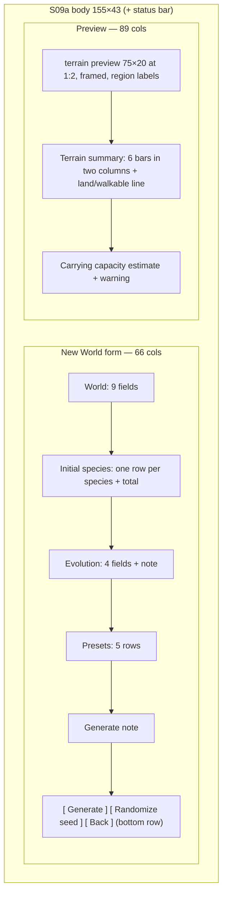

# S09 — World Generation

Back to the [screen overview](README.md).

Live since: C1

## Purpose
The "new world" form. The player names the world, chooses a seed, sets the terrain mix,
climate, starting populations and evolution parameters (or picks a preset), and watches a
live preview of the generated terrain with a terrain summary and a carrying-capacity
estimate so the starting populations can be sanity-checked before committing. `Generate`
builds the world and drops the player onto the map.

## Variants
| Id   | Variant         | When it is shown |
|------|-----------------|------------------|
| S09a | new world form  | After `New World` on the [title screen](s00-title.md). |

## Layout
Two panels over a status bar; body is 155×43.

| Panel      | Columns  | Width | Rows | Border |
|------------|----------|-------|------|--------|
| New World  | 0–65     | 66    | 43   | Outer, right hint `field <n> of <total>` |
| Preview    | 66–154   | 89    | 43   | Outer, right hint `seed <seed>, <w>x<h> at 1:2, <wind> wind, <young/mature/old> land, <n> events` |
| Status bar | 0–154    | 155   | 1    | — |

Inside the Preview panel a 75×20 terrain image (with a single-line frame around it) is
centred horizontally on the first rows; the terrain summary and capacity estimate sit
below it.

### Field row format
Every form field occupies one row: label (20 cells, from column 1), a 26-cell value box
starting at column 21, and a dim hint after the box. Adjustable fields are bracketed by
`◄` and `►`; free-text fields by `[` and `]`. The focused field draws its label bold in the
label colour, its brackets in the key colour and its value in the selected style;
unfocused values are bright text on the plain background.

## Content requirements

### New World form
1. **Panel hint** `field <current> of <total>` tracks keyboard focus through every
   focusable field (world fields, species count rows, evolution fields, presets, buttons).
2. **World section** — ten fields in this order:

   | Label          | Example value          | Adjustable | Hint            |
   |----------------|------------------------|------------|-----------------|
   | World name     | The Valley of Sunfall  | text       | `text`          |
   | Seed           | 0xC0FFEE               | text       | `hex/decimal`   |
   | Map width      | 150                    | `◄ ►`      | `100 - 1000 cells` |
   | Map height     | 40                     | `◄ ►`      | `30 - 1000 cells`  |
   | Water %        | derived from preview   | `◄ ►`      | `lakes + rivers`|
   | Forest %       | derived from preview   | `◄ ►`      | `predator cover`|
   | Rock %         | derived from preview   | `◄ ►`      | `impassable`    |
   | World age      | 8                      | `◄ ►`      | `erosion 0 - 30`|
   | Rainfall       | normal                 | `◄ ►`      | `dry/normal/wet`|
   | Season length  | 90 days                | `◄ ►`      | `30 - 180 days` |

   Map width and Map height are two separate fields, each adjusted with `←`/`→` like every
   other adjustable field; there is no combined `W x H` field and the arrow keys never
   change a second dimension.

   Water / Forest / Rock percentages are the rounded share of world cells of that terrain
   in the current preview (water = deep + shallow; forest; rock), so the form and preview
   never disagree. Source: generated world cells.
3. **Initial species section.** Header `species  kind  count  share of starting
   population`, then one row per roster species (`[[species]]` order, six by default): glyph (upper-case, species
   colour), plural name, `prey`/`predator` (dim), `◄ <count> ►` (arrows in key colour when
   focused), a 22-cell bar of the species' share of the total in the species colour, and
   the share as `<pct>%`. The focused row is highlighted across the full width. Prototype
   defaults: Voles 240, Hares 180, Deer 90, Foxes 30, Wolves 24, Lynxes 12. A dim total
   line follows: `total <n>   prey 
   predators <q>   ratio <p/q>:1`.
4. **Evolution section** — four adjustable fields: `Mutation rate` (0.04, `per
   trait/birth`), `Mutation strength` (0.06, `mutation sd`), `Predation difficulty`
   (normal, `easy/norm/hard`), `Regrowth rate` (1.0, `veg multiplier`); then a two-line
   `¶` note: `Higher mutation strength speeds adaptation but raises the chance of unviable
   offspring.`
5. **Presets section** — five rows, the active one marked `♦` (label colour, name in the
   title style), the others `·` (dim): `Balanced — default values, gentle seasons`, `Harsh
   winter — 180-day seasons, regrowth 0.6`, `Lush — forest 30%, regrowth 1.4, predation
   hard`, `Archipelago — water 55%, islands isolate lineages`, `Fast evolution — mutation
   rate 0.10, strength 0.12`. Choosing a preset writes its values into the fields above.
6. **Generate note.** `► Generate builds the world from the seed above; the preview
   updates as seed or terrain sliders change.`
7. **Buttons** pinned to the last inner row, from column 4 with 3-cell gaps: `[ Generate ]`
   (primary: cursor foreground on the accent background, bold), `[ Randomize seed ]` and
   `[ Back ]` (bright text on the header background).

### Preview panel
8. **Terrain preview.** The generated world drawn at 1:2 (every second column and row) as
   a 75×20 image of terrain glyphs in terrain colours (land tinted toward its biome hue,
   `theme::BIOME`), summer/day palette, no creatures, framed by a single-line box
   (`┌ ┐ └ ┘ ─ │`). Region names are overlaid, bold and bright, centred on each region's
   centre cell (clamped inside the image). Regions are the eight drainage basins the
   generator merged the flow tree into, named for their position and dominant biome
   (`Northern Taiga`, `Western Coast`). Source: generated world cells and regions.
9. **Terrain summary.** Six terrain groups in two columns: glyph in terrain colour, name
   (12), a 14-cell bar of the share of all cells, `<pct>% <cells>`:
   `water` (deep + shallow, `≈`), `sand / dirt` (`·`), `grassland` (sparse + grass, `"`),
   `meadow` (dense grass, `♣`), `forest` (`♠`), `rock` (`▲`). Then a dim line: `land
   <pct>%  walkable <cells> cells  mean vegetation <0.00>  regions <n>  dens <n>  seeds
   <n>` (walkable = land minus rock).
10. **Carrying capacity estimate.** `forage cells <n>  → supports about <prey> prey and
    <pred> predators at normal rainfall` where forage cells are grassland + meadow + forest
    cells, prey capacity ≈ 0.35 × forage cells and predator capacity ≈ prey capacity / 8.
    Then `starting 
 prey / <q> predators: within capacity` (good, bold) or an
    over-capacity warning, with `(<pct>% / <pct>% of capacity)`.
10a. **Biome shares.** `biomes  <name> <pct>%  …  regions <n>`: the five largest biomes
    by share of all cells, each name in its biome tint, then the region count. Source:
    `Cell.biome`.
11. **Placement warning.** `! <region> has little forage; <species> placed there tend to
    starve early.` (warn colour) when a region's forage is low relative to the species
    assigned to it.

### Status bar
12. `[Tab] next field  [←→] adjust  [Enter] generate  [Esc] back`; right text `seed <seed>
    preview is live`.

## Glyphs and colors
| Glyph / colour        | Meaning                                                    |
|-----------------------|------------------------------------------------------------|
| `◄ ►`                 | adjustable field brackets (KEY colour when focused, dim otherwise); `►` also prefixes the Generate note |
| `[ ]`                 | free-text field brackets                                   |
| `♦` / `·`             | active / inactive preset                                   |
| `¶`                   | advisory note                                              |
| `!`                   | placement warning (WARN)                                   |
| `→`                   | "supports about" arrow in the capacity line                |
| `┌ ┐ └ ┘ ─ │`         | frame around the terrain preview (border colour)           |
| terrain glyphs `≈ ~ · . , " ♣ ♠ ▲` | preview cells and summary rows, in terrain colours |
| `V H D F W L`         | species glyphs in the initial-species rows                 |
| `[█░]`                | share and terrain bars                                     |
| ACCENT background     | primary `[ Generate ]` button                              |
| HEADER_BG             | secondary buttons                                          |
| SELECT_BG             | focused field value and focused species row                |
| GOOD                  | `within capacity`                                          |

## Interaction
| Key         | Action                                                       | Goes to |
|-------------|--------------------------------------------------------------|---------|
| `Tab`       | move focus to the next field (wrapping from the last button to the first field); `Shift+Tab` should move back | stays on S09 |
| `←` `→`     | decrement / increment the focused adjustable field or species count; cycle enumerations (rainfall, difficulty); on a text field move the caret | stays on S09 |
| typing      | edit the focused text field (world name, seed)               | stays on S09 |
| `Enter`     | generate the world with the current settings (equivalent to the `[ Generate ]` button; on a preset row it applies the preset; on `[ Randomize seed ]` it draws a new seed) | [S01 World Map](s01-world-map.md) |
| `Esc`       | back without generating                                      | [S00 Title](s00-title.md) |

Global keys have no world to act on and are disabled here; `s g y e w` must reach the text
fields as characters, not as screen shortcuts.

## States and edge cases
- **Preview regeneration.** The preview, the derived Water/Forest/Rock percentages, the
  terrain summary and the capacity estimate all recompute on every seed or terrain change.
  Generation must be fast enough to feel live, or the preview needs a `generating…`
  placeholder. Measured with the erosion generator (C1 FR2, `world.age` 8): a 200×60
  preview regenerates in about 14 ms in the dev profile, inside the 16 ms budget, so the
  preview stays live; larger maps or a higher age are slower in proportion. Climate
  physics took that to ~15.5 ms and biomes-as-regions to ~17.6 ms (biome labelling
  ~1.1 ms, basin merging ~2 ms); the preview still reads as live.
- **Invalid seed text.** Non-hex/decimal input should be flagged in the field hint and
  block Generate rather than silently falling back.
- **Map size changes.** A world larger than 150×40 cannot be shown at 1:2 in 75×20; the preview
  scale must adapt (1:3, 1:4) and the panel hint must report the scale in use.
- **Over capacity.** When starting populations exceed the estimate the `within capacity`
  text becomes a warning and Generate should still be allowed (the player may want a
  crash).
- **Species set to 0.** A species with count 0 is absent from the world; the share bar is
  empty and the totals/ratio must handle a zero predator count.
- **Long world names** are clipped to the 23-cell value box; define the maximum length.
- **Presets vs manual edits.** Editing a field after choosing a preset should clear the
  `♦` marker (the preset no longer matches).
- **Terminal without truecolor**: bars and terrain colours degrade; glyphs still read.

## Open questions
- The panel hint says `field 3 of 17` but the prototype draws 8 + 6 + 4 = 18 field rows
  plus 5 presets and 3 buttons. Which elements count as fields, and are presets and
  buttons in the Tab order?
- The prototype shows two focused items at once (the Size field and the Hares row) to
  demonstrate both styles; only one focus exists in the real screen.
- Are Water / Forest / Rock percentages inputs the generator honours, or outputs of the
  seed? The form treats them as adjustable, the preview derives them from the world.
- Do `Map width` / `Map height` change the on-screen map dimensions (112-column map panel)
  or only the world? They clamp to 100–1000 cells wide and 30–1000 cells tall.
- The carrying-capacity formula (0.35 prey per forage cell, 8 prey per predator) is
  invented; it should come from the simulation's actual consumption model.
- The placement warning (`Sunfall Coast … lynx … starve early`) implies species are
  placed by region; the form has no per-region placement control. Is placement automatic?
- What does `[ Randomize seed ]` do to a hand-edited world name, and is the seed shown in
  hex, decimal, or both?
- `dens` and `seeds` counts appear in the summary but nothing on the form controls them.
- Should `Enter` on a text field generate immediately, or only when a button is focused?

Prototype reference: `src/prototypes/s09_worldgen.rs`.
