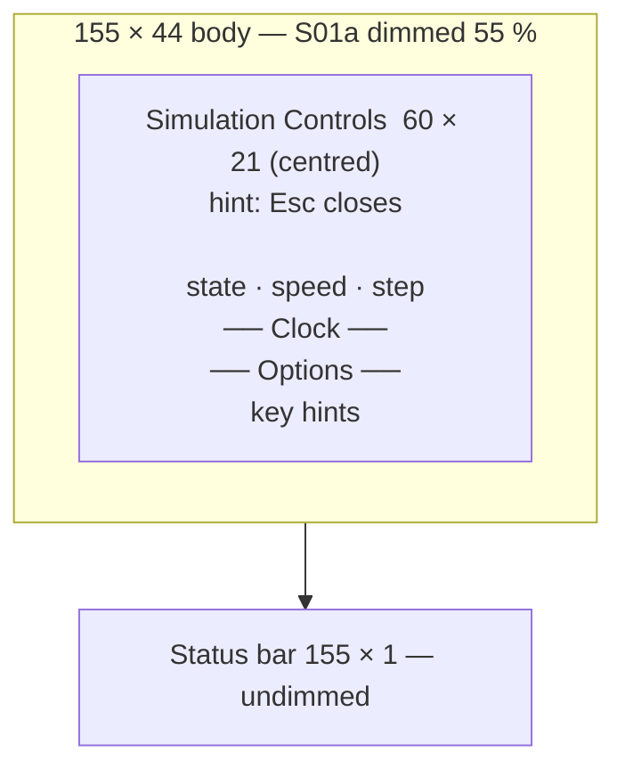

# S10 — Simulation Controls

Back to the [screen overview](README.md).

Live since: C1

## Purpose
A small modal where the player sees and changes how time runs: whether the simulation is
paused, how fast it advances, how large a manual step is, and a few automatic-pause and
logging options. The world map stays visible underneath, dimmed, so the player keeps their
bearings while adjusting speed. Everything on this modal is also reachable with the global
`Space`, `+`/`-` and `.` keys; the modal exists to make the current state legible and to
house the rarely-used toggles.

## Variants
| Id   | Variant              | When it is shown                                  |
|------|----------------------|---------------------------------------------------|
| S10a | modal over world map | `p` (or `Space`, see open questions) on the map   |

## Layout
The modal is centred over the [S01a World Map](s01-world-map.md), which is drawn first and
then dimmed 55 % toward the background. The status bar is repainted on top so it stays fully
readable under the modal.

| Panel                | Position (cols × rows)         | Notes                                              |
|----------------------|--------------------------------|----------------------------------------------------|
| Backdrop             | 155 × 44                       | S01a rendered normally, then dimmed                |
| Controls modal       | 60 × 21, centred in the body   | double border in the focus colour; inner 58 × 19   |
| Status bar           | 155 × 1, row 44                | redrawn undimmed                                   |

The modal title is `Simulation Controls` with the right-aligned dim hint `Esc closes`.

## Content requirements
Rows are counted inside the modal, top to bottom (19 rows available).

1. **State row** (row 0), from the clock: `state` label, then either `► RUNNING` in the good
   colour or `││ PAUSED` in the warning colour, bold; then the current speed as `►► x‹n›`;
   then the dim reminder `││ Space toggles`.
2. **Speed row** (row 2): `speed` label and the five speed stops `x1 x2 x5 x10 x25` as
   inline chips; the active stop uses the selection style. Dim hint `+/- or 1-5`.
3. **Step row** (row 3): `step` label and the three step sizes `1 tick`, `1 hour`, `1 day`
   as chips; the active size is underlined in bright text. Dim hint `→│ . steps once`.
4. **Clock section** (rows 5–7): a `── Clock ──` rule, then one line with the tick counter
   (thousands separated, e.g. `1,064,772`), `day D of Season` with the season glyph in the
   season colour, `year Y`, and `HH:00 ☼`. Below it a dim conversion line:
   `24 ticks = 1 hour   1 day = 576 ticks   x‹speed› = ‹24 × speed› ticks/s`.
5. **Options section** (rows 9–15): a `── Options ──` rule and five checkbox rows, each
   `[x]` (good colour, bold) or `[ ]` (dim), a 36-column label, and the toggle key in key
   style at the right:
   - `[x] auto-pause on extinction` — `[a]`
   - `[ ] log births to the event log` — `[b]`
   - `[x] pause when a followed creature dies` — `[c]`
   - `[x] day/night tint: status text` — `[t]` cycles `off` → `map` → `status text`
     (default). `map` blue-shifts the map palette at night; `status text` leaves the map
     alone and instead draws the status-bar clock in moon blue at night (accent by day).
     The mark is `[ ]` only for `off`.
   - `[x] auto-pause on epidemic` — `[d]` (C7: raises [S12b](s12-alert-modal.md))
   then the autosave row `◄ autosave every N days ►` stepped with `[←→]` (`off` at 0).
6. **Key hints** (last row): `[Space] pause  [+/-] speed  [.] step  [Esc] close` in key /
   dim styles.
7. **Status bar**: hints as in the table below; right side is the clock label followed by
   `☼ day`.

Data sources: the simulation clock (paused flag, speed, tick, day, season, year, hour) and
the persistent option flags. Nothing else on the modal depends on world state.

## Glyphs and colors
| Glyph / colour        | Meaning                                              |
|-----------------------|------------------------------------------------------|
| `►` good              | running                                              |
| `││` warning          | paused                                               |
| `►►`                  | fast-forward / current speed multiplier              |
| `→│`                  | single step                                          |
| `[x]` good / `[ ]` dim | option on / off                                     |
| season glyph `♪ ☼ ♫ *` | Spring / Summer / Autumn / Winter, in the season colour |
| `☼`                    | daytime in the clock line and status bar             |
| focus border (gold)   | the modal has keyboard focus                         |
| selection style       | active speed chip                                    |
| underline, bright     | active step size                                     |

## Interaction
| Key      | Action                                     | Goes to |
|----------|--------------------------------------------|---------|
| `Space`  | pause / resume                             | stays here; state row updates |
| `+` `-`  | next / previous speed stop                 | stays here |
| `1`–`5`  | set speed to x1 / x2 / x5 / x10 / x25      | stays here |
| `.`      | advance one step of the selected size      | stays here (only meaningful while paused) |
| `a` `b` `c` `t` `d` | toggle the corresponding option | stays here |
| `←` `→`  | autosave interval down / up (days)         | stays here |
| `Esc`    | close the modal                            | [S01 World Map](s01-world-map.md) |

Keys with a local meaning override the README global bindings while the modal is open
(`1`–`4` do not pick overlays here). `?` is not offered; the modal must be closed first.

## States and edge cases
- **Paused vs running**: only the state row and the status-bar clock differ; the modal must
  keep re-rendering while the simulation runs so the tick counter advances live.
- **Speed at either end**: `+` at x25 and `-` at x1 do nothing (no wrap).
- **Stepping while running**: `.` should either pause first or be ignored; the prototype
  shows the hint regardless of state.
- **Opened from a screen other than the map**: the README allows modals over any screen but
  the prototype only shows the map backdrop; the modal must not depend on the backdrop.
- **Terminal narrower than 60 columns** is out of scope (fixed 155 × 45 frame).

## Open questions
- The README navigation diagram opens this modal with `p / Space`, while the global key
  table says `Space` toggles pause and the help screen lists `p` = controls panel. Should
  `Space` open the modal at all, or only pause?
- The speed stops (1, 2, 5, 10, 25) and the time model (24 ticks per hour, 576 ticks per
  day, `24 × speed` ticks per second) are invented; the simulation's real tick rate and
  whether speed is a multiplier or a target ticks-per-second are undecided.
- There is no key to change the **step size**; the step row is shown as a selector (1 hour
  underlined) but the global `.` is documented as "step one tick". Either add a key
  (e.g. `<`/`>` or `Tab` on the row) or make the row read-only.
- The three options are persistent settings; where they are stored (per world save, global
  config) and whether a fourth option such as "pause on drought" belongs here is open.
- Should the status bar's right text reflect the paused state (as S12's does) instead of
  always showing the clock?
- Whether the modal is one of several "settings" pages (audio, colours, autosave) or stays
  a single time-control panel.

Prototype reference: `src/prototypes/s10_controls.rs`.
