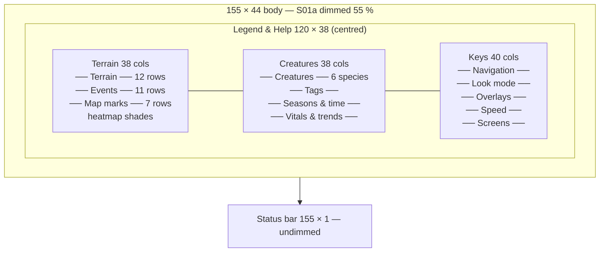

# S11 — Legend & Help

Back to the [screen overview](README.md).

Live since: C1

## Purpose
A single reference card that explains every glyph, colour and key the game uses, drawn over
the dimmed map so the player can compare a symbol on the map with its legend entry without
leaving the view. It is the only place where the terrain, event, creature, season and vitals
conventions appear together, and it doubles as the key-binding cheat sheet. Nothing here is
live data except that the species table is generated from the species roster.

## Variants
| Id   | Variant                | When it is shown             |
|------|------------------------|------------------------------|
| S11a | overlay over world map | `?` from the map family      |

## Layout
The [S01a World Map](s01-world-map.md) is drawn and dimmed 55 %; a large focus-bordered modal
is centred on it; the status bar is repainted undimmed.

| Panel                 | Position (cols × rows)          | Notes                                                   |
|-----------------------|---------------------------------|---------------------------------------------------------|
| Backdrop              | 155 × 44                        | S01a dimmed                                             |
| Help modal            | 120 × 38, centred               | title `Legend & Help`, hint `? or Esc closes`; inner 118 × 36 |
| Column 1 — Terrain    | 38 × 36                         | terrain legend, events, map marks, shade scale          |
| Column 2 — Creatures  | 38 × 36                         | species table, tags, seasons & time, vitals & trends    |
| Column 3 — Keys       | 40 × 36                         | key groups                                              |
| Status bar            | 155 × 1, row 44                 |                                                         |

Columns are separated by two single vertical rules (`│`) spanning the modal's inner height.
The third column receives the two leftover inner columns.

## Content requirements

### Column 1 — Terrain
1. **Terrain** (12 rows): the shared map legend in map order — deep water, shallow water,
   sand, bare dirt, sparse grass, grassland, meadow, forest, rock, den / burrow, carcass,
   regrowth — each as a bold glyph in its map colour, a 14-column label, and a dim
   gameplay note: *impassable, drinkable · drinkable, slow · no forage · regrows here first ·
   thin forage · hare & deer grazing · rich grazing, cover · cover for small prey ·
   impassable heights · shelter, litters · scavenger food · regrowing this season.*
2. **Events** (11 rows): event-kind glyphs in their log colours — birth / litter, death by
   predation, death by starvation / thirst, death of old age, mutation in a newborn,
   migration between regions, species extinct, drought / scarcity warning, `☻` outbreak /
   epidemic / death by disease (infection colour), `☺` recovery (now immune), `!` prey
   giving predators room (C5 `FR5b`). The three
   death kinds share the `x` glyph and differ only by colour.
3. **Map marks** (7 rows): look cursor (inverted cell), cursor corner marks `╬`, trail of the
   followed creature `∙`, its current target `♦`, sense-range ring edge `°`, danger marker
   `!` (predator nearby), `∩` parasites (cell tint, warning colour).
4. **Heatmap shades** (2 dim rows): `░ <25%  ▒ <50%  ▓ <75%  █ full`, matching the S02
   overlay thresholds.

### Column 2 — Creatures
5. **Creatures** table: header `ad jv  species role  diet`, then one row per species in
   roster order (Vole, Hare, Deer, Fox, Wolf, Lynx): adult and juvenile glyphs (`V v`, `H h`,
   …) in the species colour, name, role `prey` (good colour) or `predator` (bad colour), and
   the diet string (seeds/roots, grass/bark, grass/leaves, voles/hares, deer/hares,
   hares/voles). Two notes follow: `UPPER adult   lower juvenile`, and the two highlight
   styles — bright bold `W` = selected, inverted-accent `H` = followed.
6. **Tags** (2 rows): `h#217 = species letter + id`; `♂ ♀ sex`; `gen 23 generation`.
7. **Seasons & time** (6 rows): the four seasons with glyph, colour and an effect note —
   Spring *births peak, regrowth fast*; Summer *water cells shrink*; Autumn *forage peaks then
   falls*; Winter *regrowth halved, ice* — then `☼ day / ○ night (blue-shifted)`, and the
   run-state glyphs `► running  ││ paused  ►► x2 speed`.
8. **Vitals & trends** (5 rows): three `███` swatches in good / warning / bad for
   *healthy / rising*, *strained*, *critical / falling*; `↑ ↔ ↓` = 30-day population trend;
   `§` = trait differs from the species mean.

### Column 3 — Keys
9. Five key groups, each a section rule followed by `key  description` rows (10-column key
   field in key style):
   - **Navigation**: `← → ↑ ↓` scroll the map · `PgUp PgDn` scroll a page · `Home` center on
     the valley · `Tab` next notable creature · `c` center on selection.
   - **Look mode**: `k` enter look mode · arrows move the cursor · `Enter` inspect cell /
     creature · `f` follow creature · `z` local zoom view · `Esc` leave look mode.
   - **Overlays**: `o` overlay switcher · `Tab` next predator / species / pathogen ·
     `Shift+Tab` previous species / pathogen · `Esc` clear overlays.
   - **Speed**: `Space` pause / resume · `+ / -` faster / slower · `.` step one tick · `p`
     controls, options, AI.
   - **Screens**: `s` species & traits · `g` graphs & charts · `y` ecology & regions · `e`
     event log (c: chronicle) · `l` lineage tree · `w` world generation · `?` this help ·
     `q` quit.
10. The column is exactly filled (5 rules + 31 rows = 36 of 36 rows). The whole content
    area scrolls (`widgets::scroll`, all three columns together), so a new binding pushes
    the column past the bottom and the bottom border shows ` ↑n ↓m ` for the hidden rows.

### Status bar
11. Left: the hints in the table below. Right: the fixed text `help overlay` (no clock).

## Glyphs and colors
This screen is the canonical list; every glyph it shows must be the same constant the
corresponding screen draws. In particular: terrain `≈ ~ · . , " ♣ ♠ ▲`, resources `Ω % *`,
events `♥ x § → ‼ ¡ ☻ ☺ !`, marks `X ╬ ∙ ♦ ° ! ∩`, seasons `♪ ☼ ♫ *`, sky `☼ ○`, controls
`► ││ ►►`, trend `↑ ↔ ↓`, sex `♂ ♀`, shades `░ ▒ ▓ █`, bars `███`. Colours: each species'
palette entry, the terrain foreground colours, event-kind colours, good / warning / bad for
vitals, accent for marks, and the focus border for the modal. Note that `*` is used for both
regrowth and the winter season glyph, and `☼` for both summer and daytime.

## Interaction
| Key            | Action                                            | Goes to |
|----------------|---------------------------------------------------|---------|
| `?`            | close help                                        | [S01 World Map](s01-world-map.md) (or whichever screen opened it) |
| `Esc`          | close                                             | same as above |
| `↑` `↓`        | scroll the help content one row                   | stays here |
| `PgUp` `PgDn`  | scroll the help content a page; `Home` / `End` jump to the top / bottom | stays here |
| `k`            | close help and enter look mode                    | [S01c Look mode](s01-world-map.md) |
| `o`            | close help and open the overlay switcher          | [S14 Overlay Switcher](s14-overlay-switcher.md) |
| `s`            | close help and open the species browser           | [S04 Species Browser](s04-species-browser.md) |

Keys `k`, `o` and `s` are offered in the status bar as shortcuts *through* the help screen:
the player reads the binding and presses it directly. By extension the other documented keys
(`g y e l w Space + - .`) should behave the same way rather than being swallowed.

## States and edge cases
- **Content overflow**: all three columns fit within 36 rows today, so `PgUp`/`PgDn` have
  nothing to scroll; they are reserved for when the key list grows.
- **Opened over a data screen**: the README allows `?` everywhere; the backdrop would then
  be that screen, not the map, and the `k`/`o` shortcuts may not apply.
- **Extinct species** still appear in the species table (it lists the roster, not the living
  population).
- **Night / winter backdrop**: the dimmed map underneath may be in its night palette; the
  modal's own colours are unaffected.

## Open questions
- The **Screens** group lists `l` = lineage tree and `w` = world generation, but the README
  global table binds `w` to Lineage and gives no world-generation key from the map. One of
  the two must change.
- `Tab` = "next notable creature" here, "next predator" in S02d and "next creature" in S13;
  the help text should describe one consistent rule.
- The gameplay notes (e.g. *summer: water cells shrink*, *dens: −60 % detection*) describe
  simulation rules that do not exist yet; the help must be regenerated from real rules, or
  the notes dropped until then.
- Whether `Home` centres on "the valley" (world centre) or on the selection, and what `c`
  does when nothing is selected.
- Whether the help should be context-sensitive (show only the bindings of the screen
  beneath) rather than the full global list.
- The `*` glyph collision (regrowth vs winter) and `☼` collision (summer vs day) may confuse
  a player reading this card; do we accept it or pick distinct glyphs?

Prototype reference: `src/prototypes/s11_help.rs`.
