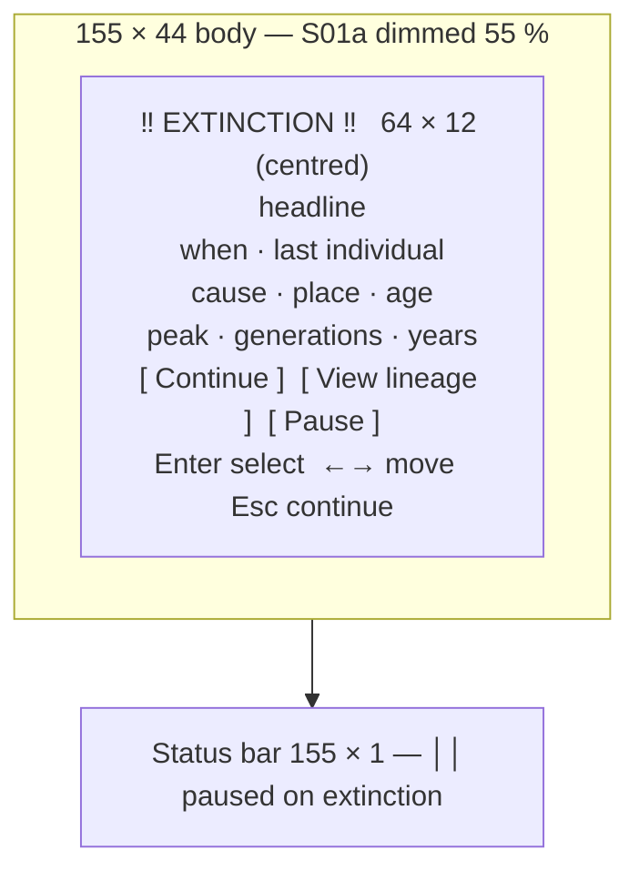

# S12 — Alert Modal

Back to the [screen overview](README.md).

## Purpose
The simulation interrupts the player for events that change the shape of the world — in the
prototype, a species going extinct. The modal names the event, gives the facts a player would
want to remember (when, where, who was last, how the line fared) and offers a small set of
next actions. It is raised by the simulation rather than by a key press, and while it is open
the simulation is paused (when the corresponding auto-pause option in
[S10 Simulation Controls](s10-simulation-controls.md) is on).

## Variants
| Id   | Variant          | When it is shown                                                       |
|------|------------------|------------------------------------------------------------------------|
| S12a | extinction event | the last individual of a species dies and auto-pause on extinction is on |

## Layout
[S01a World Map](s01-world-map.md) drawn and dimmed 55 %; a compact focus-bordered modal is
centred on the body; the status bar is repainted undimmed.

| Panel         | Position (cols × rows)     | Notes                                                        |
|---------------|----------------------------|--------------------------------------------------------------|
| Backdrop      | 155 × 44                   | S01a dimmed                                                  |
| Alert modal   | 64 × 12, centred           | double focus border; title ` ‼ EXTINCTION ‼ ` centred on the top border in magenta bold; inner 62 × 10 |
| Status bar    | 155 × 1, row 44            | right side reads `││ paused on extinction`                   |

## Content requirements
Rows are counted inside the modal (10 available).

1. **Title** on the border: `‼ EXTINCTION ‼`, centred, magenta, bold — the same glyph and
   colour the event log uses for extinction events.
2. **Headline** (row 1, centred, magenta bold): `The ‹Plural› are extinct`, from the species
   roster (`The Lynx are extinct`).
3. **When and who** (row 3): the clock at the moment of the event as `Year Y, Day D of
   Season` with the season glyph in season colour, then dim `last individual:` and the
   creature's `Name tag` in the species colour, bold (`Gloam l#088`).
4. **How** (row 4): the death glyph `x` and the cause in the death-kind colour (`starved`,
   warning colour), then ` in ‹region› at (x, y), age N days` from the last individual's
   death record.
5. **Line summary** (row 6), from the species statistics: `peak population N`,
   `generations survived N`, `years N`.
6. **Buttons** (row 8, centred as a group with four spaces between): `[ Continue ]`,
   `[ View lineage ]`, `[ Pause ]`. The focused button uses the selection style; Continue is
   focused by default.
7. **Hint** (row 9, centred, dim): `Enter select   ←→ move   Esc continue`.
8. **Status bar**: hints per the table below; the right side replaces the clock with the
   pause glyph and `paused on extinction` in the accent colour.

Data sources: the extinction event (species, clock stamp, position, last individual), the
last individual's creature record (name, tag, cause of death, age), and the species
statistics (peak, generation count).

## Glyphs and colors
| Glyph / colour           | Meaning                                                   |
|--------------------------|-----------------------------------------------------------|
| `‼` magenta              | extinction (event-kind glyph and colour)                  |
| `x` warning / bad / dim  | death; colour by cause (starved / predation / old age)    |
| season glyph `♪ ☼ ♫ *`   | season of the event, in season colour                     |
| species colour           | the last individual's name and tag                        |
| selection style          | focused button                                            |
| `││` accent              | paused, in the status bar                                 |
| focus border (gold)      | the modal owns input                                      |

## Interaction
| Key      | Action                                                | Goes to |
|----------|-------------------------------------------------------|---------|
| `Enter`  | activate the focused button                           | see buttons |
| `←` `→`  | move focus between buttons                            | stays here |
| `l`      | shortcut for View lineage                             | [S08 Lineage](s08-lineage.md) |
| `Space`  | shortcut for Pause (keep the modal closed but paused) | [S01 World Map](s01-world-map.md), paused |
| `Esc`    | Continue                                              | [S01 World Map](s01-world-map.md), resumed |

Buttons: **Continue** closes the modal and resumes the simulation at its previous speed.
**View lineage** closes the modal and opens the lineage screen focused on the last
individual, leaving the simulation paused. **Pause** closes the modal and leaves the
simulation paused on the map.

All other global keys are swallowed while the modal is open.

## States and edge cases
- **Auto-pause off**: the event should still be logged and shown in the ticker; whether the
  modal appears at all (non-blocking) is an open question.
- **Multiple alerts in one tick** (two species collapse together): alerts must queue and be
  shown one after another, or be merged into one modal.
- **Last individual unknown** (e.g. species removed at world-generation time): the "when
  and who" and "how" rows need a fallback such as `no individuals recorded`.
- **Long names / regions**: the "how" row is the widest (`starved in Southern Thicket at
  (149, 39), age 1460 days` fits in 62 columns); longer cause strings must be truncated.
- **Raised over a data screen**: the backdrop is whatever screen was active; the modal must
  not assume the map.
- **Night / winter**: the backdrop keeps its palette; the modal does not change.

## Open questions
- The prototype's facts disagree with its own event log: the log records a *local*
  extinction ("The Lynx line of Sunfall Coast is extinct … 5 remain elsewhere") at Year 11,
  Day 338, position (128, 7), while the modal claims a global extinction at Year 12, Day 4,
  position (131, 9), and the `age 412 days` is borrowed from another creature. Which event
  raises the modal — local line extinction, global extinction, or both with different
  wording?
- `years` shows the current clock year, not the number of years the species survived; the
  intended statistic (years since world start, or since the species' first generation) is
  unspecified.
- A **Pause** button on a modal whose status bar already says "paused on extinction" is
  redundant; it only makes sense if Continue resumes. Confirm the resume/pause semantics
  of each button, and whether Esc should be "Continue" (resume) or "dismiss, stay paused".
- Is this the template for other alerts (drought warning, followed creature died, first
  mutation of a kind)? If so the title, glyph, colour and button set must become
  parameters, and the S10 options should map one-to-one onto alert kinds.
- Should the modal offer **Inspect** (open [S03 Creature Inspector](s03-creature-inspector.md)
  on the corpse) or **Jump to location** (look cursor at the death site), which the
  event-log screen already provides?
- Whether alerts are recorded so the player can re-open a missed one from
  [S07 Event Log](s07-event-log.md).

Prototype reference: `src/prototypes/s12_alert.rs`.
