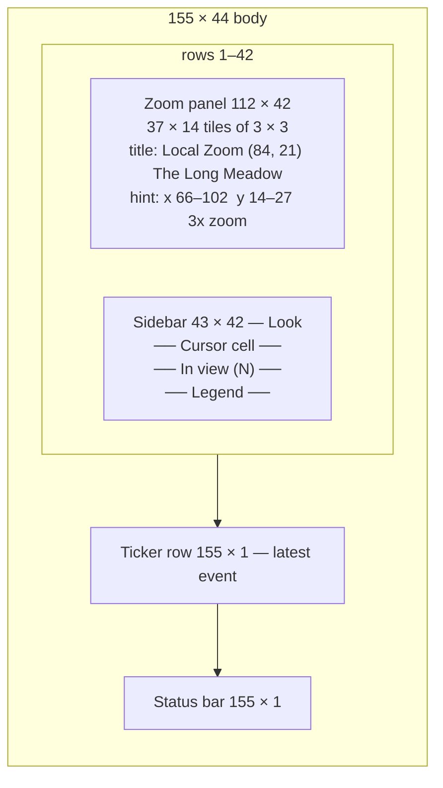

# S13 — Local Zoom View

Back to the [screen overview](README.md).

## Purpose
At normal scale a world cell is one character and a hare standing on a den next to a carcass
is unreadable. The local zoom redraws the neighbourhood of the look cursor with every world
cell as a 3 × 3 tile, so terrain, resources and creatures can each be seen individually and
the player can tell exactly who is where. It is entered from look mode, keeps the look
cursor, and its sidebar is the look-mode cell readout expanded with a list of everything in
view.

## Variants
| Id   | Variant                | When it is shown                          |
|------|------------------------|-------------------------------------------|
| S13a | 3×3 tiles around cursor | `z` from [S01c Look mode](s01-world-map.md) |

## Layout
Same split as the map family; the map panel shows a zoomed window instead of the world.

| Panel        | Position (cols × rows) | Notes                                                                   |
|--------------|------------------------|-------------------------------------------------------------------------|
| Zoom panel   | 112 × 42, top-left      | double border; title `Local Zoom  (x, y)  ‹region›`; hint `x a–b  y c–d   3x zoom`; inner 110 × 40 |
| Sidebar      | 43 × 42, top-right      | double border, titled `Look`; inner 41 × 40                              |
| Ticker row   | 155 × 1, row 43         | latest event, as on S01                                                 |
| Status bar   | 155 × 1, row 44         |                                                                         |

### Zoom window
- Window size in world cells is the inner panel divided by the tile size, **rounded up**:
  ⌈110 / 3⌉ = 37 columns × ⌈40 / 3⌉ = 14 rows. The last tile column is 2 screen cells wide and
  the last tile row 1 screen cell high, so partial tiles fill the edge instead of leaving a
  gutter.
- The window is centred on the cursor (`x0 = cx − 18`, `y0 = cy − 7`) and clamped so it never
  runs past the world's 150 × 40 edge. For the prototype cursor (84, 21) this gives
  x 66–102, y 14–27, which the panel hint reports.
- Any inner area not covered by a tile is filled with the panel background.

## Content requirements

### Zoom panel
1. **Terrain tile** per world cell: the cell's terrain background fills the 3 × 3 block; the
   terrain glyph is drawn full-strength at the tile centre and faintly (35 % blend from
   background toward foreground) at the four corners, so large same-terrain areas still show
   texture and tile boundaries.
2. **Resources** draw at the tile centre, replacing the terrain glyph: regrowth `*`, den `Ω`
   (bold), carcass `%`, in that order.
3. **Creatures** draw at the tile centre over resources: living creatures as their species
   glyph in species colour (adults bold, juveniles lowercase); dead creatures as `%` in the
   carcass colour.
4. **Cursor tile**: all nine cells of the cursor's tile are inverted (white background,
   black foreground, bold); the eight non-centre cells are blanked so only the occupant or
   terrain glyph shows in the middle.
5. **Corner marks**: the four diagonally adjacent tiles receive a `╬` in cursor-white at the
   corner nearest the cursor, framing the cursor tile the way corner marks frame the cursor
   on S01c.
6. Title shows the cursor position and its region name; the hint shows the window's world
   x and y ranges and `3x zoom`.
7. The prototype uses the daytime, non-winter palette; night and winter tinting must apply
   to tiles the same way they apply to map cells.

### Sidebar — `Look`
8. **Cursor cell** (9 rows): terrain swatch (glyph on its terrain colours), terrain name in
   title colour and `(x, y)`; `region ‹name›`; five labelled bars (14-column label,
   16-column bar) from the world cell — elevation (rock colour), moisture (shallow-water
   colour), vegetation (vegetation green), prey traffic (good colour), pred traffic (bad
   colour); then one dim occupant line: `‹Name tag› is here`, `a den is here`, or `nothing is
   standing here`.
9. **In view (N)** (up to 17 rows): the count of creatures whose position falls inside the
   window (living and dead), a header `tag name goal dist`, then rows sorted by distance from
   the cursor ascending, at most 14, followed by `… and N more`. Each row: glyph in species
   colour (or `%` carcass colour for the dead), tag, name (8 cols), goal truncated to 16
   characters (dead creatures read `carcass` in dim text), distance rounded to a whole
   number of cells and a compass direction `N NE E SE S SW W NW` (blank when on the cursor).
10. **Legend** (9 rows): the twelve shared map-legend entries in two columns of six, then
    `cursor tile` (white swatch) and `╬ corner marks`, and the reminder
    `1 tile = 1 world cell (3x3 screen cells)`.

### Ticker and status bar
11. Ticker: newest event glyph, colour and text, then dim `(e: full log)`.
12. Status bar right side: clock label and `☼ day`.

## Glyphs and colors
| Glyph / colour                 | Meaning                                                 |
|--------------------------------|---------------------------------------------------------|
| terrain glyphs `≈ ~ · . , " ♣ ♠ ▲` | tile centre and faint corners, in terrain colours   |
| `* Ω %`                         | regrowth, den (bold), carcass at a tile centre          |
| species glyphs, UPPER / lower  | adult (bold) / juvenile creature in species colour      |
| white background, black glyph  | the cursor tile                                         |
| `╬` white                       | corner marks in the diagonal neighbour tiles            |
| rock / shallow / vegetation / good / bad | bar colours for elevation, moisture, vegetation, prey and predator traffic |
| `☼`                             | daytime in the status bar                               |

## Interaction
| Key        | Action                                            | Goes to |
|------------|---------------------------------------------------|---------|
| `z`        | zoom out                                          | [S01c Look mode](s01-world-map.md) |
| `↑ ↓ ← →`  | move the cursor one world cell; window follows    | stays here |
| `Enter`    | inspect the creature (or cell) under the cursor   | [S03 Creature Inspector](s03-creature-inspector.md) |
| `f`        | follow the creature under the cursor              | [S01e Follow](s01-world-map.md) |
| `Tab`      | jump the cursor to the next creature in view      | stays here |
| `Esc`      | back to map                                       | [S01c Look mode](s01-world-map.md) (see open questions) |

Global keys not shown (`Space + - . ? s g y e w q`) keep their README meaning.

## States and edge cases
- **Cursor near the world edge**: the window clamps, so the cursor is no longer centred; the
  cursor tile may sit in the first or last column of tiles.
- **Partial edge tiles**: the rightmost tile column and bottom tile row are cut to 2 × 3 and
  3 × 1 cells; a creature at the centre of a cut tile is still drawn if its centre cell is
  inside the panel, otherwise it is omitted from the panel but still counted in the sidebar.
- **Several creatures on one cell**: only one glyph can be drawn at the tile centre (the
  last drawn wins); the occupant line names the first. The In view list shows all of them.
- **Empty window** (no creatures): the section reads `In view (0)` with just the header.
- **More than 14 creatures in view**: the list truncates with an overflow line so the legend
  below it stays visible.
- **Enter on an empty cell**: no creature to inspect; either open the cell inspector or do
  nothing (unspecified).
- **Paused simulation**: unchanged; the zoom is a view, not a mode of time.

## Open questions
- Distance in the sidebar is plain Euclidean in cell units, while the S02d sense ring uses a
  2:1 ellipse metric. Since tiles here are 3 × 3 (visually ~3:1.5), neither is "what the
  player sees"; pick one distance definition for the whole UI.
- `Esc` is labelled "back to map" but the README's navigation returns to look mode (S01c)
  on both `z` and `Esc`. Should `Esc` skip look mode and return to the plain map?
- Does the window scroll one cell at a time as the cursor moves (cursor stays centred until
  clamped), or does the cursor move within a fixed window that pages when it reaches an
  edge?
- Whether overlays ([S02](s02-map-overlay.md)) should be available inside the zoom — a
  heatmap on 3 × 3 tiles would be very readable — and whether the followed creature's trail
  and target marks should be drawn at this scale.
- The `Tab` ordering ("next creature" — by distance, by id, by species?) and whether it
  includes carcasses.
- A 3 × 3 tile is a fixed choice; whether 2 × 2 (a 55 × 20 window) or a user-selectable zoom
  factor is preferable has not been tested.
- The faint corner-glyph texture is a prototype aesthetic; check it does not read as four
  extra objects on dense terrain such as meadow (`♣`) or forest (`♠`).
- Whether the occupant line should name a carcass (`Thistle d#133's carcass is here`) or
  only living creatures.

Prototype reference: `src/prototypes/s13_zoom.rs`.
